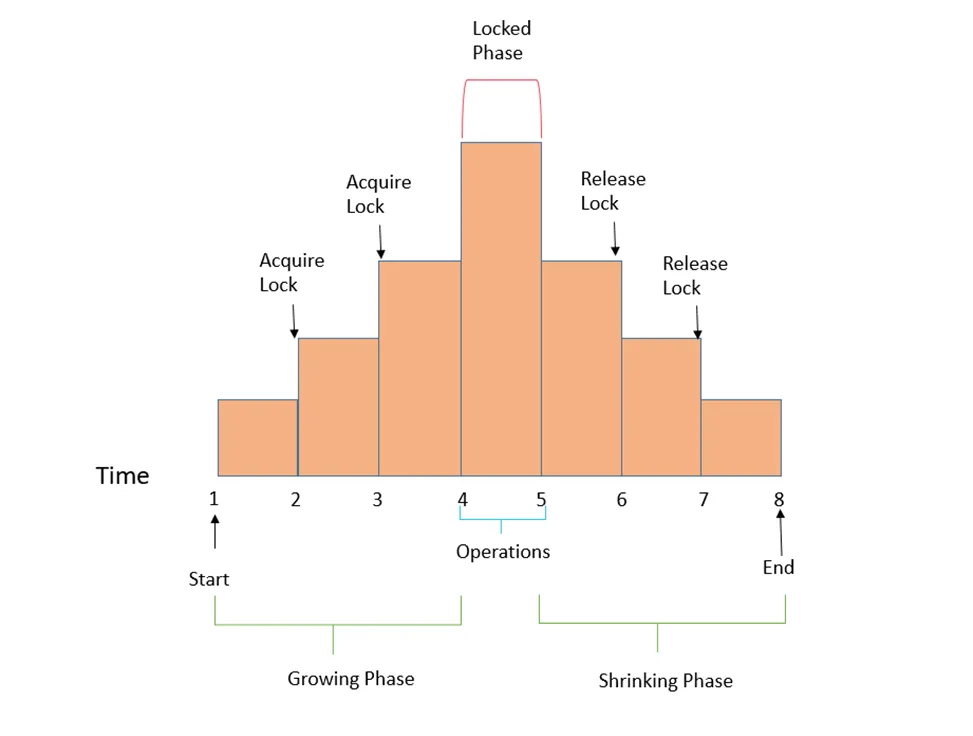

按理说是一份共享资源对应一份锁，但是并非锁的粒度仅仅取决于资源的粒度。比如说我们希望将 A 账户里的钱转账到 B 账户上，在语义上，A 和 B 是一个共同体，所以锁不能仅仅是 A Lock 和 B Lock（这样会导致有一个中间态是 A 账户的钱已经没了，而 B 账户还没有收到钱），而应该是一个 AB Lock 。

在实践上，我们没有必要真的声明一个 AB Lock，这样的话，一个有 N 个账户的银行就需要 $C_{n}^{2}$ 个锁了，这显然是不现实的。我们只需要同时拿住 A Lock 和 B Lock 即可保证粒度是 AB 。

从上面我们说到，锁的粒度不仅取决于资源本身的粒度，还取决于事务（上面的例子是转账）的粒度。如果一个事务需要多种资源，那么它应该同时拿多把锁。问题在于，拿锁这个行为并不能同时发生。两阶段锁（Two Phase Locking, 2PL）这个理论告诉我们，只要按照它说得做，就可以达到跟“同时拿两个锁”一样的效果。

2PL 的两个阶段：

- Expanding phase：只拿锁，不放锁
- Shrinking phase：只放锁，不拿锁

也就是说，以对共享资源进行具体的操作为界，在操作前只拿锁，在操作后只放锁，不会存在放锁后再拿锁的情况。

