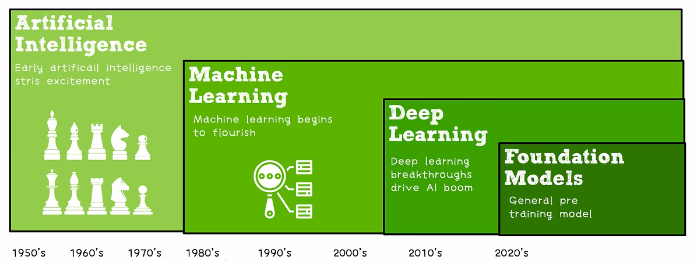

# 概念联系

人工智能（Artificial Intelligence）的目标是造出具有“人类智能”的程序，是最宏大的一个概念，其目的是制造出可以通过“图灵测试”的程序，并没有规定这个程序是如何制造的。

机器学习（[[Machine Learning]]）是制造 AI 的一个子任务。它是训练计算机程序或系统在没有明确指令的情况下执行任务的科学，也就是让 AI 具有“学习能力”，我个人觉得就是将一部分逻辑让渡给程序本身，形成一个“黑箱”。需要强调的是，AI 不应该只具有学习能力，它还应该具有自然语言处理、计算机视觉、分析推理、情感、机器人（也就是在物理世界中运动和感知）等能力，这些能力可以不通过机器学习的方式来实现，也就是“白箱实现”。此外还需要强调，学习能力与其他能力并非完全正交，其他能力也可以使用机器学习“黑箱”，比如 chatgpt 就是一个用机器学习方法来实现自然语言处理的例子。

可以说“黑箱”是机器学习的核心特征。但是需要说明，“黑箱”并不意味着完全不可解释，比如说对于机器学习中的最小二乘法，我们知道参数的设定是为了让数据预测的方差达到最小，并不是完全不能理解参数的设定。只是我们没办法在编写程序的时候就明确地写出具体的参数，参数的获得需要通过机器本身的学习而不是程序员的学习。有点像“数学”和“统计”的区别。

深度学习（Deep Learning）是机器学习中的一种技术，它的核心特点是使用人工神经网络这种仿生学思想进行机器学习（但是人工神经网络不止能在深度学习中使用，只是深度学习用得比较多）。实现机器学习还可以有其他方法，比如支持向量机，最小二乘法，主成分分析，感知机等。

大型语言模型 (Large Language Model, LLM) 是深度学习的一种模型，它强调两点，一个是规模极大（本来深度学习就是机器学习中规模较大的一种了），另一个是用于自然语言处理。它的核心技术是 transformer 模型，这个模型采用了注意力（attention）机制，这种模型使得原本只能有 10 多层的人工神经网络模型拓展到了几百几千层，进而推动了整体模型的规模，使得其训练效果好到出圈。

也就是如图所示，途中的 foundation model 就是 LLM：

需要注意的是，即使 LLM 属于 Machine Learning 或者 Deep Learning 的一个子集，但是在实践中，我们一般将 LLM 独立于 ML 来看。传统 ML 的应用已经很成熟了，应用于广泛的领域，包括图像识别、推荐系统、异常检测、金融分析等。而 LLM 还很新兴，专注于自然语言处理（NLP）任务，如文本生成、机器翻译、问答系统和对话生成等。

正如机器学习可以助力 AI 在其他方面的功能，LLM 也可以助力深度学习在其他方面的不足。这种助力是极其豪横的。也就是说，一个极其强大的自然语言处理模型（LLM），看上去只要继续发展，就可以解决全部的 AI 问题。

# 概念

- [[Epoch vs Batch]]
- [[Emergence]]
- [[Quantization]]

# 框架

- [[PyTorch]]
