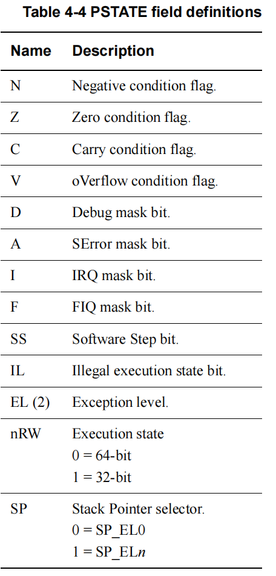

# 状态寄存器

CPU 运行的时候会有一定的状态，比如说目前正处于哪个特权等级，计算结果是否溢出等等。状态寄存器就是指示这种状态的寄存器。在功能上，这种寄存器一般被软件读取，来查看当前处理器的状态。

Arm 中的状态寄存器被叫作 CPSR (Current Processor Status Register) 。有趣的是，这个寄存器并不是真实村子啊的，有些 predicate 指令可以读取这个寄存器来判断是否具有执行效果，但是并不存在 `mrs cpsr, x0` 这样的读取 CPSR 的指令。我们可以读取这个寄存器的某些位域，比如说 `CurrentEL` 。

我们真正可以读取的寄存器被叫作 SPSR (Saved Processor State Register) ，当异常发生时，CPSR 中的处理器状态将保存在 SPSR 中，在异常返回使将 SPSR 中的值恢复到 SPSR 中。也就是说，SPSR 并不是一个状态寄存器，而是一个 **状态寄存器现场** 。SPSR 寄存器的作用是两方面的，一方面我们可以读取其中的值来了解 CPU 的运行状态，另外我们可以写入 SPSR 来修改 CPU 的运行状态。

在 Armv8 中，CPSR （CPSR 是 Armv7 的概念）则对应的是 PSATE (Processor STATE) 寄存器。总之这些概念比较混淆，了解意思即可。

# SPSR

SPSR 位域情况如下：


含义如下：

| 名称 | 位域    | 含义                                                |
|------|---------|-----------------------------------------------------|
| N    | 31      | 负数标志位                                          |
| Z    | 30      | 零标志位                                            |
| C    | 29      | 进位标志位                                          |
| V    | 28      | 溢出标志位                                          |
| SS   | 21      | Software Step, 在异常发生时，Software Step 是否开启 |
| IL   | 20      | 非法执行状态位                                      |
| D    | 9       | 程序状态调试（Debug）掩码                           |
| A    | 8       | SError（系统错误）掩码位                            |
| I    | 7       | IRQ 掩码位                                          |
| F    | 6       | FIQ 掩码位                                          |
| M    | 4       | 异常发生时的执行状态 ，0 表示 AArch64               |
| M    | \[3:0\] | 异常发生时的异常级别                                |

# 处理器状态

AArch64 没有直接与 ARMv7 当前程序状态寄存器(CPSR)等价的寄存器。在 AArch64 中，传统 CPSR 的组件作为可以独立访问的字段提供。这些状态被统称为处理器状态(PSTATE)。

独立访问的形式如下：

``` asm
mrs     X0, CurrentEL
```

这些寄存器包括：



`PSTATE.{N, Z, C, V}` 字段可以在 EL0 级别访问。 其他的字段可以在 EL1 或更高级别访问，但是这些字段在 EL0 级别未定义。

另外提一嘴，到了 A64 时，并不是所有指令都会影响 PSTATE 的标志位了，只有数据处理中的算术逻辑运算指令和比较指令会影响状态位。
