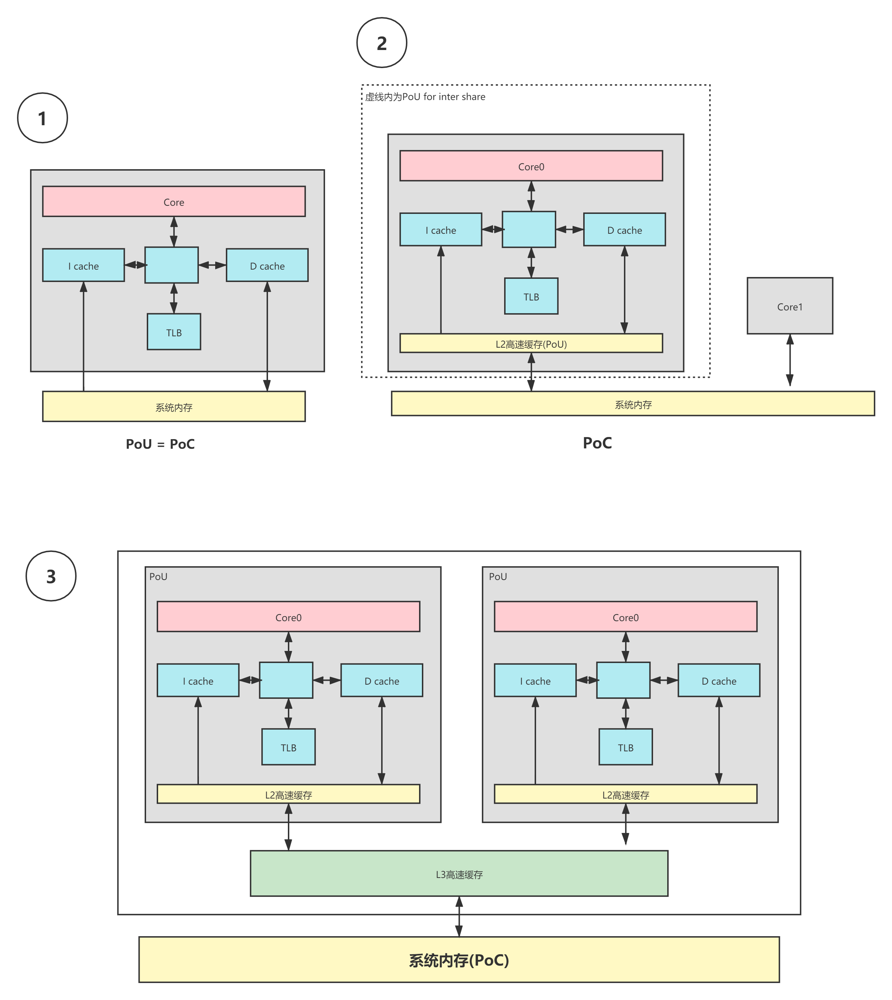

# PoU and PoC

Point of Unification(PoU) 和 Point of Coherency(PoC) 是 Arm 为了描述 Cache 的一致性提出的两个概念。我个人觉得它们是具有某种特性的缓存结构，具有这种特性的缓存之上的观察者们，一致性得到了一定的保证。

PoU 指的是在 **一个 CPU Core** 内的 icache, dcache, MMU, TLB 看到的是同一份数据拷贝，即它们具有一致性。它强调的是，在一个 **单系统** 中的各个组件间保持一致性。l2 Cache 就可以被理解成一个 PoU ，因为 l1-icache, l1-dcache, MMU 都共享 l2cache 。PoU 的但系统往往是一个 CPU Core (PE) 有时也是一个 Inner Share 。

PoC 指的是在 **整个硬件系统** 下内的所有 CPU Core, DMA, GPU, DSP 看到是同一份数据拷贝，它要比 PoU 的格局要更大一些。它强调所有有权访问内存的设备间的一致性。外部的 l3 Cache 或者 Memory 一般是 PoC 。

两者的举例如下所示：

# Cache 指令

Armv8 的 Cache 指令非常复杂，它由多个参数组成，分别指定了针对 Cache 的操作、类型、范围、Point(就是 PoU 还是 PoC) 。

在操作（function）方面，Armv8 提供了 3 种方式：

- Invalidate: 无效化，指的是将 cache line 的 Invalidate bit 置位，这样下次访存的时候就会重新从下一级中读取。
- Clean: 清除，指的是将标记为 dirty 的 cache line 主动写回下一级缓存中，但是对于没有标记为 dirty 的 cache line 不进行处理。
- Zero: 清零，将对应的 cache line 数据置零。这种方式看起来没有什么道理可讲，但是对于即将进行清零的内存操作来说，直接清零 cache 可以提高效率。

在类型（type）方面，Armv8 提供了按照地址，按照 Way/Set, 全部 Cache 操作三种方式。

在 Point 方面，从上面一章的知识补充可以得知，它表示了某一个特定的缓存结构。以 invalidate PoU 为例，可能它只会将 l1 cache l2 cache 进行无效化，而对 memory 中的目标依然有效。

指令的具体格式如下：

需要强调的是，这些操作并不互斥，可以同时进行 Invalidate 和 Clean ，这也更加合理。此外，这些参数并不能自由组合，而是组成特定的几种，如下所示：

