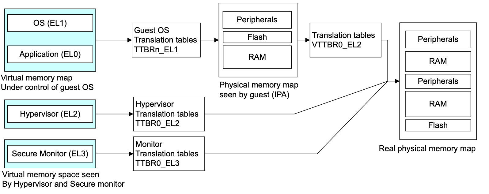
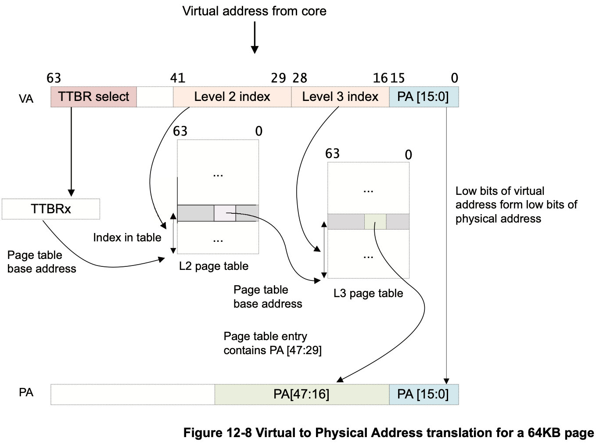

# 基本知识

MMU(Memory Manage Unit) 由 TLB(Translation Lookaside Buffer) 和 Table Walk Unit 组成，如下所示：

物理内存会被分割成一个个独立的单位，每个独立单位都具有一片连续的内存，这种结构被叫作“页”（Page），也被叫作“块”（block）。这篇内存的大小（Page Size）一般有 4KB, 16KB, 64KB 的多种选项，这也叫作内存的粒度（Granule）。之所以说每个物理页面是一个独立单位，是因为一个页面内的所有内存具有相同的权限（Permission）和属性（Attributes），被当作一个单位管理。

处理器核心（在 Arm 中也被叫作 PE, Precessing Element）发出的是虚拟地址（VA, Virtual Address），需要映射到物理地址（PA, Physical Address），这个过程被叫作翻译（Translation）。因为虚拟化的存在，翻译过程又可以分为单阶段（Stage）的翻译和多阶段的翻译。

翻译依据的结构被称为页表（Table），页表也因为异常等级、虚拟化和安全等考虑而产生了多个，因为一套完整的翻译流程（使用了不同 table ，有不同阶段）被成为“翻译机制”（Translation Regime）。因为 Armv8 采用硬件翻译，所以页表数据必须符合一定的格式，这个格式被叫作描述符（Descriptor），具体又有 Table Entry 等具体的格式。需要注意翻译的本质是将一个虚拟页表号和一个物理页框号对应起来，虽然地址是 64 位的，但是页框号不是 64 位，所以节省下来的位数可以用来描述这个条目的属性。如下所示：

在一次翻译过程中，输入的虚拟地址被称为 Input Address, IA ，而输出的物理地址被称为 Output Address, OA 。在虚拟化场景下，经过 Stage1 翻译出来的结构被成为 Internal Physical Address, IPA, 它会被送入 Stag2 进而变成 OA 。也就是如下过程：

硬件按照多级页表一层层查找的过程被叫作“遍历”（walk），如下所示：

# 相关寄存器

## 空间 0 和空间 1

虽然虚拟内存是同一片空间，但是实际上被分割成了两片，一片从 `0x0` 开始向上增长，而另一篇则从 `0xFFFF_FFFF_FFFF_FFFF_FFFF_FFFF_FFFF_FFFF` 往下递减。

低地址区的空间常用标号 `0` 来描述，用于用户进程，Hyperviosr, Secure Monitor 等软件，而高地址区的空间常用标号 `1` 来描述，一般用于内核进程。

## TCR

TCR(Translation Config Register) 是翻译过程的配置寄存器，他是一个 banked register ，分别在 EL1 ~ EL3 有对应的寄存器。 `tcr_el1` 结构如下：

首先需要强调，因为没有 `tcr_el0` ，所以 `tcr_el1` 控制 EL1 和 EL0 的管理功能。其结构域如下：

- `TGx`: Translation Granule ， `TG1` 和 `TG0` 字段分别给出高地址区和低地址区的颗粒大小， `00=4KB, 01=16KB, 11=64KB`
- `TxSZ`: 高地址区和低地址空间的大小是 $2^{64-TxSZ}$ ，之所以有一个减法的设置，是一种抹除高地址的运算，比如 `TxSZ` 取 `25` ，那么 MMU 就会忽略一个地址的高 25 位，也就是 `[63:39]` 。
- `TBI`: Top Byte Ignored, 与高地址的全 1 和全 0 有关

其他的域可以在官方[文档](https://developer.arm.com/documentation/ddi0601/2024-03/AArch64-Registers/TCR-EL1--Translation-Control-Register--EL1-)中找到。

因为在 EL2 和 EL3 是没有高地址区的，所以他们只有标号为 `0` 的域，如下所示：

## TTBR

TTBR(Translation Table Base Register) 用于保存页表的基地址，他也是 banked register，其结构如下：

| 异常等级 | 低地址区    | 高地址区    |
|----------|-------------|-------------|
| EL0      | NULL        | NULL        |
| EL1      | `ttbr0_el1` | `ttbr1_el0` |
| EL2      | `ttbr0_el2` | NULL        |
| EL3      | `ttbr0_el3` | NULL        |

## MAIR

MAIR(Memory Attribute Indirection Register) 共 64 位，被分为了 `0 ~ 7` 这 8 组。这八组分别表示 8 种可配置的内存属性，涉及缓存策略和共享策略等，具体的编码在[官方文档](https://developer.arm.com/documentation/ddi0595/2021-12/AArch64-Registers/MAIR-EL1--Memory-Attribute-Indirection-Register--EL1-)中可以找到。

在每个页表项的 `[4:2]` 位，会指定 MAIR 中的 8 组属性中的一种，用来表示具体物理页面的属性。

## SCTLR

虽然 [[ARM SCTLR]] 不是专有的内存管理寄存器，但是我们需要在开启 MMU 的时候用它，是第 0 位，置 1 表示开启 MMU 。
