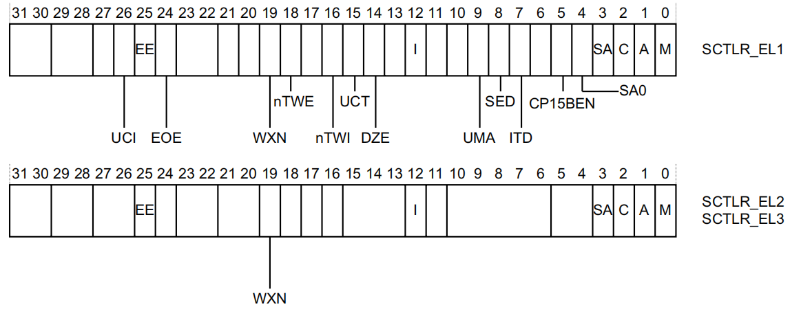

# 系统寄存器

ISA 中有很多系统寄存器，这些寄存器用于配置各种设备，似乎非常复杂，各种寄存器的功能似乎并不正交，就比如 [[ARM CPSR]] 中有关于中断的域，而 SCTLR 中也有关于中断的域；[[ARM MMU]] 中关于 MMU 配置的域，SCTLR 中也有关于 MMU 配置的域。如此繁复，如何是好？我觉得可以从两个方面去理解：

首先系统寄存器其实分为两种，即配置寄存器和状态寄存器。 **配置寄存器** 可以看作一种更偏向于“只写”的寄存器，软件开发者向这个寄存器写入特定的值，硬件读取这个配置并按照它进行工作。而 **状态寄存器** 则可以看作一个“只读”寄存器，硬件将反映自身状态的值写入这个寄存器，然后软件开发者通过读取这个寄存器来知晓机器的运行状态。前者类似于 SCTLR ，而后者类似于 CPSR 。

另外就是应当注意寄存器的作用范围，寄存器往往是一个设备和 CPU 通信的一种接口，因为通信很复杂，所以往往是几个寄存器来组成一个设备的接口层，比如说 MMU 就由 `TCR, TBBR, MAIR` 等寄存器来描述，将寄存器分类可以有效减少复杂度。此外，应当注意到，有些寄存器是具有 **统帅性质** 的，也就是可以管理其他寄存器组，比如说将要介绍的 SCTLR(System Control Register) 。

# 介绍

SCTLR 按照上上面的约定，应该属于配置寄存器，同时是用于管理全局的寄存器，它的作用域如下：

有如下作用域：

| 名称 | 位 | 含义 |
|----|----|----|
| `EE` | 25 | 异常字节顺序： `0` 小端， `1` 大端 |
| `EOE` | 24 | EL0 显式数据访问的字节序： `0` 小端， `1` 大端 |
| `WXN` | 10 | 写权限不可执行 XN (eXecute Never)： `0` 可写区域不设置不可执行权限， `1` 可写区域强制为不可执行 |
| `nTWE` | 18 | 不陷入 `wfe` ，为 `1` 表示 `wfe` 作为普通指令执行 |
| `nTWI` | 16 | 不陷入 `wfi` ，为 `1` 表示 `wfi` 作为普通指令执行 |
| `UCT` | 15 | 为 `1` 时，开启 AArch64 的 `EL0` 下访问 [[ARM CTR]] 寄存器 |
| `I` | 12 | 为 `1` 时，开启 Instruction Cache |
| `C` | 2 | 为 `1` 时，开启 Data Cache |
| `ITD` | 7 | 是否禁用 `itd` 指令： `0` 不禁用， `1` 禁用 |
| `SA0` | 3 | EL0 的栈对齐检查使能位 |
| `A` | 1 | 对齐检查使能位 |
| `M` | 0 | MMU 使能位 |
