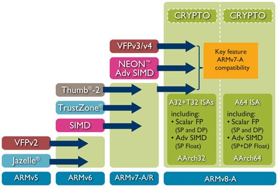
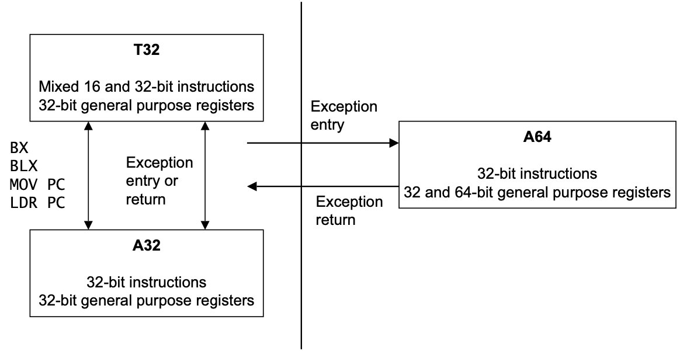

# 名称

Arm 的名称非常混乱，这里理清一下：

像 `ARMv7, ARMv8` 这种是架构名，是硬件的具体技术规范，是最为宏大的概念。比如说 [[Intel]] 家的 `I3, I5, I7` 或者奔腾也是架构名。

而 `Armv8` 为了兼容性的考量，存在 32 和 64 位两种子架构，这两种子架构分别被成为 `Aarch32` 和 `Aarch64` 。它们同时还是 Armv8 处理器的两种状态，因为处理器可以在 64 位指令集和 32 位指令集之间切换，所以需要两个状态的名字来表示当时使用的是 64 还是 32 位指令。不可能在单个应用程序中使用来自两个执行状态的代码（但是多个程序就可以了）。

而 `A32, A64` 这些名字是 ISA 的名字，他们分别在 Aarch32 和 Aarch64 上运行，他们和 Intel 的 [[X86]] 指令集概念是类似的。为了满足不同的需求，Arm 的处理器上往往可以运行多种指令集，比如说 [[Thumb]] 和 [[Neon]] 都是特殊的指令集。此外，之前运行的 32 位指令集其实就叫作 ARM ，但是在 64 位指令集出现后，又将原本的 32 位 ARM 指令集称为 A32 。属于是“老子随儿子姓”了。

需要强调的是，和 Thumb 是 16 位和 32 位的混合指令集不同，A64 和 A32 并不是一套指令集的两个部分，A64 并不能兼容 A32 指令集。

在一些软件开发中，会出现 `arm64` 的字样，这个并不是 ARM 的官方名称，它只是描述了一种 Arm 公司的 64 位的 ISA ，比如说 Armv9 的指令集，也可以算入 `arm64` 的范畴。

# 汇总

- [[ARM CPSR]]
- [[ARM SCTLR]]
- [[ARM MMU]]
- [[ARM CTR]]
- [[ARM Cache]]
- [[ARM PMU]]
- [[ATF]]
