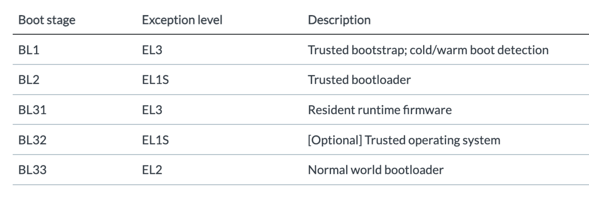

ATF 即 Arm Trusted Firmware 。它的目的是为了在 bootflow 中构建一个信任链。

它的各个阶段如下所示：

而执行流程如下：

- BL1 是信任链首部，是不可变的高权限。其核心目的是配置 EL3 。
- BL2 的核心目的是配置安全世界。是运行在安全世界 EL2 或者 EL1 的，用于初始化安全世界的页表。在 BL2 结束后，会通过 `SMC` 回到 BL1 。
- BL3 的核心目的是加载镜像
  - BL3-1 用于重新配置 `SMC` 向量表（之前被 BL1 配置过）。
  - BL3-2 用于加载 Secure World 的 OS 。
  - BL3-3 用于加载 Normal World 的 Bootloader ，更具体而言，一般是开始加载 UEFI 或者 uboot 了。
