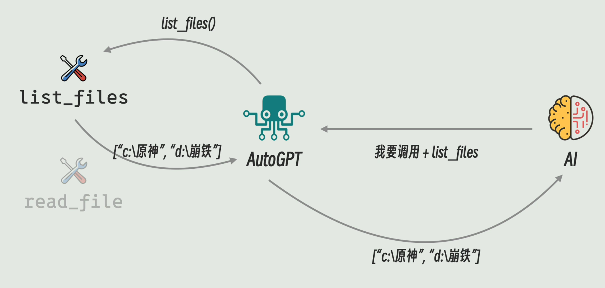
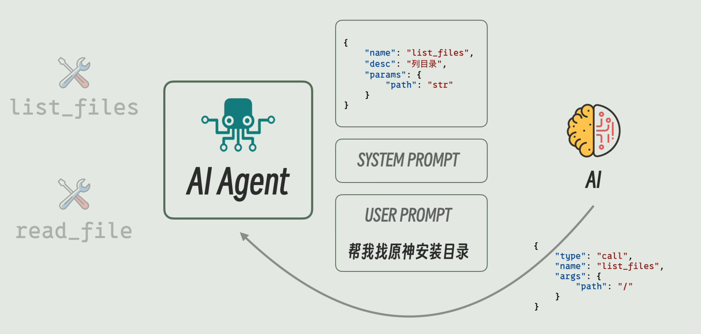
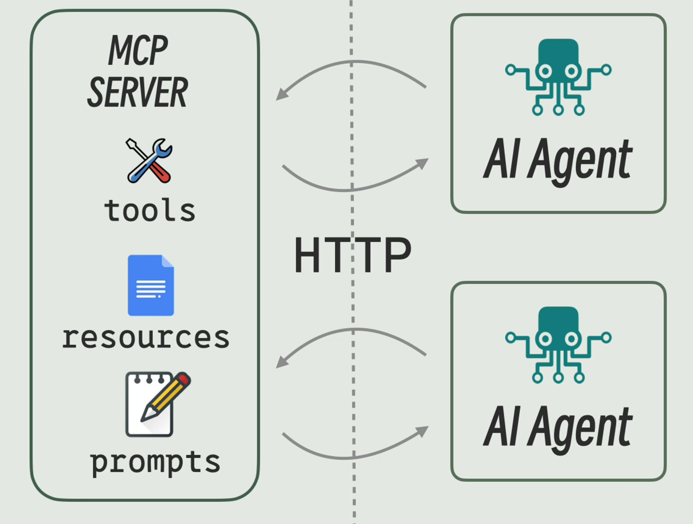

# System Prompt

预训练的 LLM 的表现不仅仅取决于模型参数，还取决于提示词（prompt）的内容。

而那些为 LLM 提供“背景知识”、“人物设定”的 prompt ，就被称为 System Prompt ，系统提示词与用户实际的问题无关，但是却很能影响最终的效果。

# Agent

LLM 是语言模型，所以这就决定了它基本上只会“打嘴炮”，而没有办法利用工具。

Agent 是为赋予 LLM 操纵工具的能力而设计的。它运行在 local 里，可以看作是一个 system prompt 生成器和工具（Tools）的调用器。

初代的 Agent（如 AutoGPT）会记录 local 中可以使用的 Tools 的信息，当用户使用时，就根据 Tools 的信息生成 System Prompt 并发给大模型，大模型会根据 Tools 提供的 Tools 的信息，生成对应的调用信息并发给 Agent ，Agent 会根据调用信息来使用 Tools ，并将结果传回 LLM 。

这样就相当于 Agent 以代理的形式拓宽了 LLM 的能力，如下图所示，左侧的为 Tools ，右侧的为 LLM：

# Function Call

在 Agent 与 LLM 进行通信的时候，由于输出的不稳定性，LLM 可能并不能正确生成回答，并通过 Agent 调用 Tools 。当遇到这种情况时，就需要 Agent 重发请求，这就对 LLM 资源是一种浪费。

如果我们可以统一 system prompt 中关于 Tools 信息的格式和 LLM 调用 Tools 的信息，并按照格式对 LLM 进行训练或者微调，那么就可以提高 LLM 的准确度。

这种统一的标准我们就称之为 Function Call ，它的本质是一种对于 System Prompt 的标准化，如下所示：

但是为 LLM 引入 Function Call 需要额外的训练成本，所以并不是所有的 LLM 都支持 Function Call 。

# MCP

而 Agent-Tools 侧，Agent 存在一个“掌握 Tools 信息”的过程。而这个过程如果缺少标准化，那么就会导致 Agent 和 Tools 的开发量都会很大（又从 M + N 问题变成了 M × N 的问题）。

MCP(Model Context Protocol) 就是解决这个问题的，它规定了 Agent-Tools 的通信协议，它称 Tools 为 MCP Server（从图上可以看出，并不只有 Tools, 还包括 Resources 和 Prompt），称 Agent 为 MCP Client 。两者的通信可以通过 `stdio` ，也可以通过 `HTTP` ：

从图上可以看出，MCP 协议其实与 LLM 无关。有一说一，我觉得 MCP 和 Function Call 的名字应该调换一下。
