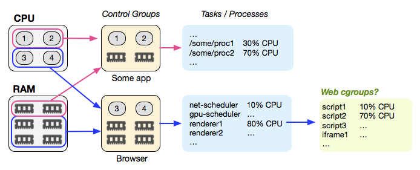
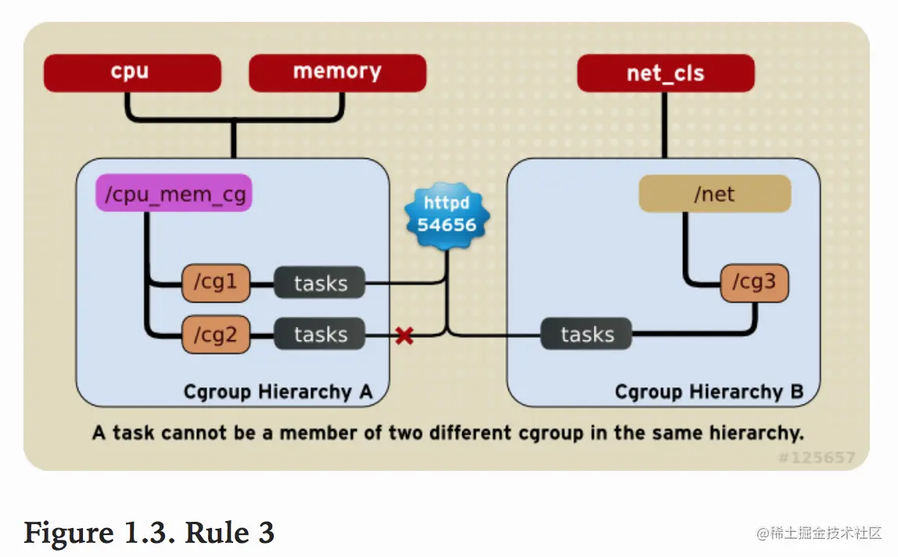

# 功能

Linux cgroups 的全称是 Linux Control Groups，它是 [[Linux]] 内核的特性，主要作用是限制、记录和隔离进程组（process groups）使用的物理资源（cpu、memory、IO 等）。

cgroups 从设计之初使命就很明确，为进程提供资源控制，它主要的功能包括：

- 资源限制：限制进程使用的资源上限，比如最大内存、文件系统缓存使用限制
- 优先级控制：不同的组可以有不同的优先级，比如 CPU 使用和磁盘 IO 吞吐
- 审计：计算 group 的资源使用情况，可以用来计费
- 控制：挂起一组进程，或者重启一组进程

目前 cgroups 已经成为很多技术的基础，比如 [[LXC]]、[[Docker]]、[[Systemd]] 等。

# 子系统资源

subsystem 子系统，具体的资源控制器（resource class 或者 resource controller），控制某个特定的资源使用。

目前有下面这些资源子系统：

- Block IO（blkio)：限制块设备（磁盘、SSD、USB 等）的 IO 速率
- CPU Set(cpuset)：限制任务能运行在哪些 CPU 核上
- CPU Accounting(cpuacct)：生成 cgroup 中任务使用 CPU 的报告
- CPU (CPU)：限制调度器分配的 CPU 时间
- Devices (devices)：允许或者拒绝 cgroup 中任务对设备的访问
- Freezer (freezer)：挂起或者重启 cgroup 中的任务
- Memory (memory)：限制 cgroup 中任务使用内存的量，并生成任务当前内存的使用情况报告
- Network Classifier(netcls)：为 cgroup 中的报文设置上特定的 classid 标志，这样 tc 等工具就能根据标记对网络进行配置
- Network Priority (netprio)：对每个网络接口设置报文的优先级
- perfevent：识别任务的 cgroup 成员，可以用来做性能分析

# VFS

cgroup 内核功能比较有趣的地方是它没有提供任何的系统调用接口，而是对 linux vfs 的一个实现，因此可以用类似文件系统的方式进行操作。

我个人直观感觉是这样的，我们可以把某个 subsystem 或者某几个 subsystem 挂载到目录上，这个目录里的子目录就表示不同的 cgroup ，group 里有 `tasks` 文本文件，里面记录着属于这个 cgroup 的进程号，如下所示：

我们把 CPU 和 Memory subsytem 挂载到了 `/cpu_mem_cg/` 这个目录下，把 netcls subsystem 挂在到了 `/net/` 这个目录下。 `/cpu_mem_cg/` 下有 `cg1, cg2` 两个 cgroup ，他们占据了不同的 CPU 和内存资源，对应 `/cpu_mem_cg/cg1/` 和 `/cpu_mem_cg/cg2/` 两个文件夹，而 `/net/` 下只有 `cg3` 一个 cgroup ，对应 `/net/cg3/` 文件夹。其中 httpd 进程的 `PID` 是 `54656` ，这个 PID 在 `/cpu_mem_cg/cg1/tasks, /net/cg3/tasks` 文件中都有记录。
