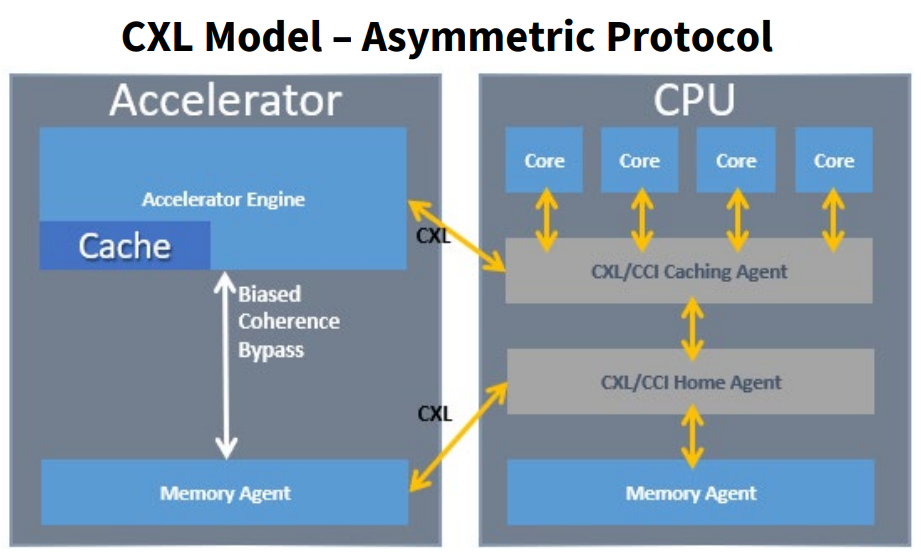

Compute Express Link (CXL) 是一种开放式互连新标准，面向 CPU 和专用加速器的密集型工作负载，这些负载都需要在主机和设备之间实现高效稳定的存储器访问。

CXL 相比于 [[PCIe]] 不再存在一致性问题，同时也更加向着 AI 加速器特化总线方向发展。这里说的“一致性（Coherence）”指的是缓存 Cache 的一致性。PCIe 这样的设备，对于 cache 是无能为力的，它们能做的就是用 DMA 的方式去访问内存，而 CPU 会用 MMIO 的方式访问设备（和 DMA 不是同一片）。无论是 DMA 的内存，还是 MMIO 的内存，对于 CPU 来说，往往是不经过 cache （bypass cache）的，原因也很好理解，有多方（CPU, Device）都在修改内存，如果 CPU 刚用 cache 对内存进行了备份，这个内存就被 Device 改了，那么 cache 里的内容就失效了（出现了不一致性）。因为无法利用 cache ，所以 PCIe 在这个部分的性能存在一定的问题。

而 CXL 是考虑到 cache 的一致性的，所以经 CXL 连接的 CPU 和 Device ，没有必要只用内存作为数据共享的中介，它们甚至可以使用 Cache 作为共享中介。

在这种思路下，CXL 架构将具有不同性能特征的存储（包括内存和 cache ）分开，并尝试将每个页面放置在适当的层中。一个典型的例子是将“热”（经常访问的）页面放置在快速、近的层中（比如说 L1 Cache），而冷页面可以放置在更远的地方（比如说内存）。任何一个页面是否“热”最终都是由用户决定的。

PCIe 的 Host-Device 设计中，还是以 Host （也就是 CPU）为核心，是一种不对称（asymmetric）的设计。而 CXL 这样的设计，双方在设计上应该会更加对称。
