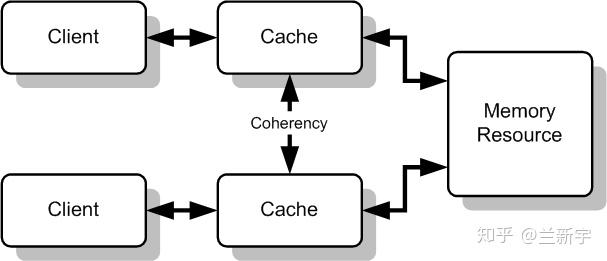
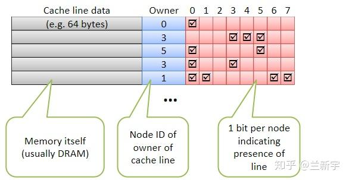
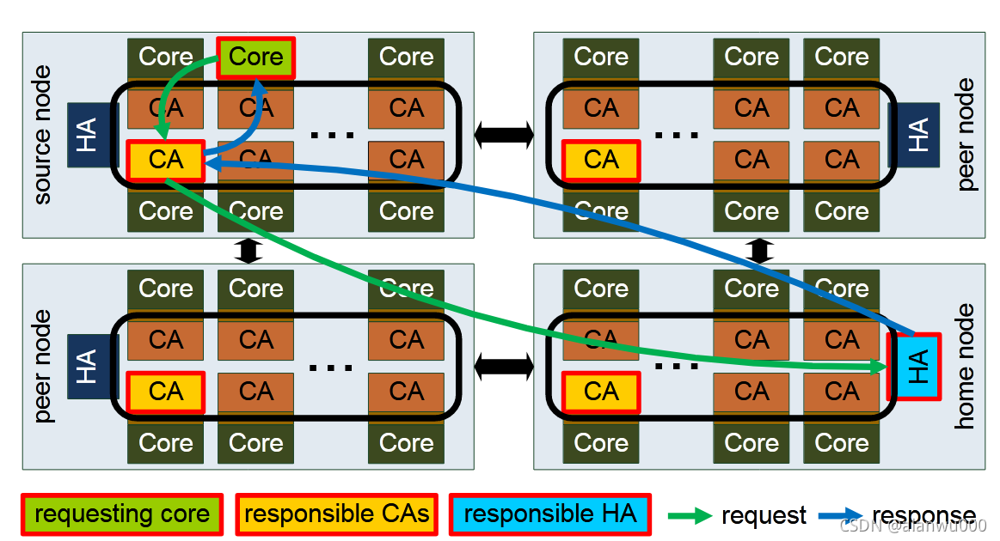

# 定义

Cache Coherency 指的是在多核系统中，不同核上的 Cache 应当保持一致，因为他们都是内存的拷贝。效果如图：

而更加本质的来说，所有被纳入 CC 的存储元件，在逻辑上就被视作了相同的一份数据的不同“分身”。包括内存，各级缓存，本质上都是同一份数据，我们写 cache 就等于写 memory 了。维护这种一致性依靠的是 CC 的硬件机制，省去了软件编程人员手动维护的开销（比如说缺页异常和页面逐出算法就是软件在维护内存与外存的一致性）。

与之形成对比的就是 [[PCIe]] 设备 private 的存储，需要显式地用 DMA 搬运到 memory 中，或者用 MMIO 的方式去读写。这种方式增加了软件开发的难度，同时性能也不高，所以我们现在主张通过 [[CXL]] 这样支持 CC 的设备总线协议，来将设备的 private memory 也纳入 CC 的范畴，相当于 device private memory 也变成 host memory 的一个备份了。

# 实现

## Update vs Invalidate

如果从如何传播新值的角度，可以分为写更新协议（Write-Update）协议和写无效（Write-Invalidate）协议。在写更新协议中，写值的 Core 会把自己的写入的值传递给其他 Core 的 Cache 。而写无效协议中，写值的 Core 会把自己的写入的值在其他 Core Cache 中的备份给无效掉，等其他 Core 需要这个值的时候，会再次从内存中读取。

写更新的优点是，一旦某 Cache 缓存了某一变量，它就一直持有此变量的最新备份，除非此变量被替换掉。其缺点是：写数的处理器核每次都得把所写的值传播给其他处理器核，即使其他处理器核不再使用所写的共享块。

写无效协议的优点是：一旦某处理器核使某一变量在所有其他 Cache 中的备份无效后，它就取得了对此变量的独占权，随后它可以随意地更新此变量而不必告知其他处理器核，直到其他处理器核请求访问此变量而导致独占权被剥夺。其缺点是：当某变量在一处理器核中的备份变无效后，此处理器核再读此变量时会引起 Cache 不命中，在一个共享块被多个处理器核频繁访问的情况下会引起 [[Cache Thrash]] 。

## Snoop vs Directory

Snoop （嗅探或者侦听，BTW ，史努比的英文就是 Snoopy）的基本思想是，当一个处理器核对共享变量的访问不在 Cache 命中或可能引起数据不一致时，它就把这一事件广播到所有处理器核。系统中所有处理器核的 Cache 都侦听广播，当拥有广播中涉及的共享变量的 Cache 侦听到广播后，就采取相应的维持一致性的行动（如，使本 Cache 的备份无效、向总线提供数据等）。侦听协议实现较简单，每个处理器核 Cache 只需要维护状态信息就可以了。

由于侦听协议需要广播，因此只适用于共享总线结构。总线是一种独占式资源，且总线延迟随所连接的处理器核数目的增加而增加，存在可伸缩性差的问题。在采用片上网络互连的多核处理器中通常使用基于目录的 Cache 一致性协议。目录协议的主要思想是，为每一存储行维持一目录项，该目录项记录所有当前持有此行备份的处理器核号以及此行是否已被改写等信息。当一个处理器核欲往某一存储行写数且可能引起数据不一致时，它就根据目录的内容只向持有此行的备份的那些处理器核发出写使无效/写更新信号，从而避免了广播。

典型的目录组织方式为位向量目录。位向量目录中的每一目录项有一个 `n` 位的向量，其中 `n` 是系统中处理器核的个数。位向量中第 `i` 位为 `1` 表示此存储行在第 `i` 个处理器核中有备份。每一目录项还有一改写位，当改写位为 `1` 时表示某处理器核独占并已改写此行。位向量目录的缺点是，所需的目录存储器容量随处理器核数 `n` 以及共享存储容量 `m` 的增加以 `O(m x n)` 的速度增加，有较大存储开销。目录结构如下：

## Cache 状态

在单核系统上，Cache 的状态只有 2 种，valid 和 invalid 。那么现在是不是也可以只有 2 种状态呢？我觉得是可以的，无论是写无效协议还是写更新协议，只有这两种状态都是没有问题的，我们每次写值的时候都 snoop 或者 directory 就好了。

但是这种 2 状态的方式存在开销过大的问题，试想一下，每当我们写一个值的时候，我们就需要 snoop 或者 directory 一次，就很麻烦，有没有中可能，我们写的值，只在当前 Core 上有备份，那么我就没有必要在告诉别的 Core 了。这种情况非常多见，既因为不同 core 有不同 cache 就是正常的，而且如果采用写无效协议的话，那么写过后就一定是独占的了。

所以基于此我们提出了 ESI 状态，也就是 Exclusive, Shared, Invalid 3 种状态，将原本的 Valid 用 Exclusive 和 Shared 代替，借此我们可以区分一个 cache line 是否是独占的。其状态转移图如下：

更进一步，还会有 MESI, MOESI 等状态，都是通过细化状态，来减少不必要的一致性开销。

# CHA

CC 的实现，在 [[Intel]] 中依赖的是 Cache Agent, CA 和 Home Agent, HA ，两者也合称 Cache and Home Agent ，CHA 。

我个人感觉是这样的，CPU 在访问 Memory 的时候也是有一定的硬件机制的，CPU 直接沟通的就是 Home Agent ，它相当于是内存（或者是 memory controller）的一个 Agent ，用于让 CPU 更加方便地访问。Cache Agent 也是类似，它相当于是让 Cache 可以被 CPU 更加方便地访问。之所以说 CHA 在维护 CC ，可能是因为一致性的维护就是在 CPU 访问 Cache 和 Memory 的时候。

更具体来说，每个 core 中都有一个与之对应的 CA，同时在每个 Memory Controller 中实现一个 HA(Home Agents)。如果内核需要的读数据不在本地 L1 和 L2 中，core 会首先发送请求给 CA，CA 会在本地 L3 或者其他 L1/L2 Cache 中寻找数据。如果发生 Cache Miss，CA 会将内核读请求发个 HA，HA 在 memory 中找到对应地址数据并返回。

下面这幅图我觉得有些问题，因为 core 的请求被另一个 core 的 CA 响应了，而不是自己的 CA。我觉得可能是因为这幅图少了一些路径，core 应该先询问自己的 CA ，然后发现 miss 了，然后自己的 CA 查询其他 Cache ，发现在某个 cache 中，所以由那个 CA 来响应，但是那个 CA 自己的 value 又失效了，所以采取 HA 中查找（不保真）。

Intel 使用两种监听模式：source snooping 和 home snooping。

source snooping 模式，监听信息由 CA 发送。如果 L3 Miss 发生，CA 会广播监听请求到其他 CA 和 HA。如果其他 CA 的状态为 modified，exclusive 或 forward，那么会将 CA 对应的 cache line 数据返回。HA 会搜集所有监听响应，解析冲突，必要时提供 memory 中的数据。该模式有更低的延时更高的效率，但它的带宽消耗非常高。

home snooping 模式，监听信息由 HA 发送。该模式下，CA 接收到内核请求后不会广播寻找，而是将所有请求全部转给 HA，HA 再发送监听信息给合适的 CA（拥有相同 cache line 的 CA）。由于 HA 存有 directory，因此 HA 可以精准请求 CA 得到最新的数据。该模式延时要高一点，但带宽会有效降低，同时 Cache性能提升明显。
