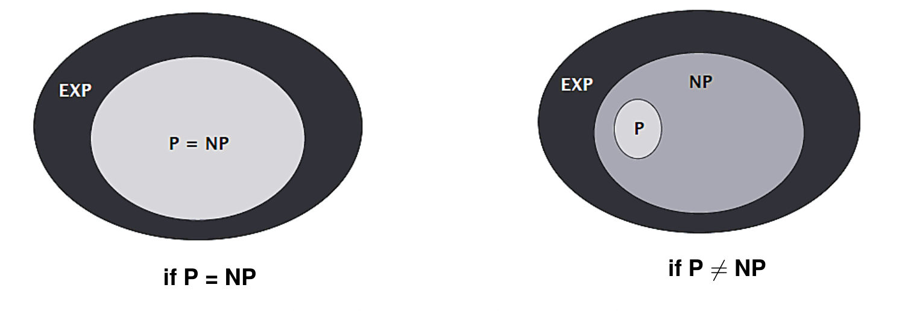

# 问题的规模

问题的规模，衡量它的指标就是输入的数据在二进制编码下的长度。正因如此，背包问题才不是传统的 $\text{P}$ 问题。

# 规约

规约（Reduce）是研究问题复杂性分类的一种重要工具，当我们说 $X$ 规约到 $Y$ ，即 $X \leq_{p} Y$ ，指的是：

- 我们可以在多项式时间内，将 $X$ 问题转换成对于 $Y$ 问题的求解
- 当 $Y$ 问题输出 yes 的时候， $X$ 问题也输出 yes
- 当 $Y$ 问题输出 no 的时候， $X$ 问题也输出 no

更具体一些，reduce 又可以分为 Cook Reduce 和 Karp Reduce 两种。Cook Reduce 更加灵活，可以多次调用 $Y$ ；而 Karp Reduce 更加严苛，只能调用一次 $Y$ ，并且 $X$ 和 $Y$ 的输出必须对应。可以看出，上面的定义更偏向于 Karp Reduce 。

直观来说，$X$ 的复杂度是不低于 $Y$ 的，我们使用这个性质来定义 $\text{NPC}$ 问题。在 $\text{NPC}$ 问题的定义中，我们使用的是 Karp Reduce ，而 Cook Reduce 则用于解决实际问题。

# P

在决策问题中，$\text{P}$ 问题指的是，给定一个输入，存在一个算法，可以在多项式时间内给出 yes or no 的结果。

而搜索问题（也就是求解问题），可以通过二分查找的方式，规约到决策问题，所以两者本质是等价的。

需要强调，$\text{P}$ 这个属性对应的是问题，而非具体的算法。无论多么简单的问题，我们都可以有一个指数级的复杂算法，这显然不能说明问题的难度。

# NP

$\text{NP}$ 问题（Nondeterministic Polynomial Time）指的是，在决策问题中，我们提供一个证书（certificate）和一个输入，存在一个算法（certifier）可以在多项式时间内给出 yes or no 的结果。整个证书的规模也必须小于等于输入的规模。

所谓的证书，往往就是一个“可能正确的答案”，我们的算法，也发生了从“求解”到“判别”的转变。

# EXP

$\text{EXP}$ 问题指的是，一个决策问题，给定一个输入，存在一个算法，可以在多项式时间内给出 yes or no 的结果。

严格意义上说，$\text{EXP}$ 才更像我们理解中的那种“非常难的算法问题”，而不是 $\text{NP}$ 。

我们有 $\text{P} \subset \text{NP}$ 。这是因为当我们给 $\text{P}$ 提供一个“空证书”的时候，就可以将它转变成一个 $\text{NP}$ 问题。

我们有 $\text{NP} \subset \text{EXP}$ 。这是因为我们可以遍历证书空间，给 $\text{NP}$ 提供所有证书，进而将其转成一个 $\text{EXP}$ 问题，而遍历是一个指数复杂度。

但是我们并不知道这三者是否相等：

# NPC

$\text{NP-Complete}$($\text{NPC}$) 是最难的一种 $\text{NP}$ 问题，所有的 $\text{NP}$ 问题都可以规约到 $\text{NPC}$ 问题。

为了证明一个问题 $Y$ 是 $\text{NPC}$ 问题，我们需要：

- 证明 $Y \in \text{NP}$
- 选择一个已知的 $\text{NPC}$ 问题 $X$
- 证明 $X \leq_{p} Y$

# Co-NP

$\text{co-NP}$ 的意思是 $\text{NP}$ 问题的补集（Complementary）。有一说一我对于这个概念理解得并不好，因为我并不知道什么是问题的补集。我只能说，$\text{NP}$ 问题的形式往往是“是否存在一个解，可以满足某个要求”，而 $\text{co-NP}$ 的形式则是“是否任意解，都不满足这个要求”。

在 $\text{NP}$ 问题中，我们可以将一个特例作为证书输入给验证器，而在 $\text{co-NP}$ 问题中，如果仅仅输入一个反例，显然是无法满足要求的。最为朴素的做法是输入所有的可能取值，并让验证器证明这些都是反例。但是这样的时间复杂度又太高了。总之，$\text{co-NP}$ 也是一个非常复杂的问题。

那么 $\text{NP} = \text{co-NP}$ 吗？目前没有定论，但是我们倾向于他们是不相等的。因为对于 $\text{P}$ 问题，有 $\text{P} = \text{co-P}$ ，当有 $\text{P} = \text{NP}$ 时，才能有 $\text{NP} = \text{co-NP}$ 。而我们知道 $\text{P} = \text{NP}$ 又不太可能。

那么 $\text{NP}$ 问题与 $\text{co-NP}$ 问题是完全没有交集吗？也不是，显然有 $\text{P} \subset (\text{NP} \cap \text{co-NP})$ ，但是我们不能确定是否 $\text{P}$ 问题就等于 $\text{NP}$ 问题与 $\text{co-NP}$ 问题的交集，也就是 $\text{P} = (\text{NP} \cap \text{co-NP})$ 。

# NP-hard

$\text{NP-hard}$ 与 $\text{NPC}$ 很相似，所有的 $\text{NP}$ 问题都可以规约到 $\text{NP-hard}$ 问题；而它与 $\text{NPC}$ 的不同点在于，$\text{NP-hard}$ 并不需要是一个 $\text{NP}$ 问题。也就是说，它可能比 $\text{NPC}$ 问题还要难。
