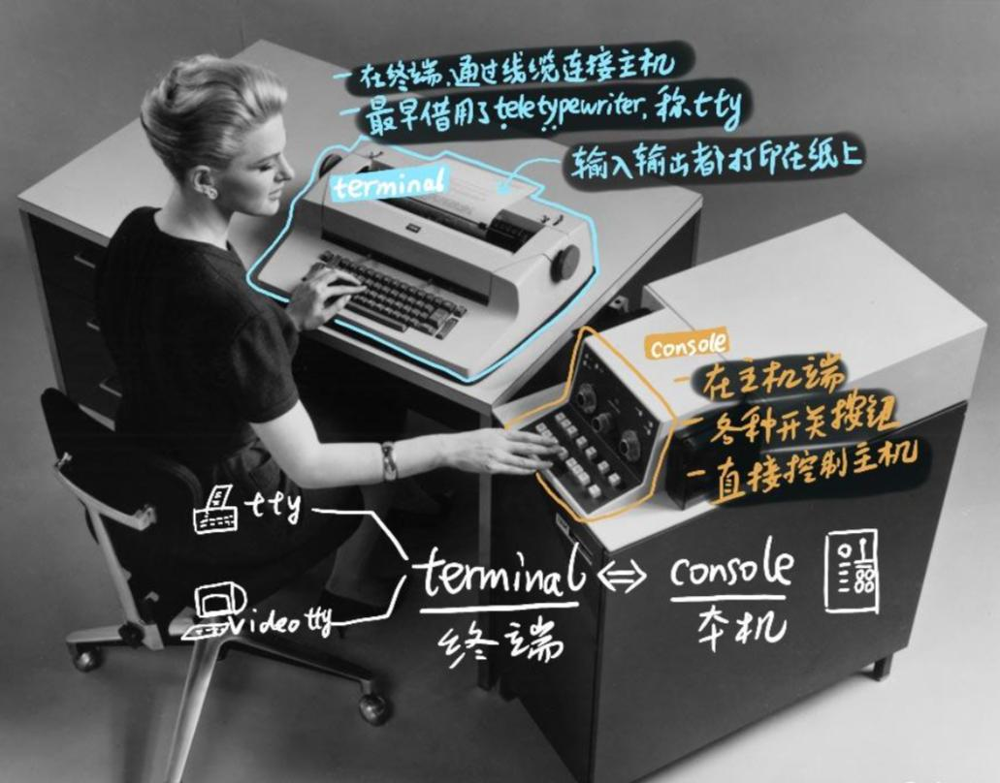
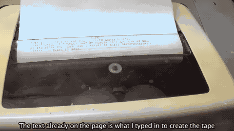

控制台（Console），终端（Terminal）和电传打字机（TTY）这三个概念都起源自“远古时期”，而在“现代”又失去了原本的实体（要不就不会这么难区分了），还衍生出了新的概念，所以事情变得更加复杂。搞清楚这些概念的关键有两点：

- 了解过去的时代背景
- 了解现在的引申含义

# 控制台 Console

在远古时代，计算机是一个庞然大物，一般长得就像一个四四方方的柜子。就像同样四四方方的冰箱上面会有电源指示灯一样，主机上同样会有一些指示灯和开关。而控制台（Console）的本质，就是一个长满指示灯、开关、旋钮的工作台，计算机操作人员，可以根据控制台上的各种指示灯，判断系统的工作状态，或者读取系统的输出。其本质是一个可以直接对硬件进行控制，并且监控硬件工作状态的物理面板。

它长成这个样子：


如果从 I/O 的角度去理解，那么可以将控制台理解成初代的 I/O ，这个 I/O 属于庞大计算机（或者说主机）的附庸，其目的也就是为了控制计算机的电源等很“机械”的作用。此外就是，一个计算机只有一个控制台，这种“唯一性”成了控制台现代概念的一个特性。

# 终端 Terminal

正是因为远古时代的计算机很大，而且控制台是唯一且笨拙的，所以终端应运而生。终端的概念是相对于主机而言的，正是因为主机资源稀缺，所以是多个用户共用一个主机，而建立在主机和用户之间的桥梁，就是终端。相比于控制台，它是一个更加完善的 I/O 设备，失去了计算能力。

放一章对比图：



可以看到终端是一个更加完善的 I/O 设备，而且可以一个计算机连接多个终端。

其实终端的实际意义一直很弱，而更接近一个抽象的概念，它是为了描述一个“失去计算能力，方便 I/O”的概念来存在的。我们也可以说现在的手机是一种相对于数据中心服务器的终端。

# 电传打字机 TTY

正因为终端是一个偏抽象概念，所以落实到实处的时候，TTY 就登场了，TTY(teletype) 就是一项具体的技术，也就是电传打字机，它长成这个样子：



它是随着电报技术的普及而普及的，人们将两台电传打字机通过（无线）电信号建立连接，当用户在其中一台机器上按下一个按键时，几百公里之外与之建立连接的另一台打字机上对应的击锤就会在电力的驱动下击向打印纸。可以看到 TTY 具有远程易用的特点。

当然随着 PC 的出现，这种“单主机-多终端”模式逐渐退出主流舞台。PC 可以看作一个主机（主板）和一个终端（键盘、鼠标、显示器等）紧密的联系在了一起。

# 后续演变

在后续的演变中，tty 这种具体的技术渐渐有了和终端（Terminal）完全类似的含义。也就说， Terminal = TTY 。比如说在 Linux 中用户无法找到类似 `/dev/terminal` 的设备，但是可以找到类似 `/dev/tty` 的设备。

而控制台 Console 已经不再是一个大的工作面板了，它演变成了一种更加抽象的概念，即“唯一的指示系统状态的设备”。而如果它需要和用户沟通，需要借助于 Terminal 。换句话说，现代的 console 看上去和 terminal 一样，只是它 I/O 的内容是更加系统级的，而且是唯一的。在内核启动的时候，我们需要给内核传递参数来指定 console 使用哪个终端，也就是 `console=ttyS0` 这样的语句。在某种意义上 `/dev/console` 和某个 `/dev/tty` 是等价的。

# 虚拟终端和伪终端

按理来说应该现在的 PC 应该只有一个终端，也就是在 Linux 只存在一个 `/dev/tty` 。而实际上 `/dev/` 下有多个 `tty` 设备，可以通过 `Ctrl + Alt + F1` 到 `Ctrl + Alt + F7` 进行切换，也可以通过 `chvt` 命令进行切换。一般 tty1 被登录界面占用，tty2 被桌面系统占用。这样的终端被称为虚拟终端（VT, Virtual Terminal）。

至于为什么要有虚拟终端这个功能呢？因为这样可以进行多任务处理（两个终端干不同的活儿）和故障排除（桌面环境崩了以后用其他终端修）。

然而仅有虚拟终端依然是不够的。因为现在经常采用 SSH 的方式进行远程连接，这种远程连接和电传打字机的原理是不同的，电传打字机的设备在 client 侧，而远程连接的时候，tty 是在 server 上的。所以 SSH 是没有办法使用 VT 的（因为 PC 的设计思路是主机和终端集成在一起，所以即使操作 VT 也需要在 Server 旁边操作）。

因为实际上 SSH 使用的是一种叫做伪终端的东西，伪终端设备都是以 `pts` 开头，它的表现和 tty 完全一致，应用程序感觉不到它的差别。

除了 SSH 外，GUI 界面下的终端模拟器，比如说 KConsole, Alacritty, Kitty ，利用的也是虚拟终端。

我们可以使用如下命令来判断自己所在哪个终端：

``` shell
tty
```
