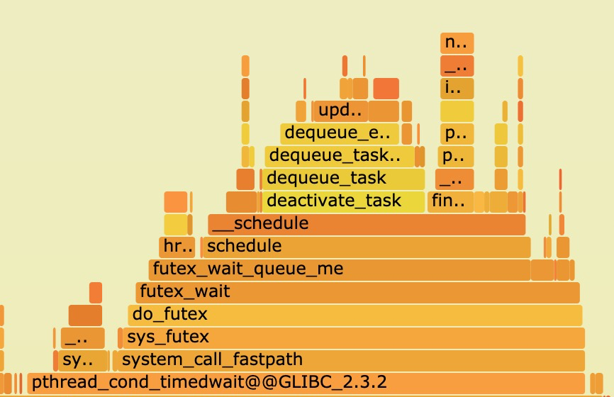

# 定义

CPU 的运行总是需要在一个环境中，也就是上下文 context 中。

我觉得上下文概念的核心是：

> CPU + Context =\> Function

# 种类

Context 有两种：

- **进程上下文** ：是程序（program）所拥有的上下文
- **中断上下文** ：是设备（device）所拥有的上下文

上面这种说法出于定义本质和简洁的考量，所以有些不直观。应该这样说，CPU 是用来进行计算任务的，那么谁会利用 CPU 来完成计算呢？其实有两个实体：

一个是程序，这个简直不言自明，用户程序或者说软件使用 CPU 来完成计算任务。操作系统负责 **调度** 这些任务，让这些任务能够更加高效的使用 CPU 。它们在操作系统看来是一个个的进程或者线程。

另一个是设备，当中断的理念引入系统后，会出现这样的情景：当一个磁盘控制器完成了对于磁盘块的搬运后，它会给 CPU 发送一个中断，它需要使用 CPU 来处理后续的任务。操作系统负责 **中断处理** 。

我感觉我很难再用语言下更加准确的定义了，所以我会列一个表格来展示它们的不同：

|  | 进程上下文 | 中断上下文 | 解释 |
|----|----|----|----|
| 场景 | 用户态运行，系统调用 | 中断处理 | 系统调用就是原本用户态的线程进入了内核态 |
| 切换 | 调度器调度 | 中断抢占 | 只要中断信号来临，就要处理中断 |
| 时序 | 同步 | 异步 | 进程内的执行都是同步的，而中断随时可能发生 |
| 正确性 | 线程安全 | 可重入 | 线程安全是可重入的必要非充分条件 |
| 优先级 | 低 | 高 | 只要中断来了，就要处理中断 |
| CurrentPCB | 有 | 无 | 中断并不依赖进程 |
| 感觉 | 完备的进程资源 | 内核启动的资源 | 更像是内核启动的那个上下文 |
| 执行流 | 每个进程一个执行流 | 所有中断共用一个执行流 | 所以中断嵌套更危险 |
| sleep | Yes | No | 中断不受调度器控制 |

# 上下文与安全

有一种很著名的攻击叫做栈溢出攻击，窃取的就是栈上的数据，以往提到栈溢出攻击，总是从“如何攻击栈”的角度去理解这件事情，但是其实还有另一个角度，就是“为什么要攻击栈”。

因为栈就是上下文的一个重要组成成分，窃取了栈就意味着窃取了大部分上下文，黑客就可以做很多为所欲为的事情了。

# 上下文切换的开销为什么这么大？

虽然同样都需要保存一定的上下文，函数调用的开销大约是在 10ns ~ 100ns 的级别（较小的函数可能在 10ns 以内），而 Linux context switch 的开销约在 1000ns ~ 10000ns 之间，差距大约是 20 多倍。系统调用的开销大约是 100ns 左右。

目前 CPU 的频率是 GHz 级别，也就是说，大约一个周期需要运行 1ns 以下的时间，可以看到 context switch 的开销是巨大的了。

这主要由两点因素导致：一个是上下文切换需要进行调度，调度的开销是巨大的；另一个是上下文切换导致了局部性被破坏（函数调用因为在栈上发生，所以局部性很好），导致性能降低，而这其中是页表项的缺失（函数调用同样没有这个问题）。

其他的具体数据可以参考[这里](https://www.cnblogs.com/cdaniu/p/15739058.html)和[这里](https://plantegg.github.io/2022/06/05/%E4%B8%8A%E4%B8%8B%E6%96%87%E5%88%87%E6%8D%A2%E5%BC%80%E9%94%80/)。
