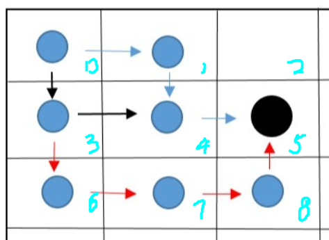
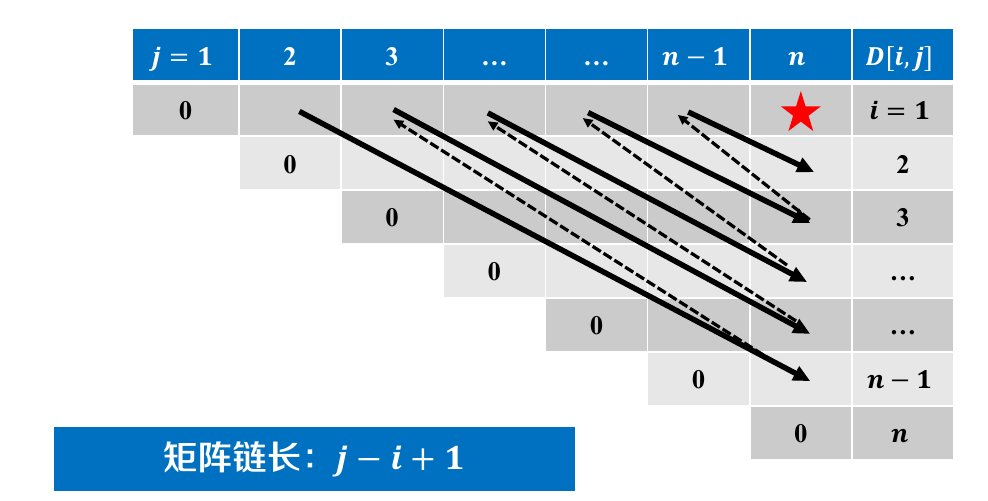

# 无后效性

时隔多年，我们又来讨论 DP 的无后效性了。

无后效性的官方定义是“如果给定某一阶段的状态，则在这一阶段以后过程的发展不受这阶段以前各段状态的影响”，我当时还尝试解释了这个定义，“重要的是我已经是北航的学生了，不重要的是我是如何上北航的”。这个理解是没有错的，但是它没有指导 DP 算法的实践。

我现在的心得是 **“状态设计直接决定有无后效性，总能够通过设计足够复杂的状态，来使得算法具有后无效性，但是此时的状态空间就是不可遍历的了”** ，所以我们思考 DP 的过程，其本质就是在进行状态设计，让这个状态设计可以被遍历。更具体地说，我们不但需要找到一种最优子结构，而且我们还需要一个状态设计来描述这种最优子结构，如果办不到的话，那么这个问题就不能用 DP 来解决。

我们举一个例子：

在一个二维格子纸上，我们指定一个 source 和一个 target 的，我们需要计算他们之间的路径数目。

第一个小问，我们限制行走时，我们 **只能往下走或者往右走** 。第二个小问，我们限制行走时，我们 **可以随意走，但是不能走重复的点** 。我们来看一个例子：



在例子中，从左上角的点到黑色点，图上有蓝、黑、红三条路径，对于第一小问，蓝和黑路径都是符合要求的，而红色是不符合要求的，而对于第二小问来说，则是都符合要求的。

对于第一问，我们可以设计状态$dp[i][j]$ 来表示从左上角第$i$ 行第$j$ 列的点的路径条目，然后状态转移方程为：

``` math
dp[i][j] = dp[i - 1][j] + dp[i][j - 1]
```

表示分别从上面或者左边来的点进行状态转移。但是对于第二问，如果我们还采用$dp[i][j]$ 的状态设计，那么转移方程就是：

``` math
dp[i][j] = dp[i - 1][j] + dp[i][j - 1] + dp[i + 1][j] + dp[i][j + 1]
```

但是这种方式是错误的，因为它没有考虑重复遍历的问题，图上的路径是没有问题的，但是并不是所有的路径都没有问题，没准某条以第$i + 1$ 行第$j$ 列的点为终点的路径，就是刚好经过了第$i$ 行第$j$ 列的点。

为了记录哪些点被遍历了，我们还需要一个集合来记录他们，最简单构建集合的方式就是用一个 mask 来记录，用一个长为 16bit 的 int 来记录，其中每个 bit 都表示着一个点是/否被访问。

但是这样就会发现要遍历的空间会变得巨大：

``` math
dp[i][j][v[i, j] == True] = \sum dp[i - 1][j][v[i, j] \neq True] + \sum dp[i][j - 1][v[i, j] \neq True] + \sum dp[i + 1][j][v[i, j] \neq True] + \sum dp[i][j + 1][v[i, j] \neq True]
```

虽然这种方式确实符合“重复最优子问题”的特征，但是即使用 DP 的方法去算，也不能在多项式时间内解决问题。实际上，这个问题似乎就是一个 NP 完全问题。

可以说这也是 DP 的考点之一，也就是有些问题看上去需要“枚举”、“排列”，进而产生了$2^{n}$ 的状态，也就是最开始提到的“状态设计失误”。

那么好的状态设计是什么样的呢？从算法题的角度来说，最简单是一维的，最常见的是二维的，难一些会出现三维的。

# DAG DP

严格意义上来说，DP 问题往往都可以对应出一个 DAG 问题。每个状态（或者说“最优子问题”）都是图上的节点，而能发生状态转移的状态之间都以一条边。我们进行 DP 的过程，可以被理解成按照拓扑顺序来遍历每一个节点，也就是先解决较小的最优子问题，并复用它们来解决较大的最优子问题。

但是我这里介绍的 DAG DP 是专指“只有一个维度，并且按照从左到右顺序遍历”这个特点的 DP 。至于为什么要把这种特点单独拿出来，是因为 DP 的设计是一件非常难的事情，所以除了像“背包 DP”或者“区间 DP”这种有固定套路的设计外，人们很难想出过于复杂的状态设计，所以那些需要凭空设计的 DP ，往往都是状态本身维度单一、状态转移直观的。

更具体一些，因为 DAG 上能解决的问题往往是“最长/最短路径问题”。问题的状态往往具有“以 xxx 结尾”的形式。

## 最长递增子序列

所谓的子序列，是不需要考虑“连续 or 不连续”问题的，比如说我们可以从 `5, 2, 8, 6, 3, 6, 9, 7` 挑选出 `2, 3, 9` 。

我们的状态设计是，$dp[i]$ 表示以$a[i]$ 结尾的最长递增子序列的长度，当$i < j$ 且$a_{i} < a_{j}$ 时，$dp[i]$ 与$dp[j]$ 就存在一个状态转移。如下所示：


状态转移方程为：

``` math
dp[j] = \max_{i < j, a_{i} < a_{j} } (dp[i])
```

## 堆箱子问题

堆箱子问题指的是给我们一组不同长宽高的箱子，按照不覆盖的方式进行堆叠，求解最大的高度。

这个问题的重点是想到，如果我们设计状态$dp[i]$ “以某个箱子$i$ 为顶”，然后我们就可以想到状态转移就发生在箱子$i$ 和“能摆着箱子$i$ 上的箱子$j$ ”之间。

但是问题在于，即使我们很轻松的建立了 DAG 图，我们还需要按照拓扑排序的方式去遍历这个 DAG 图，这样才能避免状态的重复计算。也就是说，当$i < j$ 时，不能让$dp[j]$ 去更新$dp[i]$ 的状态。这是 DAG DP 的特点。

在最长递增子序列中，这个特点是显然的，因为子序列虽然可以不连续，但是一定要保证顺序。但是在堆箱子问题中，就没有那么显然了。对于一组箱子，我们没法直接确定第$i$ 个箱子一定无法堆到第$j$ 个箱子上。所以我们需要对箱子进行排序（本质是在对状态进行拓扑排序）。

在排序的时候也很有意思，一个箱子能否堆到另一个箱子上，其实要考虑长和宽两个因素，着并不是一个偏序关系，比如说可能一个箱子的长小于另一个箱子的长，但是宽大于另一个箱子的宽。但是实际上，我们并不应该考虑 **“能堆上？”** ，而是应该考虑 **“不能堆上？”** ，也就是说，我们只需要比较长或者宽就可以了，反正只要有一点不符合，那么就一定堆不上，那么就应该往前排。

这种排序只是满足了一种必要条件，实际上我们在检测的时候，是需要同时检测长和宽的。

# 背包 DP

## 0-1 背包问题

0-1 背包问题非常经典，又有非常多的变化，是一种二维 dp 问题。

存在一个容量为$C$ 的背包，和$N$ 类物品。第$i$ 个物品的重量为$w[i]$ ， 价值为$v[i]$ ，每种物品只有一个。在不超过背包容量的情况下能够装入最大的价值为多少？

$dp[i][j]$ 为将前$i$ 件物品装进容量为$j$ 的背包可以获得的最大价值，dp 表为$(N + 1) \times (C + 1)$ 维的二维数组。

状态转移有两个选择：

- 不装入第$i$ 件物品时，$dp[i][j] = dp[i - 1][j]$
- 装入第$i$ 件物品时，$dp[i][j] = dp[i - 1][j - w[i]] + v[i]$

我们要取这两者的最大值，在图上看，就是取正上方或者左上方的值：


代码为：

``` python
for i in range(1, N + 1):
    for j in range(1, C + 1):
        if j >= w[i]: # 2 options
            dp[i][j] = max(dp[i - 1][j], dp[i - 1][j - w[i]] + v[i])
        else: # only 1 option
            dp[i][j] = dp[i - 1][j]
```

整体的遍历顺序就是“从上到下，从左到右”：


但是这种方式需要消耗一个二维表空间，有些浪费内存。这是因为第$i$ 行的状态转移只会与第$i - 1$ 行有关，所以我们可以压缩$dp$ 表。需要强调的是，我觉得压缩$dp$ 只是一种 OI 手段，并没有任何的理论价值，我在这里记录它，只是因为它的实现非常干扰我对于算法的理解。我们可以用一个滚动数组将$dp$ 表降至一维。

我们很容易就翻译出“错误版本”：

``` python
for i in range(1, N + 1):
    for j in range(1, C + 1):
        if j >= w[i]:
            dp[j] = max(dp[j], dp[j - w[i]] + v[i])
```

这里错误的原因是，如果依然采用“从左向右”的遍历顺序，那么在计算$dp[j]$ 的时候，我们希望引用的$dp[j - w[i]]$ 是$dp[i - 1][j - w[i]]$ ，而实际上引用的确实已经被更新过了的$dp[i][j - w[i]]$ 。

为了避免被更新，我们可以“从右向左”完成遍历：

``` python
for i in range(1, N + 1):
    for j in range(C, -1, -1):
        if j >= w[i]:
            dp[j] = max(dp[j], dp[j - w[i]] + v[i])
```

## 完全背包问题

所谓的完全背包问题，就是说此时一种物品可以有无限多个，那么问题就会变得复杂，依然沿用之前的状态设计，我们的转移发生了变化：

- 不装入第$i$ 件物品时，$dp[i][j] = dp[i - 1][j]$
- 装入第$i$ 件物品时，$dp[i][j] = \max (dp[i - 1][j - w[i]] + v[i], dp[i - 1][j - 2 \times w[i]], dp[i - 1][j - 3 \times w[i]] \dots)$

可以看到此时转移变得更加复杂，但是已经可以去处理了，但是有一个更加优美的优化，将转移分为 3 类：

- 不装入第$i$ 件物品时，$dp[i][j] = dp[i - 1][j]$
- 第一次装入第$i$ 件物品时，$dp[i][j] = dp[i - 1][j - w[i]] + v[i]$
- 第 n 次装入第$i$ 件物品时，$dp[i][j] = dp[i][j - w[i]] + v[i]$

这是一个非常巧妙的设计，如果我们能保证$dp[i][j - w[i]]$ 先于$dp[i][j]$ 被计算，那么这种“同一行”之间的状态转移，就会表达“多次添加”这个语义。在这个基础上，就是“正上方”、“左上方”和“正左方”的值会对当前值产生影响。

更加美妙的是，滚动数组的写法也更加美妙，即：

``` python
for i in range(1, N + 1):
    for j in range(1, C + 1):
        if j >= w[i]:
            dp[j] = max(dp[j], dp[j - w[i]] + v[i])
```

也就是上面的那种错误写法，此时的$dp[j - w[i]]$ 刚好是$dp[i - 1][j - w[i]]$ 和$dp[i][j - w[i]]$ 的综合。

## 多重背包问题

多重背包问题就是“0-1 背包问题”和“完全背包问题”的一个过度，第$i$ 种物品只有$n[i]$ 个，那么该如何最大？这时的状态转移为：

- 不装入第$i$ 件物品时，$dp[i][j] = dp[i - 1][j]$
- 装入第$i$ 件物品时，$dp[i][j] = \max (dp[i - 1][j - w[i]] + v[i], dp[i - 1][j - 2 \times w[i]], \cdots ,dp[i - 1][j - n[i] \times w[i]])$

遗憾的是并没有办法作出像“完全背包问题”一样的化简，我们只能老老实实三重循环：

``` python
for i in range(1, N + 1):
    for j in range(1, C + 1):
        options = [dp[i - 1][j]]
        for k in range(min(n[i], j // w[i]) + 1):
            options.append(dp[i][j - k * w[i]] + k * v[i])
        dp[i][j] = max(options)
```

## 泛化背包问题

典型题目参考 [这里](https://github.com/lxztju/leetcode-algorithm/blob/master/leetcode%E7%AE%97%E6%B3%95%E4%B9%8B%E5%8A%A8%E6%80%81%E8%A7%84%E5%88%92%EF%BC%88%E8%83%8C%E5%8C%85%E9%97%AE%E9%A2%98%EF%BC%89.md) 。

当我们考虑背包问题的泛化的时候，必须要要提取其通用的模式。然后我们就会发现一个很有意思的点，那就是状态转移只与物品和背包的 **重量** 有关系，与物品的 **价值** 没有关系。而这种伪多项式时间的状态转移才是背包问题的精髓所在。

也就是说，在泛化背包问题中，与重量相关的部分都比较死板，而与价值相关的部分都比较灵活。

### 数组和

这里说的是，给定一个整数数组 `nums` 和一个整数 `S` ，问能不能挑选其中的几个数，它们相加恰好等于 `S` 。

此时我们设计状态为 `dp[i][j]` 表示前 `i` 个整数可以挑选其中几个数，它们的和是 `j` 。也就是 `dp` 是一个布尔值状态。

状态转移方程是 `dp[i][j] = dp[i - 1][j] | dp[i - 1][j - nums[i]]` 。分别对应选择当前数和不选择当前数。

可以看到状态转移部分的设计非常类似，而状态本身从“最大利润”变成了“能否满足”。

### 零钱兑换

这里说的是，给定一组零钱 `coins` 和一个金额 `S` ，问凑出 `S` 所需要的最少的硬币数目。

仔细一看，似乎和前一道题完全一样，前一道题可以看作是再问能不能用硬币凑出来指定金额，现在问能凑出指定金额最少有几个硬币，所以我们的设计的差别只在状态本身，而状态转移是不变的。

此时我们设计状态为 `dp[i][j]` 表示前 `i` 个硬币能够凑出金额 `j` 的最小硬币数。

状态转移方程是 `dp[i][j] = min(dp[i - 1][j], dp[i - 1][j - conis[i]] + 1)` 。

### 零钱兑换 II

还是同样的题目，给定一组零钱 `coins` 和一个金额 `S` ，问凑出 `S` 有几种方案。依然论证了我的观点，状态转移是类似的。

此时我们设计状态为 `dp[i][j]` 表示前 `i` 个硬币能够凑出金额 `j` 的方案数。

状态转移方程是 `dp[i][j] = dp[i - 1][j] + dp[i - 1][j - conis[i]]` 。

# 区间 DP

也就是之前说得斜向遍历：



## 回文序列

## 矩阵链乘法
