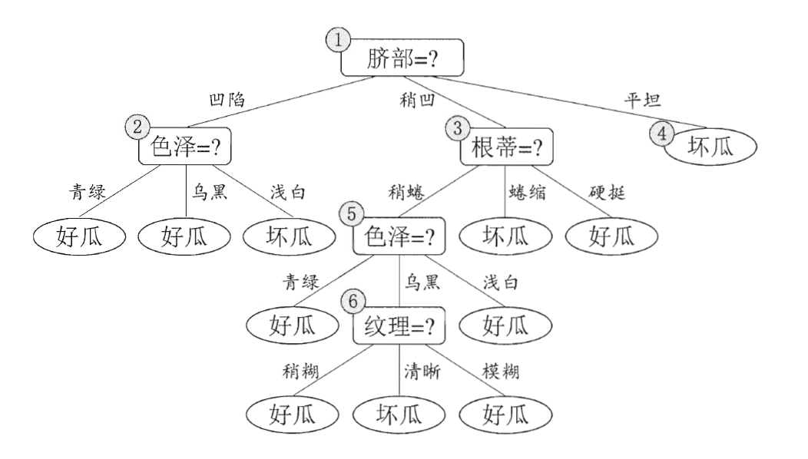
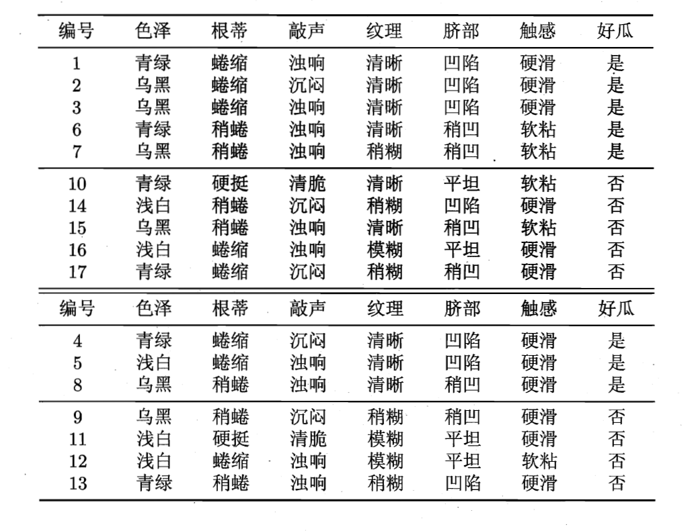

Decision Tree 决策树是一种 ML 监督分类算法。似乎最后只能处理 yes-or-no 问题。

Decision Tree 的推理非常简单，决策树是一个二叉树，我们从根节点开始，每个非叶子节点都会考察一个数据的 feature 来选择子节点，叶子节点是最终的结果，如下所示：

那么这样的一棵决策树是如何生成的呢？简单说，就是我们有一组数据，每个数据都有诸多 feature 和一个 label ，我们使用一些特殊的算法，来选择如何构建这棵树（也就是排列各个 feature）。

有一种经典的构建方式依赖的是信息熵（information entropy），信息熵可以衡量集合的“纯度”，我们的目的是，通过构建树，让叶节点（其本质是多个特定的 feature 的子集合）的纯度更高。

决策树有过拟合问题，所以我们发明了剪枝（pruning）方法来解决，不知道 LLM 中的 pruning 是不是来自这里。

决策树的优势在于非常直观，一点也不黑箱，所以被广泛应用于高责任领域：诊断、医学和金融。

此外当前的搜索引擎，就是基于决策树构建的，因为决策树在构建大型系统方面也有优势。
