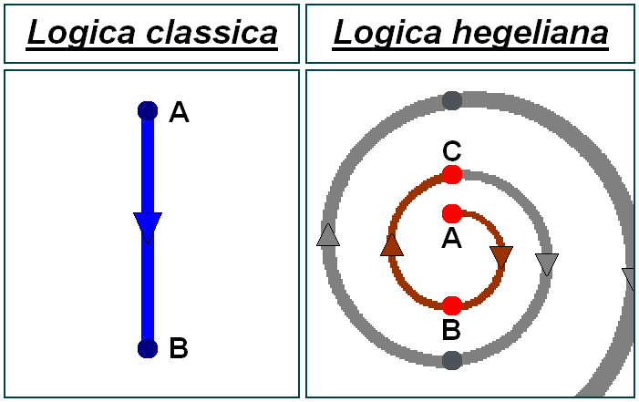

Dialectics 即辩证法。辩证法的核心在于“矛盾”。了解“矛盾”有助于了解辩证法。

# 辩证的历史

辩证法的本义就是“辩证的方法”，“辩论的方法”，或者更加通俗一点，就是“吵架吵赢的方法”，那么“矛盾”就是“吵架”中别人说话的漏洞，是 **“理性不自洽”** 的地方。把握住了矛盾，就可以把架吵赢。

比如说有人一边说“我的盾无矛不破”，一边说“我的矛无盾不破”，那么他的话就是有理性不自洽的地方，就是有矛盾的。那如果我们发现并指出了这个矛盾，那么这个人就不得不撤回他的言论了，我们吵架就吵赢了。

在之后，人们发现，似乎吵架的目的不一定非得要赢，有可能吵架（或者说“辩证”）的其中一个目的就是，通过参与论辩的双方的观点交流，使得人们能够更加深刻地认识辨题或者真理。

比如说经典辩论中的“金钱是不是万能的”的这个辨题，正反双方都根据自己的立场进行了阐述，反复的去找对方话语中的矛盾（比如“如果你说金钱是万能的，那么我给你钱，你承认金钱不是万能的”），并掩饰或者避免自己话语中的矛盾（比如“你给我钱让我承认金钱不是万能的，但是这样会导致我的声誉受损，不利于我以后赚更多的钱”）。作为听众，我们不应当在听到某个矛盾的时候，就一拍大腿说，“噢！这个辩手说的话矛盾了，我们不相信它的立场了”，而是应该在这些矛盾中更加深刻的理解金钱在社会和个人中的影响力，这才是听众应该收获的。

所以“辩证法”就从一门“如何才能吵赢架”的学问，演变成了一门“如何才能接近真理，修正错误观念涨知识”的学问。

# 理性的局限性

为什么我们不能通过听一场辩论就确定辨题应不应该相信呢？或者说判断到底正反双方谁赢了呢？就像我们在听那个既卖矛，又卖盾的商人，只要有人指出他不能用自己的矛刺自己的盾，那么我们就可以意识到这个商人是个骗子，涉及虚假宣传。这是因为矛盾的本质是 **“理性不自洽”** ，只可惜很多复杂的命题（或者说“真理”）本来就没有办法用“理性”这个工具去完整描述，就比如说刚才的那个“金钱是不是万能的”的命题，我们的理性要求我们作出一个非常确定的判断（“确定”是理性的一个特征），而实际上“万能”的定义理性都没法给出，如果“万能”是“在大部分情况下很有用”，那么金钱还挺“万能”的，但是如果“万能”是“世界上所有事情”，那么起码金钱自己不能吃火锅，也不能变成变形金刚，所以是不“万能”的。

理性并不能“精准”地描述这个世界，这样的例子除了“金钱论”之外，还有“秃子论”。如果我们找到一个头发茂密的人，然后一根根拔掉，那么到底拔到第几根头发才能让他称为一个秃子。反正我们拔完所有头发，他一定是一个秃子。但是如果我们指定一个具体的数目，认为他是秃子，那么比这个具体的数目少一根头发，难道就不是秃子了吗？理性很难说明这个事情。再比如说“芝诺的乌龟”，即使有了现代的数学工具，有了“极限”的概念，理性还是很难去立刻想出为什么速度之神为什么追不上乌龟。

此外，理性在描述不断变化的事物的时候也捉襟见肘，比如说我小时候根据理性得出“我要是每天都可以玩电脑，那么我可以开心一辈子”。但是现在的我意识到即使我现在可以每天玩电脑，想怎么玩就怎么玩，但是也不会开心一辈子。随着我的长大，我见过了比电脑更好玩的东西，意识到了有更多的责任要承担，显然原本的理性结论就不再适用了。而实际上，并不是人是唯一“随时间不断变化”的存在，这个世界上的每个事物，都是不断变化的。所以即使理性得出的论点在当时是绝对正确的，可能下一秒钟，因为事物和环境变化了，论点就不正确的。

理性善于处理绝对的，静止的事物，而不善于描述概率的，运动的事物。这也是为什么量子力学这么难以为人所接受一样，因为它从物理上承认了“上帝是掷骰子的”这件事情，许多事情都是概率，而不是一个确定的结果。

# 接近真理

当我们意识到“理性”的缺陷，或者可能理性本身没有缺陷，但是我们使用起来总会有一些比较缺陷的地方之后，我们应该怎么办？似乎真理变得不可接近了，因为毕竟我们无法用理性准确描述它了。

不过其实还有一个办法，那就是用辩证的方法，利用矛盾去趋近真理。矛盾是理性不自洽的地方，我们之前总觉得一旦不自洽，那么就是这件事情不合理，它就是错误的。不过还有一种可能，就是这里的不自洽是因为理性的局限性。比如说“芝诺的乌龟”，“乌龟很慢和速度之神永远追不上乌龟”这个矛盾其实指示了当时人们的理性（也就是数学工具），并不能够很好的描述极限。正视诸如“芝诺的乌龟”这样的矛盾，大大推动了问题的解决。

计算机中的例子也并不少，我在一次项目中，分别采用 `array` 和 `free_list` 的方式实现了“查找符合 `free` 的元素”这个需求，突然我发现了一个 bug ，也就是我发现 `array` 比 `free_list` 还快。这就产生矛盾了，即“$O(1)$ 算法应该比 $O(N)$ 算法要快的理论与实际上 $O(N)$ 更快的现实”之间的矛盾。后来在我宿舍大佬的帮助下，我意识到因为这个集合里的 `N` 只有 `64` 非常小，更加影响性能的应该是 `list` 的随机寻址导致的 cache miss ，而不是算法的差异。通过这个矛盾，我提高了程序的性能，从某个角度来说，相比于武断的理性（当然在这个例子中，主要还是我的理性比较有疏漏，而不是理性本身的问题），更加接近了真理。

直观来说，辩证法提供了一种更加曲折的方式去接近真理。任何初始的理性命题，可能有缺陷或者是不完整，比如，它太抽象了，缺乏试验、有错误、缺乏经验。这种理性命题就很容易存在矛盾，矛盾意味着对于初始理性命题的一种否定，但是没有关系，矛盾就矛盾了，否定就否定了，我们从矛盾中学习，从否定中扬弃（也叫做“否定之否定”），用辩证的方法，就可以获得一种具有具体性、综合性的真理。如下所示：

当我们的注意到矛盾后，具体要怎么学习呢，怎么改进呢？我觉得有如下几点：

1.  具体问题具体分析
2.  实践出真知
3.  持续分析

第一点是因为理性是抽象的，普适的，所以对于具体的情况，可能又有多种变种，就比如说讲算法的老师可能也没有意识到，在 N 为 64 且需求是 300 个 cycle 的时候，更重要的是 CPU 的访存特性；第二点是因为理性是局限的（对于真理的描述能力不够），所以有些时候即使理性无法描述，但是实践已经告诉我们方法了，那么就不要固守原本的结论不放了，而是应当让实践指导理性；第三点是因为理性是静态的，而现实是动态发展和变化的（本质是矛盾是在不断变化发展的），如果一味地抱残守缺，就会被时代所淘汰，所以要持续地分析、不断调整，才能够逼近真理。

# 辩证法的误用

我觉得辩证法不能被用于诡辩，不能用于自欺欺人。
