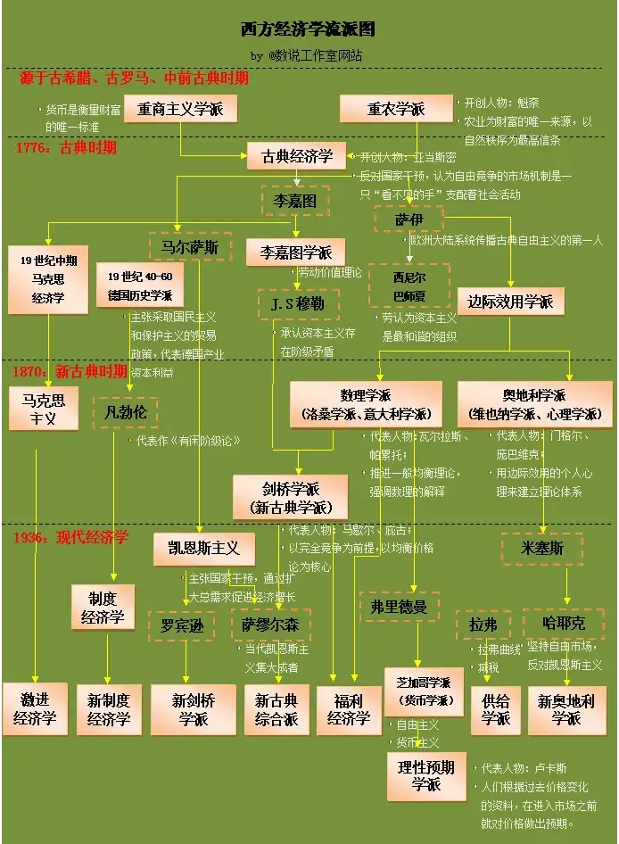

# 市场

需要强调的是，经济学并不是一个“自古就有”的学科，它是在近现代才出现的？为什么会是这样呢？这是因为经济学的大部分，都是在研究“在市场体制下，社会运行的规律”。也就是说，必须要先有“市场”，才能有经济学。

“市场”指的是，每个人都可以做出自由的选择，可以选择生产，也可以选择消费，至于具体生产/消费什么，也都完全可以自由选择。这在今天看来是非常显然的一件事情，总不能我进了商店，只能买面包，而不能买牛奶吧。

但是其实这种显然正是历代经济学家努力传播知识的成果。因为当人们去设计一个社会体系的时候，最容易想到的其实是“计划经济”，也就是规定好某一部分人生产面包，另一部分人生产牛奶，这样才能保证大家的早餐既可以吃上面包，又可以吃上牛奶。如果让人们自由选择了，那万一没人愿意去挤奶怎么办？那不是彻底乱套了吗？事实也是如此，在人类文明的大部分时候，社会都是计划经济的，比如说印度依靠种姓，来规定人们的职业；中国也有专用的“军户”或者“农户”，而且人是不能随便迁徙的。

当然经过实践证明，市场并不会让世界乱套，相反，它比计划经济更有活力。经济学家正是研究市场的人，他们尝试回答“为什么市场有效”和“市场有哪些特征”。

总的来说，市场是由很多拥有自由选择权的人组成的。因此它的特点就是宏观，而且不确定性强（确定性要是强了，那就是计划经济了）。经济学就是研究这样物体的一门学问。

# 发展历史

# 货币

## 流通性

货币看似跟生产资料是一样的，是一种财富。似乎我们只需要把它放在一个地方，它就像水稻或者奶牛一样，是财富本身。似乎只要持有他们，就是在持有财富一样。

但是实际不是这样的，货币如果只是放在那里，那就是一堆废纸。哪怕货币是金子，那也不是财富，它只能放在那里，跟石头也没有什么区别。

那么货币是什么时候有用呢？只有它花出去的时候才有用。这种“有用”，既有个人层面的，也有经济体层面的。对于个人来说，只有把钱花出去，换成商品，才是真的受益了；对于经济体来说，如果货币大家都留在家里不使用，那么商品的交换互通有无就会减弱，自然经济就不会发展了。

当然，也不是只要把钱花了，这件事情就是好的。无论是从个人的角度，还是从经济体的角度，花钱只是手段，我们的核心在于，要让生产资料和生产积极性都尽可能达到最佳配置，进而达到生产力的最优。并不一定是花钱越多，就越接近最优的，很多时候，是需要一定的“延迟满足”的。

## 总量

我们应该先讨论一下，什么是一个经济体里的货币的总量。能说印钞机印了多少钱，货币的总量是多少吗？

并不是，正如我们前面所说的，如果货币不参与流通，那么就是一张废纸。如果每个人都把钱放在罐子里埋在地底下，那么市面上就没有货币可以用了。

那么是不是市面上的货币总量，就是那些没有被用作储蓄用途的钱的总量？也不太是。就算这个经济体里，只有一块钱，但是这一块钱反复被使用，来来回回，那其实也可以促进商品的流通啊。

那么我觉得比较严格的表述，其实货币的总量，应该被定义成货币的流量，只有流量才能反映经济体是否繁荣。

最后，我们来思考一个问题，就是这个“总量”，它的绝对值有意义吗？比如说货币的量是 1g 金子，和 100g 金子，它有区别吗？仔细一想，似乎是没有的。比如说如果货币量只有 1g 金子，它刚好购买一斤大米，那么在货币总量为 100g 金子的社会，一斤大米卖 100g 就行了啊。

最后我们需要强调，并不是说，货币的流量越大，这个经济体就会越繁荣。货币流通的意义在于，它可以更高效得调配生产资料、提高人的生产积极性。但是这两者其实是存在上限的，理论生产力最多这么多了，钱的流通，只能起到一个释放空闲生产力的作用。

## 不要攒钱

### 银行

好了，现在我们继续从流量的角度去思考问题，我们该如何让流量变大呢？其实答案非常简单，那就是不要让钱停下来。钱只会因为一个原因停下来，就是储蓄，直白点，攒钱。

那么有没有什么办法让大家不要攒钱呢？其实在市场经济体制中是很难办到的。这是因为市场经济体制，要尊重每个人的选择，我们并不能拿枪指着人，去逼迫他们花钱。

那么我们还有什么办法呢？有，那就是银行。银行可以通过反复的储蓄和借贷，来让钱流动起来。我们来举个例子，A 将 100 块钱存到银行，按理说，这 100 块钱就彻底静止了，因为 A 不想花它。但是银行可以拿着这 100 块钱，去借给 B，让 B 来花这 100 块钱，这就相当于，这 100 块钱又流动了一次。这还没算完，B 花钱从 C 手里买产品，因此 C 多了 100 元，C 也存在了银行。所以这 100 元又回到了银行的时候，银行可以再把它借出去。

理论上说，这 100 块钱可以流通无数次，尽管它在存储的人看上去，是完全静止的。

当时实际上，100 块钱不会真的这样流通无数次，这主要是两点原因：

- 我们没有办法逼迫人去储蓄（就是不喜欢存银行，或者就是把钱都换成股票或者房产了），也没有办法逼迫人去借贷（创业风险高，消费欲望不强）
- 我们没办法把 100 元都借出去，那么如果储蓄者来兑换，我们就拿不出他们需要的钱。

对于第一点，我们一般会把存储时的利率提高一些，来诱惑人们存储，而把借贷的利率压低一些，来诱惑人们借贷。

对于第二点，我们一般会在银行里留一定比例金额的现金，这部分现金被称为准备金。准备金就是为了避免储蓄者突然来取钱的时候，银行里没有钱的尴尬。在引入准备金这个举措后，每次能够借贷的钱，就会少一部分，最终借不出去钱。

### 钱的贬值

除了银行外，还有什么办法可以让货币的流通速度提高吗？

我们之前的逻辑是，用户得攒钱，所以我们让银行拿着用户攒的钱去借贷，将用户攒的钱花出去。其实我们还可以避免用户产生“攒钱”的念头。

具体怎么操作呢？我们只需要让货币贬值（也就是通货膨胀）就可以了。比如说今年 100 块钱可以买 100 斤大米了，明年 100 块钱只能买 10 斤大米了。那我还不如就今年就把钱花了呢。

此外，我们其实还可以让储蓄利率降低，甚至低到 0，也就是用户把钱存到银行，连一分钱的利息都赚不到。那可能用户就会拿着这笔本该存到银行的钱，去炒股，或者买房产，或者消费。

### 发钱

除了上面介绍的让钱贬值的方法，可以有效抑制攒钱。还有一种方法，就是直接给用户发钱，用户的钱多了，自然就不会想着去储蓄了，而是变成了狠狠花钱了。

当然怎么发钱也是一个难题，我们可以建立高福利制度，或者国家重点投资某个方向，或者发现金矿和银矿了，或者外汇进入。

不过正如我们上面探讨的，增加货币的总量，将 10 元增加到 100 元似乎是没有意义的，这样只会让物价上涨 10 倍，并没有扩大财富。但是我们要意识到，物价的变动是具有滞后性的，发钱的第一天，物价是不会变的，这样就真的扩大了市场的需求。同时，这种方式是可以促进经济体释放剩余生产力的，没准供给的商品也同步增长（从原来只生产 1 斤大米，到生产 10 斤大米），这样供给和消费匹配，就不会导致物价的上涨。

## 信用

### 金本位

在这里我们谈一下货币的本质。在中学课本中我们学到过，货币需要具有珍惜性（名字是我编的），也就是不可以轻易获得。

在漫长的历史长河中，人们终于找到了金子这种东西，它产量稳定，比较稀有。最终在近现代，人类往往使用金本位的货币。

所谓的金本位货币，就是货币的面值与金子的克数呈现线性映射关系，1 元换 1g 金子，100 元换 100g 金子。货币就是金子的一个凭证而已。

不过这种线性映射关系并不会避免通胀或者通缩。一斤大米，可以值 1g 金子，也可以值 10g 金子。

### 信用货币

那么金本位货币的弊端是什么？我觉得弊端主要有两个：

- 货币量太少
- 政府很难调控

和我们上述分析的一样，货币量少并不是问题，无非物价跟着涨伏就可以了。但是也正如前面分析的一样，需求与供给并不是静态的，当出现生产力突然爆发（科技进步）等情况的时候，货币量过少，容易导致资源的流通受到滞固（通货紧缩）。

金子这种东西，它产量稳定，这就导致了它就没有办法突然增发。那么就有可能出现紧缩的现象。政府当然也可以通过银行带宽的方式来增发货币，但是正如前所述，贷款等方式，要考虑用户的意愿，总不能逼人贷款。还是直接增发货币，来得见效快。

正因如此，现在的货币不再是金本位，而是信用货币。也就是货币不再和金子挂钩，而是单纯的，国家说我有枪炮的暴力背书，我就说它值 100g 金子的纯信用货币。

这种货币，政府就可以随意超发了，能够赋予政府更高的调控经济的能力，也更适应现在动不动就激增的生产力。

> 一个题外话，比特币其实就是一种新型的金本位货币，它同样产量稳定，且不能超发。所以它到底能不能代替目前的信用货币呢？我觉得不能，也就是因为他们所不具备信用货币的优点（当然有些时候这些也是缺点）。

### 信念与利率

虽然名义上，信用货币是用国家暴力进行背书的，但是实际上，它之所以可行，是因为人们真的“信任”这套货币的逻辑。用一个甚至都无法稳定换成金子的货币来进行交易。

那么这种货币的价值到底是怎么决定呢？难道国家真的可以随意超发货币，掠夺人民的财富吗？不是的，正是因为信用货币建立在人们对于这套逻辑规则的信任程度上，因此国家必须更珍惜这份信任，因为这是唯一的背书了。

那如何体现这份信念呢？那么就是利率了，咱们先甭管到底是谁向谁借钱，咱们就说，借钱这个过程，可以被理解成，用少量现在的钱，去换未来更多的钱的过程。如果利率越低，就说明钱越稳定越保值，也就是越受信任。而利率越高，就说明风险越大，越需要利息来弥补风险，也就是越不受信任。

那么利率是谁决定呢？利率有那么多种，其中大部分利率都是由市场决定的（这也是体现用户本身信任度的体现），不过也会受到国家影响，毕竟国家可以出台政策，或者亲自下场。在诸多利率中，有一种利率国家最为看重，它就是国债利率。某一个期限（比如说 7 天，或者明天）的国债利率官方会强行控制，也就是所谓的加息/减息。所有的银行的利率都要以这个利率为基础。

需要强调的是，即使是国债利率，其实也是市场决定的，只是说国家可以亲自下场，控制某一个期限的利率。本质上，它的利率依然是信任度的体现。

## 通胀与紧缩

在开始介绍通货膨胀与通货紧缩之前，我们必须强调，并不是说物价高，就是通胀。就算一块面包，买到了 1 万块钱，如果每个月的工资是 100 亿元，那也不是不能接受。就算一块面包只卖 1 毛钱，如果每个月工资只有 1 分钱，那也是万万不够的。

所谓的通胀/紧缩，其实指的是一种不符合实际（供给与需求的差异）的物价上涨/下降过程（重点在于是过程）。也就是说，不能今天这个面包还只卖 1 毛钱一个呢，明天这个面包就卖 1 万块钱了，这还玩什么。这种通胀/紧缩，实际反应的是用户对于货币的信任度的降低。

我们经常有体会，就是近些年物价上涨，但是似乎我们也没有那么多的怨气，这是因为我们的工资也是同步上涨的，这种情况，虽然是通胀，但是不是恶意的通胀。

## 总结

货币的价值在于流通，流通的意义在于释放空闲生产力；货币的稳定与否，本质依赖于人们的信任；货币的升值与贬值，本质依赖于供给与需求的差异；按理说一切价格都会回归到价值，但是实际上，永远都不会回归。