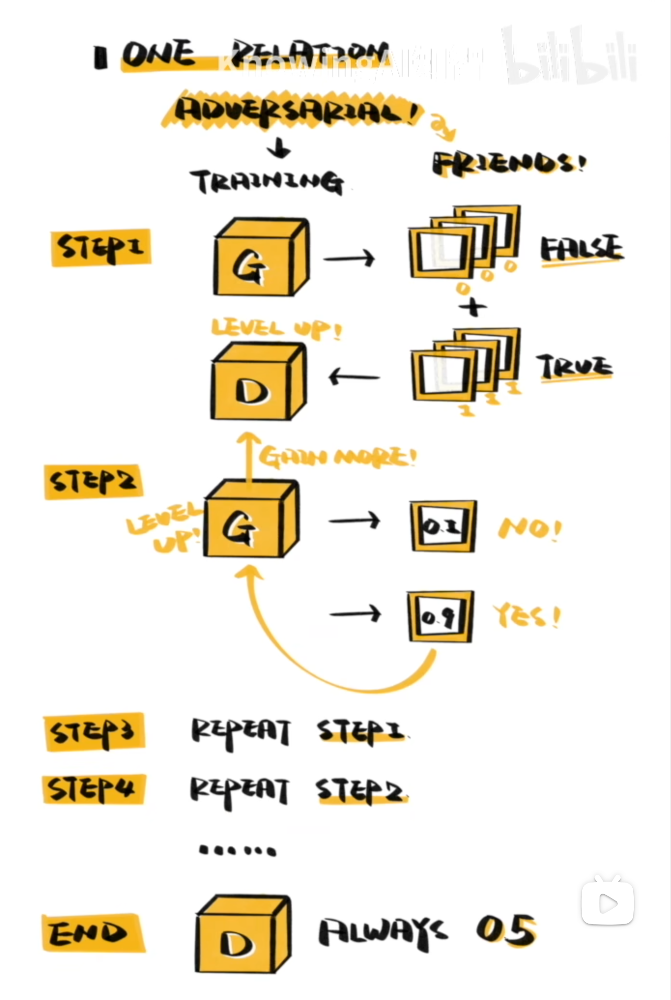

生成对抗网络（GAN, Generative Adversarial Network），由 3 个模块组成：

- 生成器（generator）：依据随机向量产生“似乎有逻辑的内容”
- 判别器（Discriminator）：判断内容是真的（真实存在的）还是假的（由生成器生成的）
- 对抗（Adversarial）：将真实数据和假数据都交给判别器并训练它，使它能够正确识别，然后再让生成器骗过判别器，这样反复迭代，直到判别器对任何内容的判定都是“50% 真实，50% 虚假”。

我们对于生成器和判别器具体是什么模型并没有要求。

如下图所示：

