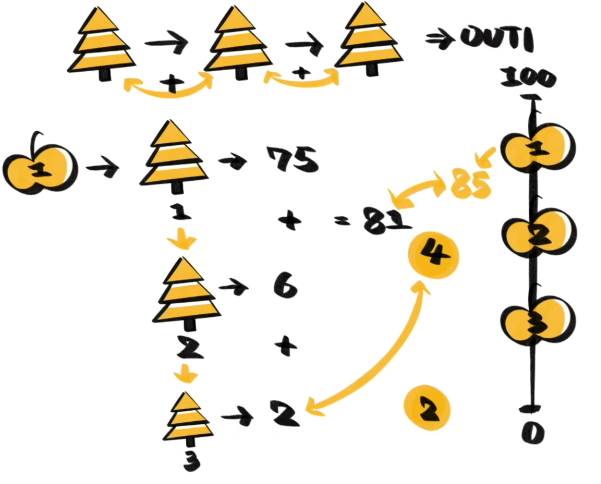

GBDT（Gradient Boosting Decision Tree，梯度提升决策树）是一种常用的机器学习算法，广泛应用于分类和回归任务中。GBDT 结合了决策树和梯度提升两种技术，通过构建一系列的决策树模型来提升预测精度。

与 [[Random Forest]] 不同，GBDT 是串行的，也就是每个决策树都是为了修正和补充上一个决策树。此外这里的决策树回答的不是 yes-or-no 问题，而是一个具体的数值，这种决策树也被称为“回归树”。

