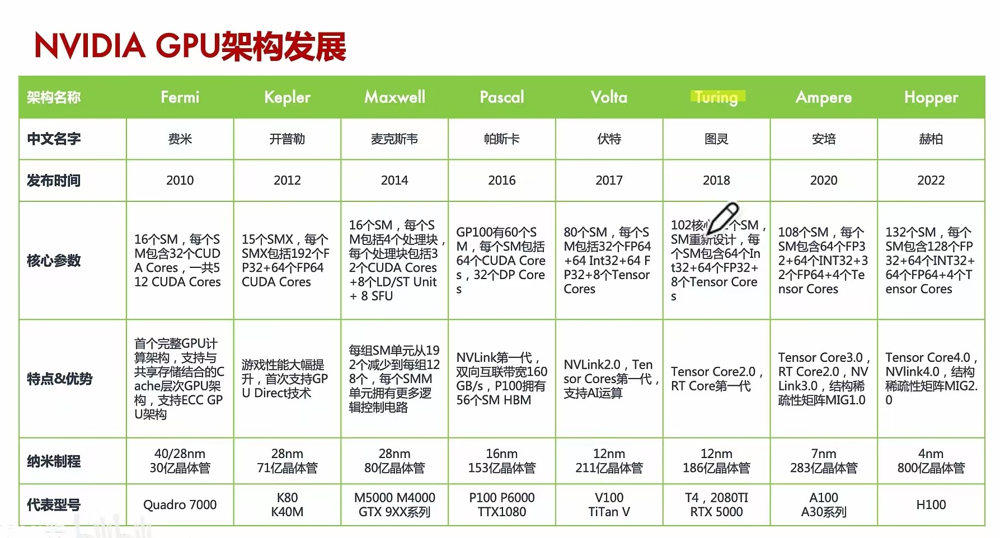
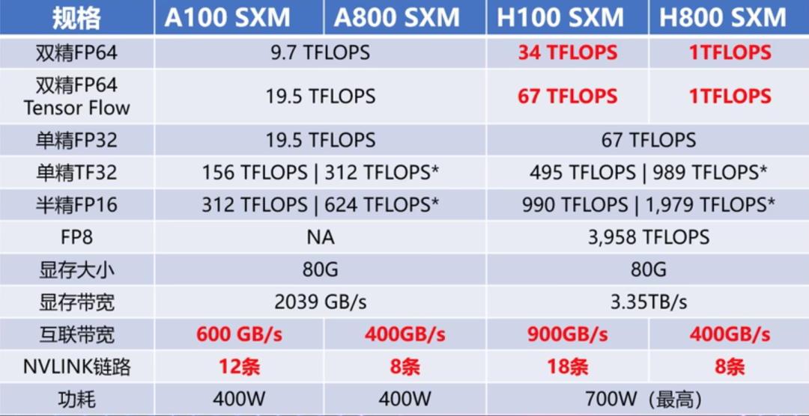
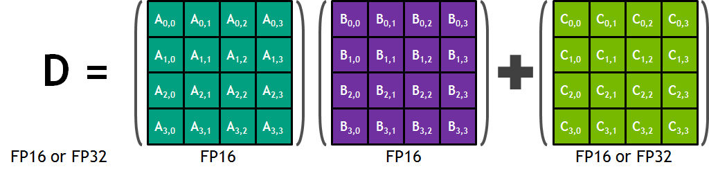
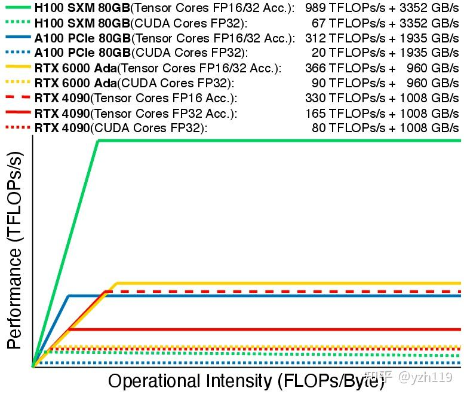

# NVIDIA

[[NVIDIA]] 家的 GPGPU 架构如下所示：

需要注意这些是 GPGPU ，而对于普通 GPU ，则有：

| 型号   | 架构         | 发行时间 |
|--------|--------------|----------|
| RTX 30 | Ampere       | 2020     |
| RTX 40 | Ada Lovelace | 2022     |
| RTX 50 | Blackwell    | 2024     |

顺便说一下，Ada 是第一个女程序员，Blackwell 是一个黑人数学家。此外更加详细的数据可以在 [官网](https://www.nvidia.cn/geforce/graphics-cards/compare/?section=compare-specs) 上看到。

此外，除了以科学家的身份命名外，GPU 架构还有数字命名，比如说：

- Kepler (sm30, sm35, sm37)
- Maxwell (sm50, sm52, sm53)
- Pascal (sm60, sm61)
- Volta (sm70)
- Turing (sm75)
- Ampere (sm80)
- Ada (sm89)
- Hopper (sm90a)

# 缓存结构

最上层的是寄存器，每个硬件线程都有自己独立的寄存器。通常几十到几百个字节

然后是 L1 Cache ，又被称为 Shared Memory ，可编程的部分被称为 Scratch Memory ，通常有几十 KB ，被一个 SM 核内的所限线程共享。

然后是 L2 Cache ，是整个 GPU 的全局缓存，用于缓存来自所有 SM 加载和存储的数据。L2 缓存可以帮助减少到全局显存（Global Memory）的访问延迟。

最后是 Global Memory ，也被称为显存（Video Memory, VRAM），是 GPU 的存储。通常采用 [[HBM]] 实现。

# 阉割版

A800/H800 是针对中国特供版（低配版），相对于 A100/H100，主要区别：

上图的 Tensor Flow 应该指的是 Tensor Core 而不是 Cuda Core 的算力。

# Tensor Core

[[Systolic Array vs Tensor Core]] 是在 Volta 架构中引入的一个计算单元，同样位于 SM 核心内。它专注于优化矩阵乘法（GEMM）的时延和能耗。最初的 Tensor Core 就可以在一个周期内完成 4 x 4 的矩阵乘法和累加运算，如下所示：

后面的 Tensor Core 开始支持更加低精读的 GEMM 计算。

# 汇编

- NVIDIA
  - [[PTX]]
  - [[SASS]]
- AMD
  - GCN (Graphics Core Next) Assembly: 这是 AMD 为其 GCN 架构 GPU 设计的汇编语言。它类似于 NVIDIA 的 PTX，作为一种中间表示。
  - PAL (Platform Abstraction Library) IL (Intermediate Language): AMD 使用的另一种中间语言。

# Schedule

在介绍调度之前，还是需要 warp 的概念，warp 的本质是一个 SIMD 的线程，一般里面有 32 个 thread （其实就是 32 个 channel）。

同一个 warp 只会分给同一个 SM ，不会有一个 warp 横跨多个 SM 的情况。而一个 SM 上通常有多个 warp 。而一个 SM 上能容纳多少个 warp ，并不是看里面有多少个 cuda-core （比如说如果有 64 个 cuda-core ，那么就能容纳 2 个 32 thread 的 warp），而是看寄存器文件和 cache 的容量。

这是因为 GPU 与 CPU 不同。在 CPU 上只有一套寄存器，不同线程切换的时候需要把前一个线程的寄存器保存到内存中，然后将新线程的寄存器从内存中恢复到 CPU 里。而 GPU 给在其上的所有 warp 都预分配了寄存器，切换 warp 并不需要保存和恢复上下文。

涉及指令调度的 warp scheduler 和 dispatcher. scheduler 负责挑选出可以发射的 warp 里的某条指令（注意应该是某条指令，而不是一个 warp），scheduler 只能顺序的调度指令，同一个 warp 内的指令是不能出现乱序的情况的。那么如果有多个 warp 都准备好了，sheduler 的调度策略是什么呢？在 GPGPUSim 中好像是 RR 策略，即每个 warp 依次调度。但是我又看了这个 [链接](https://zhuanlan.zhihu.com/p/166180054) 。里面提到调度策略可能是尽可能多地调度同一个 warp 里的所有指令，这样可以调高局部性（虽然 GPU 切换上下文的开销小，但也依然有）。

那既然有了 scheduler ，那么为什么还需要 dispatcher 呢？这是因为被 schedule 的那条指令，只是在逻辑上是同时执行的，而实际上有可能并不同时执行，这就是 dispatcher 的负责的地方了。具体而言，有两种情形：

- 计算资源不充分：比如说某个 SM 上之后 4 个 SFU ，而一个 warp 有 32 个线程，那么显然需要 8 个 cycle 才能执行完，而不是 1 个 cycle 就可以执行完。
- 条件分支（divergence）：也就是一部分线程走在 `if` 分支，而另外的部分走在 `else` 分支。

# Roofline

看到一个很不错的 [[Roofline]] 的图：

从图上可以看出，随着架构的发展，HBM 的带宽在增加，Tensor Core 的数目在增加，但是 CUDA Core 的数目在减少。
