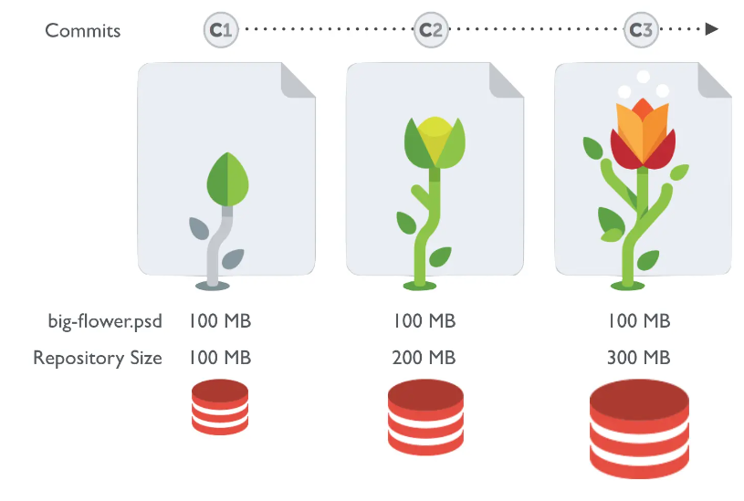

因为 git 的原理问题，每当二进制文件发生修改的时候，都会导致一份完整的二进制文件被存入 `.git` 当中，修改的次数多了， `.git` 就会变得极其庞大，进而导致 `clone` 的速度变慢，如下所示：

[git lfs(Large File Storage)](https://git-lfs.com/) 缓解了这个问题，虽然“git 只能管理文本文件”的基本事实没有改变，对于 lfs 追踪的二进制大文件，依然需要保存多份，但是它们不再存储在 `.git` 仓库中，而是存储在一个云端的其他地方（具体是哪里要看情况），在 `.git` 中只记录指向这个存储位置的指针。这样在在 `clone` 时就不会速度过慢了，因为并不需要将所有备份都 `clone` 下来，只需要 `clone` 当前指针指向的那一份。

git lfs 的相关操作在官网上很容易找到，就不赘述了。

[Github](https://docs.github.com/en/repositories/working-with-files/managing-large-files/about-large-files-on-github) 为 git lfs 提供了支持（也就是提供了存储大文件的地方），免费版的 Github 提供了 2GB 的空间，同时不能用于 Github Pages 。
