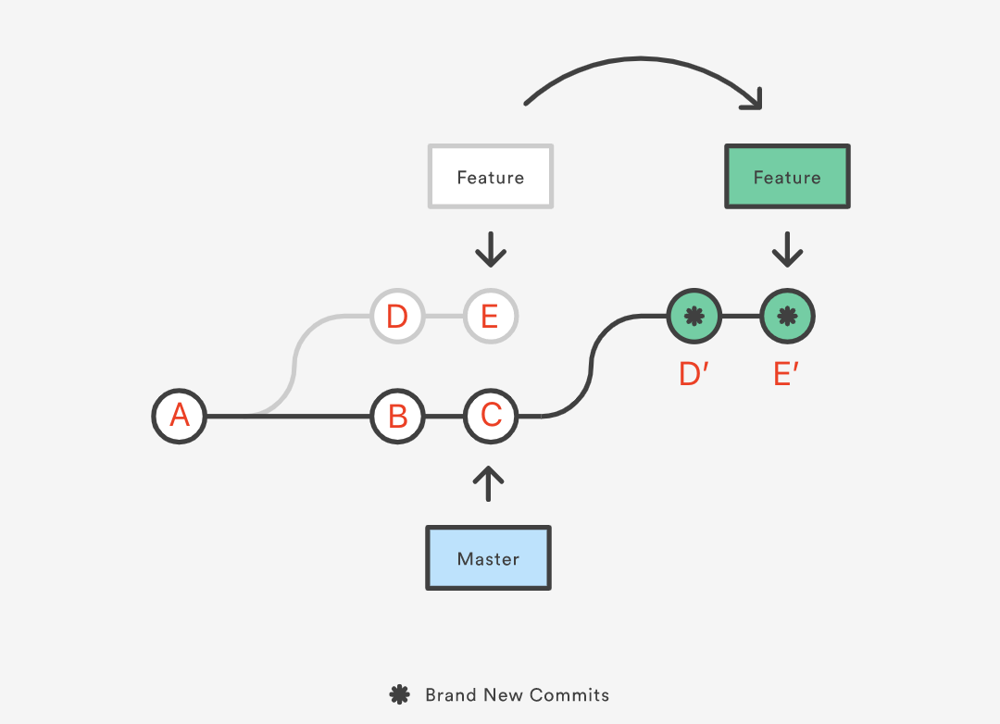
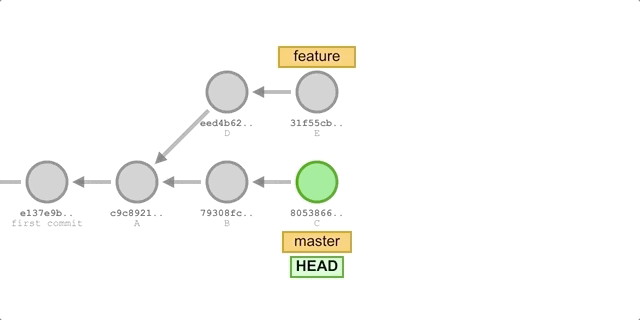

# 原理

`git rebase` 的原理如图（在 `Feature` 分支上执行 `git rebase Master` ）：



`git rebase` 的指令格式如下：

``` shell
git rebase [commit]
```

一般而言，我们在 `feature` 分支上执行 `git rebase master` ，我们会让 `feature` 上的 commits，在 `master` 上 replay，这种过程看上去就像 `feature` 的所有工作的基（原本是 `base` ）变成了 `master` ，是为“变基”。示意图如下：



注意在这个过程中，我们改变的是 `feature` 分支，而不是 `master` 分支。

因为 `git rebase` 的 **“重播”** 特性，所以我们常常在重播过程中整一些花活，比如说压缩多个 commit ，或者删除一些 commit 。

# Rebase Conflict

我们 `git pull --rebase` 时，本质上是先用 `git fetch` 更新 `origin` 标签，然后再在 `local` 分支上执行 `git rebase origin` 的命令。相当于我们将 `local` 上不同于 `origin` 的修改都重播到 `origin` 上。

当然只要是 `pull` ，就会有冲突，对于 `git merge` 来说，处理冲突就是将冲突解决后形成一个新的 commit 即可：

``` shell
git add [conflict-file]
git commit -m "conflict-solved"
```

而对于 `git rebase` 来说，并不需要形成一个新的 `commit` ，只需要进行如下命令即可：

``` shell
git add [conflict-file]
git rebase --continue
```

为什么这里的修改不需要形成一个新的 commit 了？因为 `rebase` 重播的过程就是形成一个个 commit 的过程，当有一个 commit 无法形成的时候，那么就会冲突，重播就会停下，我们将冲突修复并 `add` 后，自然就可以用 `--continue` 命令让它继续重播下去了。

# 线性历史

我们常说要保证 `master` 上要是线性历史，那么我们该怎么操作呢？当 `feature` 相比于 `master` 上有新特性的时候，如果使用 `git merge` 就有可能会出现非线性的部分。

那如果我们在 `master` 分支上直接使用 `git rebase feature` 呢？这样 `master` 分支上就可以让 `master`上有 `feature` 的 commit 了。但是这种方式，会彻底改变 `master` 分支上的 commit，而在其他开发者的 commit 并没有被修改，这种差异是没有办法弥合的。

所以我们应该在 `feature` 分支上使用 `git rebase master`，这样所有 `feature` 上的 commits 就放到了 `master` 上，而 `master` 上的 commits 并没有被改变。但是此时 `master` 并没有改变，所以我们再在 `master` 分支上使用 `git merge feature` ，就可以让 `master` 进行一个只 fast-forward 的分支，相当于让 `master` 沿着线性历史，与 `feature` 对齐了。