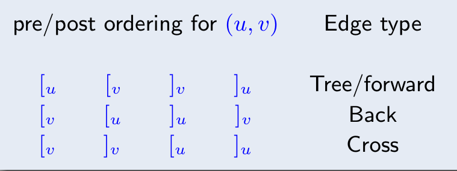

# Overview

图并不能简单理解为一个和 stack, queue, list, tree 并列的数据结构。

图是一种表达能力非常强的数学语言，它能描述一个非欧空间，跟它对标的应该是代数或者几何。

但是也应该注意到，图论并不是一种算法方法论，在图论算法中，你可以看到有贪心、动态规划、线性规划和近似算法等方法。

# DFS

## 不止一次递归

DFS 并不是只执行一次递归就可以了，因为一个图并不一定是一个联通分量，所以可能一次递归结束以后，还需要在进行多次递归，直至所有的点都被遍历到。

但是无论多少次遍历，DFS 都需要遍历每个节点和与之相连的每条边，所以时间复杂度最小是$O(V + E)$ （使用邻接表实现），用邻接矩阵实现则会变成$O(V^{2})$ 。同样的 BFS 也是。

## Previsit & Postvisit

概念本身非常好懂，都是 vertex 的属性，一个是第一次遍历此 vertex 的时间，一个是遍历玩 vertex 所有后继的时间。

关键是它的应用，基本上有两个：

- 作为判断 edge 类型的依据，对于一个边 $e = (u, v)$ ，我们可以根据 range `pre[u] ~ post[u]` 与 range `pre[v] ~ post[v]` 来判断 edge 是不是后向边。进一步，而向边有可以用于判断图中 **是否有环路** 。更进一步，如果一个有向图中无环，那么他就是 DAG 图
- 在无环的情况下，根据 `post` 数组对节点进行逆序排序，我们就可以得到一个 **拓扑序** ，而拓扑序是一种描述图结构的强大表达方式。更进一步，这也可以作为判断 SCC 算法的 sink vertex 的依据。直观来说，某个节点的 `post` 值越大，它就越可能是一个 source 。

## Edge Type

对于有向图来说，一共有四种边：

需要强调的是，Edge Type 的关键是确实有一个 edge ，我们不能随便拿两个之间都没有边连接的节点$u, v$ 来判断他们是不是有一个后向边。

所有边的类型中，我们最关注后向边，因为有定理：

> 一个有向图中有环，当且仅当图中有后向边。

还有一个有趣的事情，就是边的类型是与特定 DFS 绑定的，可能某个边在某次 DFS 中是一个后向边，而再另一次 DFS 中，就变成树边了。但是“有没有环”却是一个静态性质。

## 图的分解

我们可以使用迭代 DFS 的方式来确定图中的强连通分量（Strongly Connected Components）。

我们可以将图理解成一个有两个层次的结构：底层是一个个的 SCC ，而上层是由这些 SCC 为节点构成的 DAG 。

正因为上层是一个 DAG ，所以有两类特殊的 SCC ，source SCC 和 sink SCC ，它们有如下非常显然的性质：

- 我们对一张图执行 DFS ，得到的 `post` 最大的节点，一定在 source SCC 中。
- 我们对 sink SCC 中任意节点执行一次 DFS 递归（仅一次），那么遍历到的所有节点的集合就是 sink SCC 本身。

根据这两个性质，我们就可以构造出 SCC 算法。

- 首先我们将图反转过来，然后执行 DFS 获得 source SCC （这就是原图的 sink SCC）中的一个点
- 然后对着这个点执行 DFS ，就获得一个 sink SCC
- 将 sink SCC 删掉，然后再执行整个流程（本质是在反转图的高层按拓扑排序执行）

# MST

## Overview

MST(Minimum Spanning Tree) 的本质是一个边集。Kruskal 和 Prim 都是无向图上的算法。

## Cut & CutSet

之所以要先介绍割（Cut）和割集（CutSet）的概念，是因为这些概念会影响后面 MST 算法的证明。

Cut 指的是将图 $G = (V, E)$ 上的节点集合 $V$ 分割成 $S$ 和 $V-S$ 两个部分，而 Cut Set 指的是一组边的集合 $X \subset E$ ，有 $X$ 中的每条边，它们的一个端点在 $S$ 中，而另一个端点在 $V - S$ 中。直观上说，就是 $X$ 是连接 $S$ 和 $V-S$ 的桥梁。

分割与 MST 的关系是，如果边集 $T'$ 是某个最小生成树 $T$ 的一部分，那么某个分割 $S$ ，如果满足$T'$ 中没有横跨 $S$ 和 $V - S$ 的边，那么这个分割对应的 CutSet 中权值最小的边 $e$ ，满足 $X \cup {e}$ 也属于某个最小生成树（不一定是 $T$ ）。

分割的这个性质，让我们找到了一种 **贪心的、可迭代** 的“让 MST 持续生长”的方式。

## Kruskal

Kruskal 算法从全局视角来构建 MST。它从最小权重的边开始，将边添加到生成树中，以确保不会形成环，直到树含有所有顶点。

通常使用并查集（Disjoint Set Union，DSU）来管理森林，快速判断和合并树。时间复杂度为 $O(E \log E + E)$ 。

## Prim

Prim 算法从局部视角构建 MST。它从任意一个起始顶点开始，逐步将连接的未访问顶点添加到生成树中。类似于 Dijkstra 算法。

通常使用优先队列（如堆）来选择当前最小权重的边。时间复杂度为 $O(E \log V)$ 。

因为 Kruskal 需要对边进行排序，所以相比于 Prim 对于稀疏图（边少）效果更好，而在稠密图上表现较差。

# 最短路径

## Overview

最短路径不止有 Dijkstra 一种算法，根据图的不同有不同的算法。

## 边均为 1 的图

这种图可以直接用 BFS 即可。

## 只正边图

使用 Dijkstra 算法。Dijkstra 算法其实可以规约到 BFS 上，将长度大于 1 的边（比如说 3），那么就引入多个中间节点（2 个），这就就会变成 BFS 算法。而且你会发现这种 BFS 稍加化简就会变成 Dijkstra 。

此外 Dijkstra 还有一个解释，就是我们的本质是在维护一个“已经确定最短路径的点的集合”，我们称之为$S$ 。最开始的时候这个集合中只有起始点，每次我们挑选出“最短路径”的时候，本质是将这个最短路径的“终点”加入$S$ 的过程，换句话说，这个点的最短路径已经被确定了，以后无论怎么变化，都不会影响原点到这个点的最大路径大小了。

这么一说似乎有些反直觉，因为我们会觉得有这种情况“虽然现在看着我们直接离这个点挺远的，但是我们只要用一个很小的代价先到某个中间节点去，然后那个中间节点又恰好离这个点很近，那么不就不能现在就确定吗？”。举个例子：

第一次迭代，$A$ 是那个“确定”的点，此时 $B$ 还离我们很远：

| A   | B   | C   |
| --- | --- | --- |
| 2   | 100 | 3   |

第二次迭代，$C$ 被确定，此时更新 $B$ ，发现 $B$ 经过 $C$ 的中转，变得进了：

| A   | B   | C   |
| --- | --- | --- |
| 2   | 4   | 3   |

看上去 $B$ 似乎符合了我们的认知，就是它被一个中间节点 $B$ 给更新了，缩小了整整 25 倍。那么我们考虑，$C$ 能不能更新 $A$ ，让从原点到 $A$ 的路径也变得更小呢？不幸的是，并不可能，因为在只有正向边的图上，经过 $C$ 到 $A$ 一定比直接到 $C$ 的路径要长，而在第一轮迭代中，我们就知道了现在到 $A$ 的路径已经比到 $C$ 的短了。

Dijkstra 的算法就是迭代 $V$ 次，每次挑选出最小的值对应的点，并且根据这个点更新其他路径。如果用优先队列实现，那么我们在初始化的时候，需要将所有的节点都插入优先队列，那么就是$V$ 次，而后面更新路径，如果每条边都会更新路径，那么我们需要插入优先队列 $E$ 次。优先队列的每个操作的复杂度都是 $O(\log V)$ ，所以最终的时间复杂度是 $O((V + E) \log V)$

## 含负边图

处理含有负边的图的时候，Dijkstra 算法就不再适用，我们需要用 Bellman-Ford 算法。图上可以有环，但是不能有负权重环。

所以为什么 Dijkstra 会不适用？回看我们对于 Dijkstra 的解释，就会发现它更新边，依赖于“边是正的”这个特点（不然在上面的例子中，真的有可能从 $C$ 到 $A$ 比直接到 $A$ 要近）。

那么我们该怎么办，其实都还好，那么就是我们原来是根据当前点更新那些没有被确定的点的路径，现在我们更新所有点的最短路径，这样就没有问题了。

此时的算法复杂度为 $O(VE)$ 。

负权重环可以被很容易探测出来（具体算法我记不清了）。

## DAG

我们可以对着 DAG 生成一个拓扑序，然后按照拓扑序遍历节点，并对当前访问的顶点出发的边执行更新操作。

这个算法并不要求边是正数。

我们也可以让边的值取负值，这样我们就可以求最长路径了。

## 所有顶点间的最短路径

我们解决这个问题使用基于 [[DP]] 的 Floyd-Warshall 算法。

其中状态设计为 $dist(i, j, k)$ 为仅仅允许使用 ${1, 2, \cdots, k}$ 作为中间节点的时候，$i$ 到 $j$ 的最短路径长度。

状态转移方程为：

$$
dist(i, j, k) = \min(dist(i, k, k - 1) + dist(k, j, k - 1), dist(i, j, k - 1))
$$

# 最大流最小割问题

## Overview

最大流最小割问题可以被处理成一个 [[Linear Programming]] 问题。最大流问题是一个求解最大值的问题，而最小割问题是最大流的对偶问题。

我们研究这个问题的时候，不能用简单的“加权边”进行建模了，实际上每个边 $e$ 有两个属性，分别是“流量 $f(e)$ ”和“容量 $c(e)$ ”。

最小割指的是容量 CutSet 的最小值。而不是流量 CutSet 的最小值。

当最大流问题取到最值的时候，恰好最小割也取到最值，有“最大流等于最小割”。而在没有取到最值的情况，则是“最大流一定小于最小割”。这就是最大流最小割问题。如果从直观上理解，那么就是一个图上最大的流量，是被最小的容量割所限制的。

## Ford-Fulkerson

这是一种求解最大流问题的算法。它的思想非常简单，就是“尽可能”地找到可以增加流量的方法，然后增加流。

为了描述算法，我们先引入增广路径（Augmenting Path）的概念。它指的是在某个流图上一个从源点到汇点的路径，而且自身还有一定的流量（要不超过容量限制）。显然增广路径就是我们逐渐增大流量的抓手，我们最后的流量图，就可以视为一条条增广路径的叠加。设计的算法，就是一次次搜索出增广路径，然后更新容量（相当于将流从图上删去），直至再也找不到一个增广路径的时候就停止。

但是不幸的是，我们并不能在原图上直接进行这个算法，因为这可能会导致增广路径因为“先来后到”而达不到最优值，所以我们要允许“流量的撤销”。

因此我们实际进行算法的图被称作残差图（Residual Graph），这个图在一开始是仅有容量性质的原图，我们每在原图的某条边 $(u, v)$ 上增加一些流量，都需要更新残差图：

- 减少 $(u, v)$ 的值：相当于使用掉了一部分容量
- 增加 $(v, u)$ 的值：创举，相当于允许之后这部分流量再次撤销。

那么这种算法的时间复杂度是多少呢？这个算法可以分为两个部分：

- 搜索出一条增广路径
- 重复迭代搜索，直至找不出任何一条增广路径。

搜索增广路径可以使用 DFS 和 BFS ，那么时间复杂度都是 $O(V + E)$ ，我不知道为啥，似乎在这个算法分析中，常常会被记作 $O(E)$ ，虽然有道理，但是我并不觉得这里有什么特殊的。

那么我们会迭代多少次呢？如果我们使用 DFS ，那么我们最差会迭代 $C$ 次，其中 $CE$ 是所有边中最大的容量，也就是一点点（1 step）增加这个最大容量，那么整体的时间复杂度就是 $O(CE^{2})$ 。这样就退化成了一个伪多项式时间算法了，显然是我们不能接受的。

幸运的是，如果我们使用 BFS ，那么迭代次数不会超过 $O(VE)$ ，所以总的时间复杂度是 $O(VE^{2})$ 。

为什么 BFS 的迭代次数不会超过 $O(VE)$ 呢？这是因为我们观察到 BFS 会选出当前残差图上的最浅路径。此外需要强调一下，这里的“最浅”指的是“深度最小”而不是“路径长度最小”，如果真的是最短路径长度，那么应该用 Dijkstra 算法了。而在不同次迭代中，人们发现每次的最浅的深度都在增加，而从源点到汇点的深度是有限的，所以最终效果就是只需要迭代有限次数。

## 最大流最小割

我们现在已经知道了“最大流等于最小割”的事实，我们继续讨论一下当我们取到最大流的时候，最小割是啥？

其实非常直观，当我们取到最大流的时候，就说明源点和汇点之间不再存在增广路径（实际上就是不存在路径了），那么我们从源点进行一次搜索，所有被搜索到的节点构成的集合 $S$ ，与剩余的节点 $V -S$ 之间的割，就是最小割，这也非常自然。

# Partition & Matching

## Matching

Matching 是一个边集，这个图上的所有顶点，都只会与这个边集里面的每个边最多有一次关系。直观来说，就是不能有一个顶点，有 Matching 的多条边连在他上面。只能有一条边、或者完全没有边连在上面。

叫作 Matching （匹配），也就是所有被这个边集联系起来的顶点，都是一对一的。

所谓的完美匹配（perfect matching），指的是这个边集所涉及的所有顶点，刚好就是图上的所有顶点。也就是说，这个图上的所有顶点都可以一一对应。

## Bipartition

二部图（Bipartition）是一种特殊的图，它的顶点分为 $L$ 和 $R$ 两个部分，所有的边，有一端在 $L$ ，另一端在 $R$ 。

二部图和匹配关系和密切，但是也是完全对应的。在非二分图上也可以有匹配的概念（可以考虑成原本的二分图中，$L$ 内节点之间可以有边）。我们之所以研究二分图上的匹配，是因为它可以被规约成一个最大流问题。

为了将其规约成最大流问题，我们可以添加一个虚拟源点，用容量为 1 的边连接 $L$ 中所有的点，再添加一个汇点，用容量为 1 的边连接 $R$ 中所有的点。这样就可以使用最大流算法来求匹配了。

这样求出来的匹配，是一个最大的匹配（也就是匹配中的边的数目最多），但是不一定是完美匹配。

## Hall’s Marriage Theorem

Hall’s Marriage Theorem（霍尔婚嫁定理）：所有男生都能成功配对的充要条件是：任意选出 $k$ 个男生，他们合起来认识的总女生数必须 $\ge k$ 。

形式化的表述是：任意 $l \subset L$ ，有 $N(l) \geq |l|$ 。其中 $N(l)$ 是 $l$ 的邻居。则满足完美匹配。

## 对偶性 – König 定理

既然二部图上的最大匹配问题可以被规约到最大流问题，那么这个问题是不是也像最大流问题一样，有一个直观的对偶问题呢？

还真有，这就是最小点覆盖问题，也就是最少用多少个点，就可以覆盖二部图上的所有边？根据 König 定理，有：在二部图上，最大匹配等于最小点覆盖。
