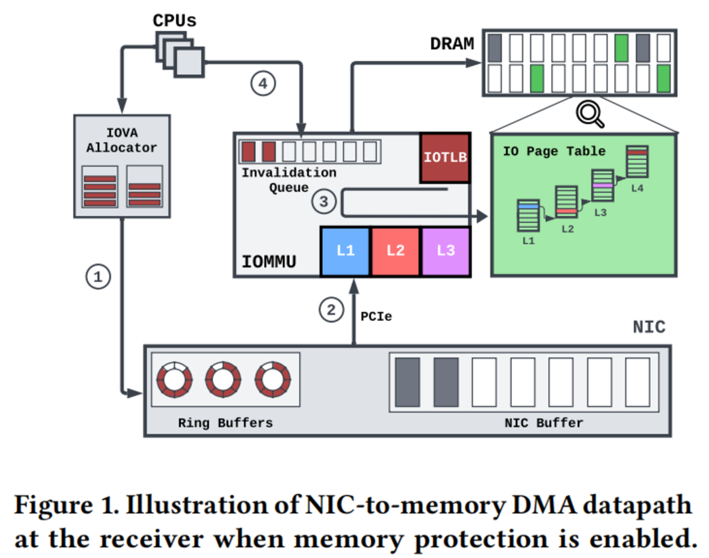

出于隔离性或者虚拟化的要求，我们引入了 IOMMU 。IOMMU 可以将 IOVA 翻译成 PA ，或者将 GPA 翻译成 HPA 。IO 的页表同样在内存中维护，但是是 IOMMU 去查表。IOMMU 中不但有 IOTLB ，还有多级 Cache 用于加速对于内存中 IO 页表的访问。

内核中会有 IOMMU Driver ，其具体工作就是维护 IO 页表（也就是图中的 IOVA Allocator）。

此外 IOMMU 还是少数的在 64Bit 世界内，保持 32Bit 的叛逆组件。
