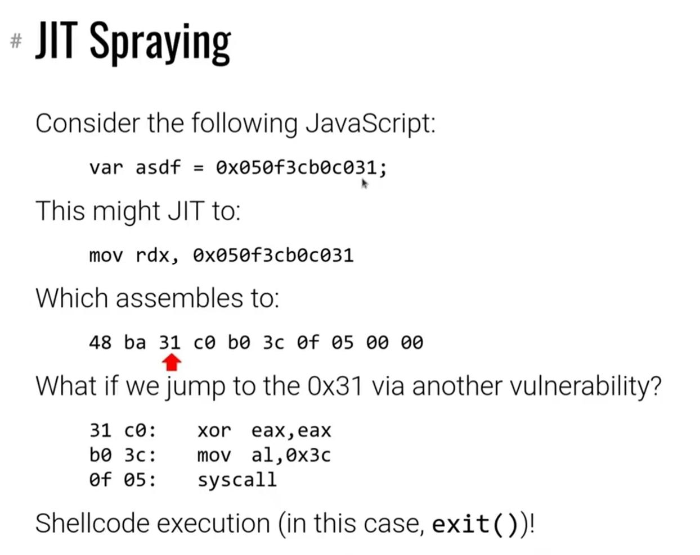

JIT Spray（JIT 喷射）指的是利用 [[JIT]] 在运行时生成机器码（汇编）的特性，诱导 JIT 生成攻击者需要的机器码的攻击（不知道算不算代码注入）。因为机器码所在的内存是可写（方便生成代码）又可执行的（方便执行机器码），所以要比普通的设置了写入和执行权限分离（Data Execution Protection, DEP）的内存要更加容易。

具体来说，我们可以通过构造出一条高级语言，来使得生成的机器码中某条指令里的立即数本身是一条指令，这呈现了一种“普通的长指令里面包含一个恶意的短指令”的形式，然后攻击者就可以通过其他漏洞跳转到这条恶意的短指令处，达到攻击目的。

下图是一个例子：

恶意的短指令是 `0x050f3cb0c31` ，这条指令被包含在了 `0x48ba050f3cb0c31` 这条正常的长指令内，然后如果我们通过其他漏洞跳到 `31` 处，就可以执行某个恶意的系统调用（图里是 `exit` ）。

为了提高攻击的成功率，攻击者会将许多内存里都填满这些恶意的指令。这也是这种手段被称为 Spray 的原因，就是把内存都喷射的“脏脏的”。
