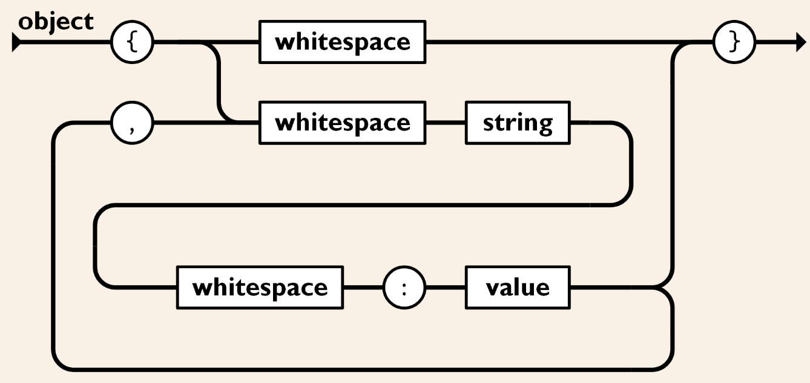
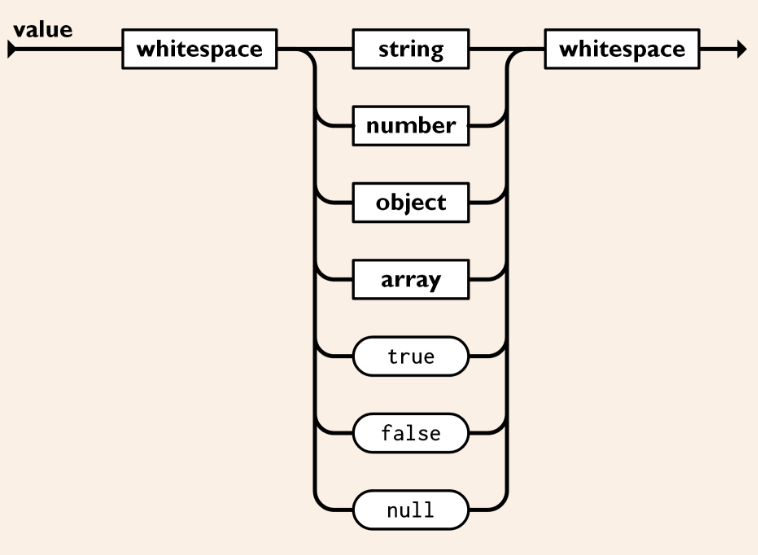
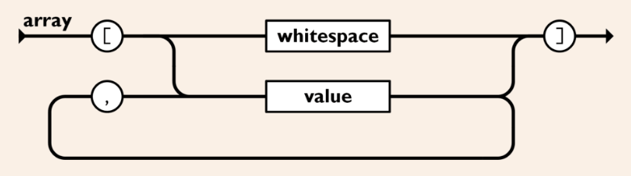

相比 [[XML]] 和 [[Yaml]]，JSON 的语法还真是简单和规范呀。从 [这里](https://www.json.org/json-en.html) 的自动机图中可以看出。

JSON 同样支持 **对象，数组，纯值** 三种类型。解析器从 **对象** 开始解析，对象是一组键值对，其中 key 一定是一个有引号的 `string` ，如下所示：

确实在一些地方有 `key` 直接是一个不带引号的 `symbol` 的情况，但是这种用法一般用在 [[Javascript]] 中，应该是一个语法糖。而在 JSON 中，为了统一地描述那些带有空格的 key ，规定必须用 `string` 来表示 `key` 。

而 `value` 的值又对应一下几种类型：

其中 `array` 这个类型如下定义：

