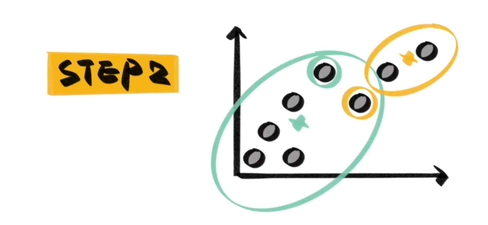

# K-Means

K-Means 是一种无监督聚类学习方法。也就是给定一堆数据，将他们聚成$k$ 个不同的 cluster ，cluster 内的数据具有相似性。

# NP

K-Means 是一个 NP 问题，但是我们有一个很好的 [[Approximation Algorithm]] 。

首先我们先随机选择 $k$ 个样本作为基准：

然后根据基准先完成聚类（也就是离哪个基准近就算哪个）：

当然这样得出的 cluster 一定非常不准，所以我们就再找到此时的 cluster 的质心，然后将质心作为新的基准，再次进行分类：

重复这个过程，直到达到迭代次数，或者 cluster 结果不变。

# KNN

KNN (K Nearest Neighbors) 是在 K-Means 之后执行的一个算法。它说的是对于新来的数据点，找到$k$ 个与之最相邻的点，然后根据这些点判断新的数据点属于哪个 cluster 。

每个数据都需要遍历整个数据集，才能判断它到底属于哪个 cluster ，如果数据集的大小为 $N$ ，则时间复杂度为 $O(N)$ 。所以当数据集很大时，KNN 算法就会变慢。这个时候可以使用 [[ANNS]] 来完成近似加速。
