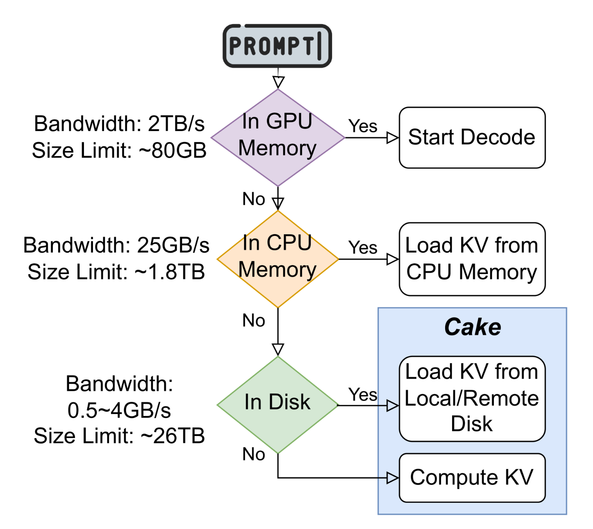

# 大小

如果设模型的参数量为 $N$ ，而序列的长度为 $L$ ，则其所对应 KV Cache 的大小是 $O(NL)$ 级别的。这个说法其实非常没有道理，因为 KV Cache 的大小其实应该是 $L \times Layer \times KV\_Head \times Dim \times DType$ ，但是考虑到每个模型的层数、头数都不同，所以准确计算并没有太大的意义。反而不如用参数量这个与层数、头数都有关的量来近似估算。

从效果来看，如果采用 float32 ，那么 1B 的模型，序列长度为 1 的时候，KV Cache 的长度为 1M 。比如说 175B 的 Chatgpt3 在序列长度为 4K 的时候， KV Cache 的大小是 604GB 。

# 策略

正因为 KV Cache 有如此巨大的 GPU 显存开销，所以我们常常采用一些策略来缓解。

## Offload

当 GPU Memory 不足以容纳 KV Cache 的时候，我们就会将其 offfload 到 CPU Memory 上，更进一步，我们就会 offload 到 local/remote disk 上，甚至在无法 offload 的时候，直接遗弃然后重计算 KV Cache：

## Quantization

我们会对 KV Cache 采用 [[Quantization]] 技术，来减少它的内存开销。

## Sparsity

利用稀疏性，来选择性的 evict KV Cache 。
