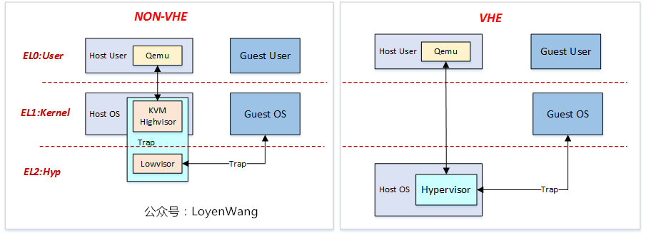

# Qemu-KVM

KVM（Kernel-based Virtual Machine）往往伴随 [[Qemu]] 出现，这并不奇怪。应该这样说，在 Qemu-KVM 架构中，KVM 只是一个“后端”，甚至只是一个“后端的一小部分”，而 Qemu 才是真正的 **系统虚拟框架** 。

KVM 的本质是 **“CPU 和内存硬件虚拟化机制的抽象”** ，KVM 在 Linux 中暴露的接口就是一个文件 `/dev/kvm` ，Qemu 会通过 `ioctl` 方法来和它交互，具体而言（一个简化的例子）：

Qemu 需要先打开 KVM 文件：

``` c
#define KVM_DEV     "/dev/kvm"

/* open kvm device */
kvm_fd = open(KVM_DEV, O_RDWR);
```

然后用 `ioctl` 创建虚拟机，CPU 并设置寄存器：

``` c
/* create VM */
vm_fd = ioctl(kvm_fd, KVM_CREATE_VM, 0);

/* create VCPU */
vcpu_fd = ioctl(vm_fd, KVM_CREATE_VCPU, 0);

/* set cpu registers */
ret = ioctl(vcpu_fd, KVM_GET_SREGS, &sregs);
```

然后 Qemu 内核文件读取到自己的虚拟地址空间，这片地址空间会作为 VM 的物理地址空间，并将这片地址空间传递给 KVM ，如下所示：

``` c
#define TINY_KERNEL_FILE    "./tiny_kernel.bin"
#define PAGE_SIZE  0x1000

/* open tiny_kernel binary file */
tiny_kernel_fd = open(TINY_KERNEL_FILE, O_RDONLY);
/* map 4K into memory */
userspace_addr = mmap(NULL, PAGE_SIZE, PROT_READ | PROT_WRITE, MAP_SHARED | MAP_ANONYMOUS, -1, 0);
/* read tiny_kernel binary into the memory */
ret = read(tiny_kernel_fd, userspace_addr, PAGE_SIZE);

/* set user memory region */ 
struct kvm_userspace_memory_region mem;
mem.slot = 0;
mem.flags = 0;
mem.guest_phys_addr = 0;
mem.memory_size = PAGE_SIZE;
mem.userspace_addr = (unsigned long)userspace_addr;
ret = ioctl(vm_fd, KVM_SET_USER_MEMORY_REGION, &mem);
```

然后 Qemu 就可以使用 `ioctrl` 中的 `KVM_RUN` 让 KVM 来执行内核的代码了，正如前面所描述的，KVM 只有加速虚拟化 CPU 和内存的功能，对于设备的虚拟化还是依靠 qemu ，所以可能 KVM 正执行 VM 的代码起劲儿呢，突然来了一条设备相关指令（比如说 MMIO ），那么这个时候 KVM 就需要将控制权还给 Qemu ，由 Qemu 来模拟设备。更具体来说，因为 VM 的物理地址空间就是 Qemu 虚拟地址空间的一部分，所以 Qemu 是可以修改这片区域的，如果有修改寄存器的需求，也可以通过 KVM 的 `ioctl` 来实现。KVM 交还控制权其实就是原本的 `ioctl` `return` 一个类似 `error code` 的东西，如下所示：

``` c
/* vcpu run */
while (1) {
    ret = ioctl(vcpu_fd, KVM_RUN, NULL);
    assert(ret >= 0);

    switch(kvm_run->exit_reason) {
        case KVM_EXIT_HLT:
            printf("----KVM EXIT HLT----\n");
            close(kvm_fd);
            close(tiny_kernel_fd);
            return 0;
        case KVM_EXIT_IO:
            putchar(*(((char *)kvm_run) + kvm_run->io.data_offset));
            break;
        default:
            printf("Unknow exit reason: %d\n", kvm_run->exit_reason);
            break;
    }
}
```

其控制流如下，其中的 Guest Mode 用于运行 VM 的代码：


# 一小部分

正如前所述，KVM 仅仅是“硬件虚拟化的一个抽象”，它本身其实是担任不了系统虚拟化的任务的。更进一步，其实即使 Qemu 帮他分担了一部分设备虚拟化的工作，它也没有办法做到上图中 Kernel Mode 的全部工作。它需要复用 Linux Kernel 本身的调度机制来调度 VM 。所以 Qemu-KVM 架构其实是 Qemu-Kernel-KVM 3 个部分，这 3 个部分可以合称为一个 Hypervisor 。

那么这些部件都是在哪个特权级，就成了一个很有意思的东西。在最初的时候，KVM 是横跨 EL1 和 EL2 的，当需要那些与虚拟化硬件机制相关的操作，Kernel 会下陷到 EL2 中，处理完以后在回到 Kernel 本身。

当然这样可能会导致 EL1 频繁下陷 EL2 ，所带来的上下文切换开销是比较大的，所以如果硬件支持的话（在 ARM 上是 VHE），那么可以将整个 Linux Kernel 都放到 EL2 ，这样 Kernel 与 KVM Lowvisor 的调用就不再需要切换特权级了。如下图所示：



由上图也可看出，KVM 可以允许 Guest OS 和 Host OS 一样，运行在 EL1 ，这种方式是非常高效的。与之前的 Qemu 二进制翻译相比，这种方式不需要 Qemu 频繁系统调用下陷。

总之，这种模拟器在 EL0 ，监视器在 EL2 ，VM 在 EL1 的架构，听上去似乎很不自然，但是经过梳理后居然变得自然了。
