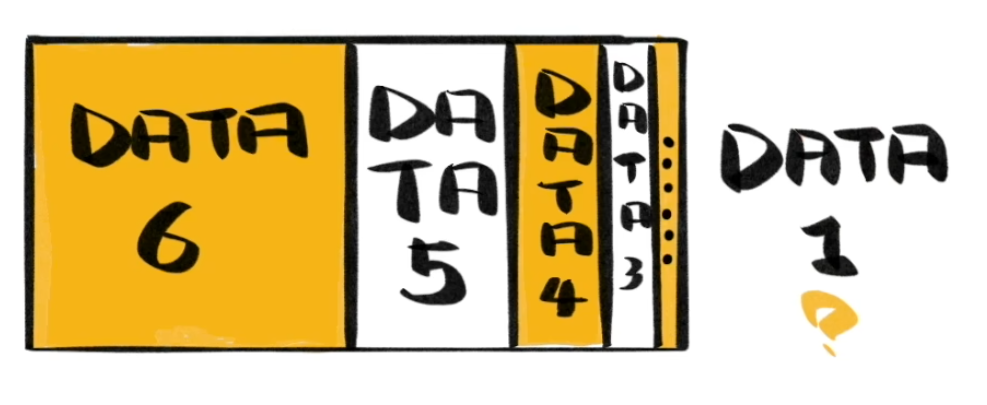
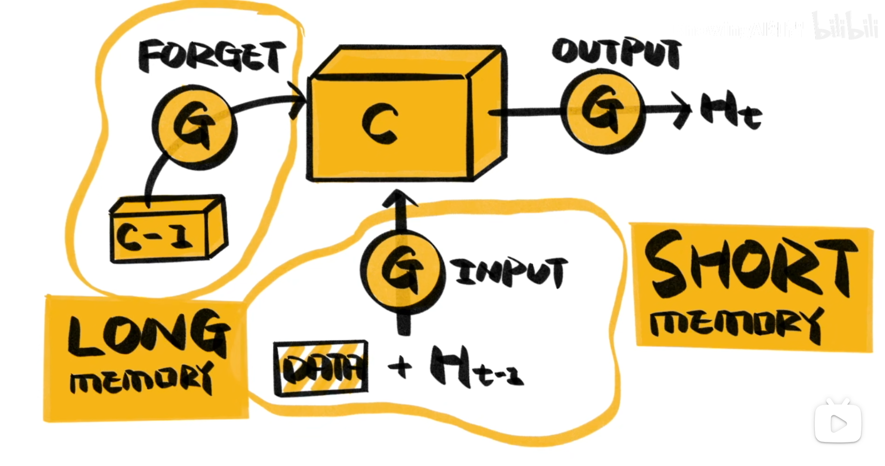

RNN 的隐藏层就像模型的记忆一样，而当序列长度增加的时候，记忆就会出现模糊（编码空间不够了），难以捕获长距离依赖（这个问题在 LLM 中也会遇到）。如下图所示：

所以 LSTM (Long Short-Term Memory) 使用 Gate 来模拟记忆的遗忘过程。Gate 是决定记忆如何保留的开关，它的输出在 0 ~ 1 之间，0 是完全舍弃，1 是完全保留。

如下图所示：

隐藏层周围有 3 个 gate:

- forget gate: 决定遗忘多少过去的记忆
- input gate: 决定增加多少现在的记忆
- output gate: 决定记忆会对决策造成多少影响
