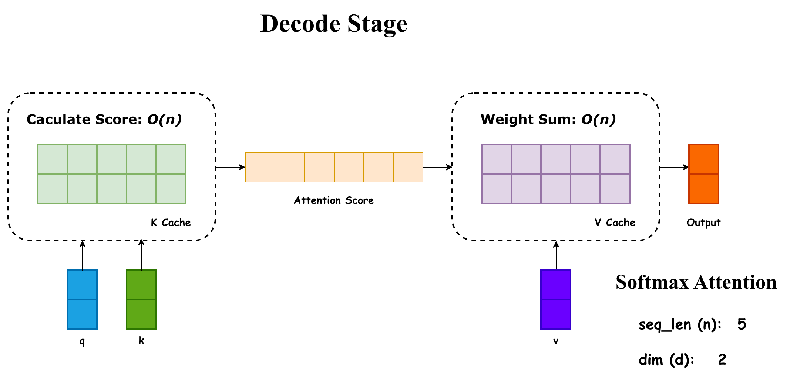
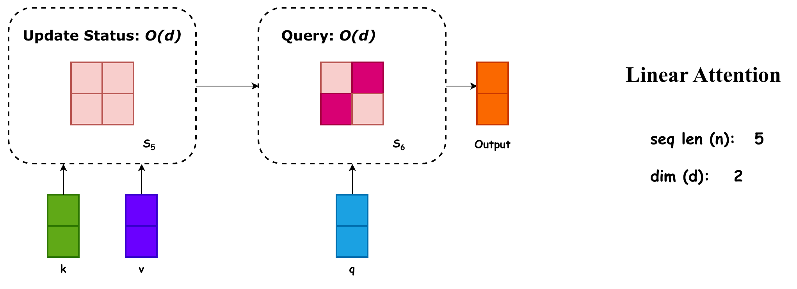
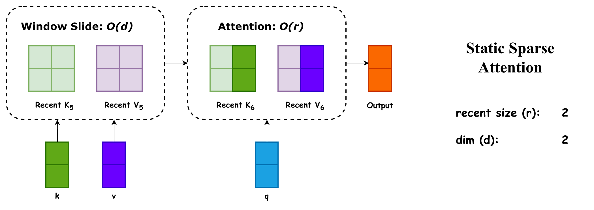

# Softmax Attention Decode

首先定义变量：

$$
\begin{aligned}
q_i, k_i, v_i, o_i \in \mathbb{R}^{d \times 1} \\
Q = [q_1, q_2, \dots q_n] \in \mathbb{R}^{n \times d} \\
K = [k_1, k_2, \dots k_n] \in \mathbb{R}^{n \times d} \\
V = [v_1, v_2, \dots v_n] \in \mathbb{R}^{n \times d} \\
O = [o_1, o_2, \dots o_n] \in \mathbb{R}^{n \times d}
\end{aligned}
$$

Attention 计算定义如下（省略了一些与计算量无关的细节）：

$$
O = softmax(QK^T)V
$$

在这个计算里面，$QK^T$ 的计算量是 $O(n^2d)$ ，再与 $V$ 运算的计算量是 $O(n^2d)$ 。因为 $n$ 是序列长度，当序列长度一旦变大，那么计算量就会非常膨胀。

在自回归 decode 有 KV Cache 的情况下，attention 计算的开销是 $O(nd)$ :

$$
o_n = softmax(q_n K^T)V
$$

如下图所示：

当然即使是 $O(nd)$ ，当 $n$ 变得很大的时候，同样是不可接受的（更不要提 Prefill Stage 还没有 KV Cache 优化）。

# Linear Attention

如果我们将 $softmax$ 直接去掉，就可以发现彻底可以解决 $n$ 的问题，有：

$$
O = (QK^T)V = Q(K^T V) 
$$

此时 $K^TV$ 的计算量是 $O(nd^2)$ ，再算 $Q$ 的计算量是 $O(nd^2)$ 。也就是从平方项变成了一次项。

我们也可以写成一种分量形式（这个版本考虑了 causal）：

$$
o_t = q_t(\sum^t_{i = 1} v_i k_i^T)
$$

记 $S_t = \sum^t_{i = 1} v_ik_i^T$ ，我们就可以写出一种递推形式，有：

$$
\begin{aligned}
o_t = S_{t} q_t \\
S_t = S_{t - 1} + v_ik_i^T
\end{aligned}
$$

这个递推形式可以用在 decode 过程中，此时的开销就完全与 $n$ 完全无关了，因为 $S \in R^{d \times d}$ 。如下图所示：

抽象得来看，KV Cache 可以被视作上下文的信息，它的问题在于，在 decode 过程中，大模型需要遍历整个 KV Cache 来检索要“Attention”哪些信息。因为 KV Cache 的形状是 $n \times d$ ，巨大无比，所以检索的消耗很大。

而线性注意力机制将 KV Cache 压缩到一个状态矩阵 $S$ ，它的形状是 $d \times d$ ，每次 decode 我们都用 $k, v$ 来更新它，相当于 $S_t$ 是所有 $k_1, k_2, \dots, k_t, v_1, v_2, \dots v_t$ 的一个累加。

在这个意义上，线性注意力机制可以看作是一种特殊的 RNN。普通的 RNN 就是会让输入 $X$ 更新状态 $h$：

它特殊的点在于，生成了 $q, k, v$ 3 个向量，用 $k, v$ 向量更新状态，用 $q$ 去查询状态。

当然如果对各个 $v_ik_i^T$ 进行累加（也就是仅仅移除 $softmax$ 的方案），那么第 $i$ 个 token 的注意力得分就是 $k_i^T q$ 。这种方式很容易出现这样的权重分布 $[100, 1, 1, 1, \dots, 1]$ ，虽然 $100$ 分很高，但是会被无数个（整个序列里面，除了少数重要的，大部分都是不重要的） $1$ 分的不重要 token 的语义所淹没。

当然 $softmax$ 不会有这个问题，$softmax$ 会用指数放大这种权重分布的差距，也就是 $[e^{100}, e^1, e^1, e^1, \dots, e^1]$ ，则就很能掩盖噪声了。

因此我们有可以有一些改进手段，比如说我们可以在每次累加 $v_ik_i^T$ 的时候，给它乘上一个系数 $\sigma_i$ ，当这个 token 重要的时候，我们就把系数调大一些，当 token 不重要的时候，我们就把稀疏调小一些。此外，我们还可以对 $S_{t-1}$ 乘上一个衰减系数 $\gamma_i$ ，因为在实践中我们发现，越新的 token 往往越重要，所以我们让历史 token 有一个衰减，整理一下就是：

$$
S_i = \gamma_i S_{i - 1} + \sigma_i v_i k_i^T
$$

当然可能更复杂，但是都脱离不了两个思路：

- 调整一下当前的 $k_i, v_i$
- 调整一下上一步的状态矩阵 $S_{i - 1}$

目前比较流行的 DeltaNet 就是延续了第二种思路，长这样：

$$
\begin{aligned}
S_t &= S_{t-1} - \eta_t\, \underbrace{(S_{t-1}k_t - v_t)\,k_t^\top}_{\nabla_{S_{t-1}}\; \tfrac{1}{2}\,\lVert S_{t-1}k_t - v_t \rVert^{2}}
\end{aligned}
$$

可以理解为先用 $k_t$ 代替了 $q_t$ 进行了一个预测 $S_{t - 1} k_t$ ，这个预测理应等于 $v_t$ 。那么 $S_{t - 1}k_t - v_t$ 就表示了 $S_{t - 1}$ 的误差，我们把这个误差从 $S_{t - 1}$ 中去掉，就得到了 $S_t$ 。这个误差也被叫作 delta，也就是它名字的由来。

# LA 能代替 SA 吗？

我觉得是不能的，正如前所述，我们的两个思路，只能达到两种效果：

- 操作 $k_i, v_i$ => 独立调整当前的 token 的重要性
- 调整 $S_{i - 1}$ => 整体调整历史 token 的重要性（其实也没有那么整体，也可以根据当前 $kv$ 修修补补）

而 softmax attention 所具有的，独立的调整历史 token 的重要性的能力，是 linear attention 并不具有的。SA 就像是一个有许多新鲜食材（KV Cache）的厨子，可以根据不同食客（也就是不同 decode 出的 $q$）来定制餐品；而 LA 就像是拿着预制菜包（状态矩阵 $S$）的厨子，对于不同的食客，他只能加些调料（$k_i, v_i$）来满足要求。

所以从逻辑上说，LA 永远到不了 SA 的极限。但是正如前面的比喻，对于很多不那么挑剔的食客来说，预制菜包就足够好了，更何况随着技术的发展，这些预制菜包会更加符合人们的定制化需求。我相信在很多场景下，LA 就足以满足需求了。

# 与稀疏的联系

> 我开始纯 YY 了，我不负责了。

在梳理完 LA 后，我发现它与静态稀疏注意力非常相像，稀疏注意力的示意图如下：

上图是最简单的 slide window 的稀疏注意力机制，可以看到它与 LA 有很多相似的地方：

- 维护了一个与序列长度 $n$ 无关的状态矩阵，当然了，我们一般叫作 recent KV Cache 
- 每次注意力计算，都是先用 $k_i, v_i$ 更新这个状态矩阵，其实就是滑动一下窗口，将最老的 kv 逐出
- $q$ 会根据这个状态矩阵得出结果

当然这是最 naive 的静态稀疏，复杂一些的静态稀疏，一般会做两点优化：

- 将重要的 token 放进 KV Cache 中，并将不重要的 token 踢出
- 将多个 token 的 KV Cache 融合成一个

会发现它和 LA 的优化思路也很类似。当然了，静态稀疏注意力机制，在长下文下表现不佳，核心原因也是缺乏动态性（这点是从我们的实验结果来看的，有一个说法认为是静态 kv cache 的份额较少，我们觉得还是前一种）。也就是虽然每次 decode，都只需要 KV Cache 的一小部分，但是每次用到的那一小部分，总是不一样的。这点和 LA 的缺陷也是类似的。
