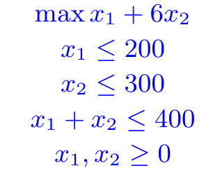
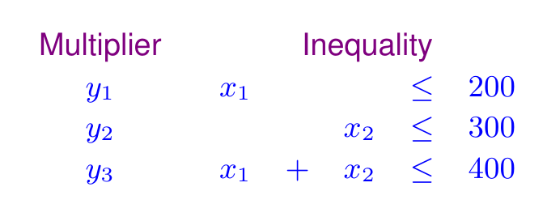
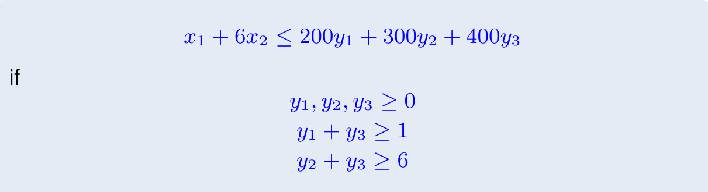

# 概念

线性规划（Linear Programming）由以下元素组成：

- 1 个目标函数（Objective Function）
- n 个决策变量（Variable），均为实数
- m 个不等式约束（Constraint）组成

有多个变量，就说明规划空间有多少个维度，而有多少个约束，就有多少个超平面。

每个线性规划都可以转换成标准型（Strandard Form），对于标准型的 PL 的求解，我们一般会采用单纯形法（Simplex）来求解，而单纯型法，需要将标准型转换成不同的松弛型（Slack Form）。

松弛型（Slack Form）的本质是通过引入松弛变量（Slack Variable）将原本的不等式约束转换成等式约束。并通过不断换入换出松弛变量，来达到优化目的。

标准型的 PL 都存在对偶（Duality）问题，这种对偶问题本质是拉格朗日（Lagrangian）乘子法在“线性规划”下的一个特例。

# 标准型

线性规划的标准型如下所示：

``` math
\max c^{T}x
Ax \leq b
x \geq 0
```

为了将普通 PL 转换成 Standard PL ，需要进行转化：

非标准型可能存在的三种情况:

1.  目标函数为$\min z$ 类型
2.  存在$=, \geq$ 约束条件（非标准形式）
3.  某些变量$x_{i}$ 缺少$x_{i} \geq 0$ 的非负约束

前两种情况的处理方法:

1.  目标函数转成$\max -z$
2.  $f(x) = k$ 转成 $k \leq f(x) \leq k$
3.  $f(x) \geq k$ 转成 $-f(x) \leq -k$

对无约束变量\$x<sub>i</sub>\$：

1.  令$x_{i} = x_{i_1} - x_{i_2}$ （替换所有原$x_{i}$)
2.  新增两个约束： $x_{i_1} \geq 0, \quad x_{i_2} \geq 0$

# Duality

## 形式

标准型如下：

``` math
\max c^{T}x
Ax \leq b
x \geq 0
```

则他的对偶问题为：

``` math
\min b^{T}y
A^{T}y \geq c
y \geq 0
```

对偶定理告诉我们，始终有：

``` math
\max c^{T}x \leq \min b^{T}y
```

而二者取等的时刻，就是两者去到最值的时刻。

## 原理

那么构造对偶问题的原理是什么呢？源于我们对于原问题目标函数的 **拼凑** 。我们举个例子，有原问题：



我们考虑给约束增加一些“乘子（Multiplier）”，并把他们加在一起，想办法制造出一个新的非常全面的约束。那么为什么要制造出这个约束呢？因为我们希望直接通过约束“看出来”目标函数的约束在哪里（我们正在求目标函数的最值）。我们的乘加操作如下：



最终我们凑出来的约束为：



可以看到目标函数小于一个含有乘子的值（也就是 $200y_{1} + 300y_{2} + 400y_{3}$ ），那么这个值达到最小的时候，刚好就是原问题目标函数的上限。这是因为原问题目标函数永远比 $200y_{1} + 300y_{2} + 400y_{3}$ 小，所以当 $200y_{1} + 300y_{2} + 400y_{3}$ 到达最小的时候，就是原问题目标函数的最大值了。

## 影子价格

影子价格是对偶问题的一个经济学应用。在我们熟悉的生产问题上，原料是有成本的，而产品是有利润的。我们用原料制作产品，在成本约束下，希望取得最大利润。

而影子价格是原料的利润，它表示，每购入 1 个单位的原料，最多能够赚取的利润。它的本质就是生产问题的对偶问题中变量的最优解。

# Slackness

## 松紧

松弛（Slack）和紧（Tight）的概念是用于形容不等式约束的。当恰好取到相等时，我们称之为这个约束“紧”了，而如果没有取等，那么就是“松”的。

在线性规划问题中，我们很难满足让所有约束同时都是紧的。从数学角度分析，这意味着 $Ax = b$ 有解。有定理：如果增广矩阵 $[A|b]$ 的秩大于矩阵 $A$ 的列空间的秩，那么方程是无解的。可以看出，应该经常无解。而从几何直观来看，所有约束都是紧的，意味着所有约束形成的超平面都交于一点，这显然很奇怪很不常见。

所以在线性规划问题中，我们常常只有一些约束是紧的，而另一些约束是松弛的。感慨一下，可能人生也是这样的，没有人可以达到自己所有的目标，有些目标本身就是矛盾的。

正因为在 LP 中，只有一些约束是紧的，所以我们需要考虑，牺牲哪些约束，让它们保持松弛，来满足哪些约束，让它们保持紧，以此来最大化目标函数。

但是我们发现，我们该如何用数学语言描述“松紧”呢？我们巧妙得引入了“松弛变量”，我们通过添加松弛变量让原本的不等式约束变成了等式约束。这有什么用呢？注意到，当原约束是紧的时候，对应的松弛变量为 0 ；而当原约束是松的时候，对应的松弛变量不为 0 。

因此，问题被我们转变成了“选哪些松弛变量为 0”的问题。

## 单纯形法

还有一点，就是当我们引入松弛变量后，我们应该有 m 个约束，n 个决策变量，m - n 个松弛变量，我们的问题是选哪些松弛变量为 0 ，但是实际上，我们的问题会变成，在 m 个变量（包括决策变量和松弛变量）中选择出 m - n 个为零。我暂时没有搞清楚为什么会产生这种结果，这可能和目标函数的线性有关，因为目标函数中的变量前都有系数，只要系数不同，我们就可以尽可能让一个系数更大的变量变大，让系数小的变量为 0，而不是做一个好好先生，两者平分。

基于这点，单纯形法（Simplex）提出了“基变量”和“非基变量”的概念，基变量是那些在达到最值时取值不为零的变量，而非基变量是那些在达到最值时取值为零的变量。那么我们该如何选择呢？我们可以根据 $Ax = b$ 把目标函数仅用非基变量表示，然后就可以可以根据这些非基变量前的系数，判断目标函数还有没有增大的可能。我怀疑这里的“基”并不是线性代数的“基”的概念。

算法的每次迭代都会选择一个“入基变量”和一个“出基变量”，对应这我们选择紧一个约束，松另一个约束。而在几何上，是我们选择从一个顶点到另一个顶点。

单纯形可以成功，依赖的是“决策空间是凸多边形”这个性质。当一个决策空间的某个顶点的所有邻居的值都不如它大时，就说明整个决策空间的所有顶点的值都不如它大。如果决策空间是“凹的”，那么就没有这个性质了。

## 互补松弛性

互补松弛性（Complementary Slackness）说的是可以从原问题的变量是否为 0，推测对偶问题的约束的松紧情况；也可以从原问题的约束的松弛情况，推测出对偶问题的变量是否为 0 。

- ​​原问题约束紧 \<=\> 对应对偶变量可能为正​
- 原问题约束松 \<=\> 对应对偶变量必须为 0​
- 原问题变量为正 \<=\> 对应对偶约束必须紧​
- ​​原问题变量为 0 \<=\> 对应对偶约束不一定紧

互补松弛性的一个重要应用反应在对于影子价格的分析上，当原料影子价格大于 0 的时候，说明原问题的约束是紧的，也就是这个原料是稀缺的，被约束的。而当影子价格等于 0 时，说明这个资源是富余的。

# 时间复杂度

单纯形法的每次迭代的时间复杂度是 $O(mn)$ ，而需要迭代的次数是 $\binom{m+n}{n}$ 。具体的证明我不会。单纯形法虽然理论分析上是指数级的复杂度，但是在实际表现中很好。

但是这并不意味着 LP 不是一个 P 问题，苏联数学家 ​​Khachiyan​​ 提出​​椭球算法（Ellipsoid Algorithm）​​，首次证明 LP 存在​​多项式时间复杂度​​的解法。只是这种算法在实际表现中很差，所以我们在现实中还是选择了单纯形法。
