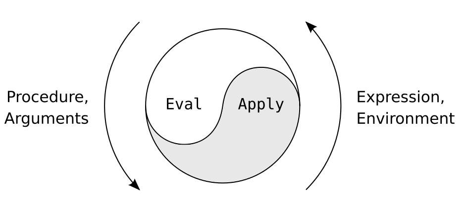

# Lisp 的精髓

我个人觉得 Lisp 的精髓在于它是 **一元论** 的，它不是“数据即计算，计算即数据”，而是用 list 这个统一结构（用 Sexp 描述）来描述数据和计算两种东西。

一元论的优势在于它简单，因为所有的现象最终都会被溯源到同一个本质，即 list 。从 [Lisp 之根源](http://daiyuwen.freeshell.org/gb/rol/roots_of_lisp.html) 这篇文章来看，Lisp 创立之初是为了当“伪代码”，这就要求 lisp 不能有太多的元语。

# 术语

## Sexp

S-表达式（S-Expression, Sexp）是 Symbolic Expression 的缩写，可以看作是前缀表达式的一种数据格式，它在 lisp 语言中被用来描述该语言的数据和代码。可以说，Sexp 是 lisp 语言 **Date 和 Text 不严格区分** 的基础，因为他们都使用同一种格式 —— Sexp。

Sexp 的作用是潜移默化的，比如说对于入门学 [[C]] 的我来说，将一个函数作为参数传递给另一个函数，是很难理解的。但是如果是一门 lisp 语言，数据的形式是 Sexp, 函数的形式也是 Sexp ，那么传参的时候传一个 Sexp ，如果想把它当个计算过程用，就 eval 它一下，如果想把它当个数据用，就用 `car, cdr` 修改它的值，都是非常好理解的。

Sexp 的形式化表示如下（需要注意，在 lisp 中还会有一些其他语法元素，没有在这里体现）：

``` text-mode
Atom -> Number | Symbol
Sexp -> Atom | (Sexp . Sexp)
```

这种原始的 Sexp 具有很多的 `.` ，并不容易书写，所以人们又制定了一些简化规则：

``` text-mode
(a . (b . c)) <=> (a b . c)
(a . (b . nil)) <=> (a b . nil) <=> (a b)
() <=> nil
```

这些简化语法消去了很多的 `.` ，在形式上就和我们常见了 lisp 非常类似。

## Eval

Eval 是 Evaluation 的缩写，它作用于 Sexp ，可以按照 Sexp 的结构执行一个计算过程：

``` commonlisp
(+ 1 (* 2 3)) ; 2 * 3 = 6, 1 + 6 = 7 => 7
```

它将每个 Sexp 的 `car` 作为运算符，并将 `cdr` 作为运算数，用 `car` 运算 `cdr` 的过程就是一种 Evaluation 。当然也有一些 Atom 的部分，他们 eval 的结果就是它们自身（self-evaluation）。整个 eval 过程是一个 **递归过程** 。

总的来说， `eval` 将原本的数据（也就是 Sexp）变成了计算过程，也就是 data 向 text 的转变，通过 eval ，data 和 text 不仅静态形式一样，还具有了转换的方法。

此外，可以被 eval 的 sexp 会被叫做 form ，也就是 formular 的缩写。

## Apply

Apply 指的是函数的调用和参数的传递（实参替换形参）过程。

在很多介绍中，apply 和 eval 的地位都是“对偶”的，比如说著名的太极图：



这个图有些误导我了，我以为 eval 是 data 向 text 的转变，那么 apply 就会是 text 向 data 转变的过程。其实并不是，eval 和 apply 都是将 sexp 转变成计算过程的方式，这个太极图在说明两个方式是互相配合的。在 eval 过程中，如果遇到函数调用，那么就需要利用 apply 完成参数传递和函数调用；而在 apply 过程中，函数体本身是 sexp ，需要 eval 才可以运行计算功能。

所以两者合起来，才是 Sexp 变成一个计算过程的全部。

## Quote

这位的重量级就较 eval 和 apply 差一些了，它用来避免一些本该被 eval 的 Sexp （作为 Text 的 Sexp 或者作为实参的 Sexp）被 eval ，其形式如下：

``` commonlisp
(+ 1 2)         ; => 3
(quote (+ 1 2)) ; => (+ 1 2)
'(+ 1 2) ; => (+ 1 2)
`(+ 1 2) ; => (+ 1 2)
`(+ 1 (* 2 3))   ; => (+ 1 (* 2 3))
`(+ 1 ,(* 2 3))  ; => (+ 1 6)
`(+ 1 ,@(* 2 3)) ; => (+ 1 . 6)
```

`quote` 除了这个函数外，还可以用 `'` 来表示，而 `` ` `` 被称为 backquote ，其基本作用和 `'` 类似，但是被它标记的 Sexp 内的 Sexp 或者 Atom ，如果用 `,` 或者 `,@` 进行标记，那么就可以被局部 eval 。

正是因为 quote 阻止 eval 的特性，也将其称为由 Text 向 Data 转变的方式，作为 eval 和 apply 的对立面。不过这种说法有些夸大 quote 的嫌疑。我个人觉得应该这么表述，C 这种语言是 text 和 data 泾渭分明的，是一种 **二元论** 的语言，而在 lisp 中，只有 Sexp 这一种东西，它既可以像 data 一样被 `car, cdr` 这种列表操作函数使用，也可以像 text 一样被 `eval, apply` 来执行，是一种 **一元论** 。

`quote` 没有完成 `text ==> data` ， `eval` 也没有完成 `data ==> text` 。而是 `eval` 完成了 `Sexp ==> text` ，而 `quote` 阻止了 `Sexp ==> text` ， `car, cdr` 可以看作是完成了 `Sexp ==> data` 。

## λ

λ 表达式即匿名函数，我们对于它可以有效缓解“不想给细碎函数起名字”的作用已经了解了。从这个方面来讲，lambda 助长了“代码即数据”的观念，因为它简化了原本函数需要的复杂声明语法，使得人们在心理上减轻了将函数作为数据处理的心理负担。

但是从理论上呢？为什么 Lisp 这门语言要具有 lambda 表达式这个特征呢？之前介绍的 Sexp ，eval 等特征看上去并不依赖于 lambda 。我个人觉得是这样的， **可复用计算过程** 的封装需要“函数”这个概念，而一个具名函数并不本质，没有任何道理要求一个计算过程必须要有一个名字，这就好像没人要求 `1` 这个数字必须具有一个名字，比如说“One”。

此外，lambda 并非只在描述计算过程中有不可或缺的作用。它更像是一种 **“以计算过程为中心的一元论”** 思想。不同于 lisp 采用的“以 Sexp 为中心，衍化出 data 和 text”，这种思想强调“以 text 为中心，衍化出 data”，至于这是怎么办到的，我并不能很好的理解，只能暂且记下来 2 点：

- 在 SICP 中由一个用 `if-else` 过程构造出一个 `cons` 结构的例子，而有了 `cons` 就可以构造所有的数据结构了。
- lambda 表达式的思想来源于 [λ 演算](https://zhuanlan.zhihu.com/p/30510749)，这是一个对标图灵机的形式化系统，给我感觉就是它利用简单的解析（resolve）操作构建了整个计算体系（就像集合论的感觉）。


## Symbol, Bind, Closure

因为 lisp 中又是指针，又是 lambda 的，所以其实符号（symbol）和真正的对象（object）是非常解耦联的，并不像 C 一样，一个函数必须与一个函数名一一对应。这种宽松的设计使得我们可以更加自由地使用 symbol 。在 emacs-lisp 中，symbol 具有一个由字符串表示的名字，一个指向 value 的指针，一个指向 func 的指针，一个属性列表（property list）。

所以我们将一个实际的 object （可能是一个基础的数据类型，也可能是一个函数或者宏）和一个 symbol 联系在一起的过程，就被称为 bind 。而在实际上，就是我们准备了一个 map ，我们可以根据 symbol 到某个 map 中查询对应的 object 的过程。

而闭包（Clouser）指的是在 lambda 函数中，它如果引用了外部变量，那么就会将这个变量捕获（capture）下来，然后放到与这个 lambda 相关的一个 map 中去。

## Cons, List

Cons 是 lisp 语言中最为基础的数据结构，它的本意是 **Construction** ，即 list 构造函数。

`cons` 给我的个人感觉就像拥有两个指针的结构体， `car` 是取第 1 个指针指向的内容，而 `cdr` 是取第 2 个指针指向的内容，用 C 语言模拟一下（并不能运行，因为 C 是强类型，模拟 lisp 太难了）：

``` c
typedef struct {
    void *first;
    void *second;
} Cons;

#define car(pair) (*(pair.first))
#define cdr(pair) (*(pair.second))
```

下面是一些使用 `cons` 的用法：

``` commonlisp
(cons 1 2) ; => (1 . 2)
'(1 . 2)
(car '(1 .2)) ; => 1
(cdr '(1 . 2)) ; => 2
(cadr '(1 . (2. 3))) ; => 2. cadr(p) = car(cdr(p))
```

在 Sexp 这章介绍的 Sexp 的化简方法，并不只是一个形式化的表达，它揭示出 `cons` 和 `list` 两种数据结构之间的关联，如下所示：

``` commonlisp
(cdr '(1 . 2)) ; 2
(cdr '(1 2))   ; (2)
```

存在这样的数据结构：


分别用 `cons` 和 `list` 来描述：

``` commonlisp
(cons 42 (cons 69 (cons 613 nil))) ; (42 . (69 . (613 . nil)))
(list 42 69 613) ; (42 69 613)
```
