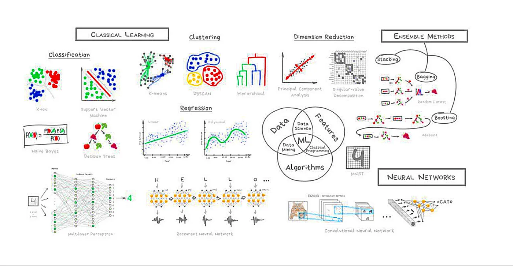
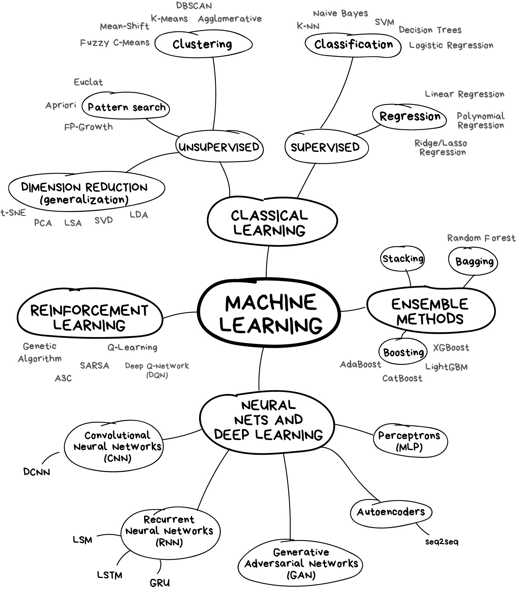
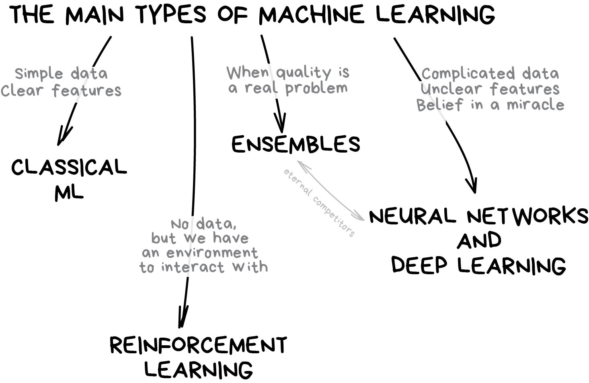
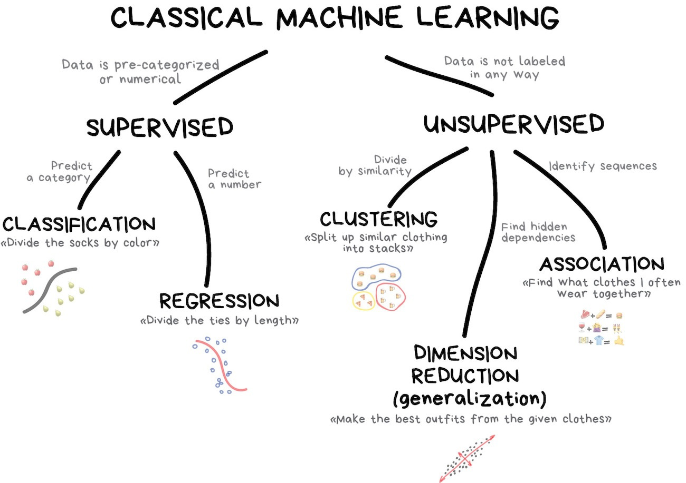
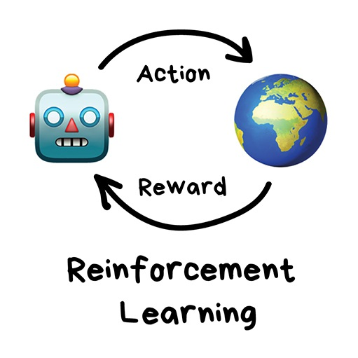

# 介绍

机器学习（Machine Learning）是制造 AI 的一个方法。

在原先，人们会从客观世界中总结、学习出规律和概念来，然后利用这些规律和概念来编程。机器学习主张的是，“肉身学习”这个过程因为现实世界的规律和“智能”这个概念太复杂了、规律太难以把握了，导致效率很低，不如直接让机器自己来学习。

我们可以把机器学习分成三个要素：

- 数据：数据是机器学习的基础。数据质量和数量对模型性能有直接影响。数据通常需要预处理，如清洗、归一化、 **特征** （feature）提取等。
- 模型：模型是用于从数据中学习的数学结构或函数，不同的模型适用于不同类型的问题（如线性回归用于回归问题，决策树用于分类问题）。
- 算法：算法是 **训练** 模型的具体方法或过程，它定义了如何从数据中提取模式并优化模型参数。常见算法包括梯度下降、随机森林、支持向量机等。

从上面的三要素可以看出，数据就是客观世界的一个反映，算法就是学习方法，学习后提炼出的 **模式和关系** （也就是知识）都存放在模型中。最后放上一张 ML 的总结图：

# 分类

ML 的分类如下图所示：

分类的依据如下：

可以看到分类依据非常不严谨，神经网络是模型的种类，而强化学习是算法的种类，而划分经典机器学习的则是数据有无标注的特性。我觉得这可能和 ML 近些年的野蛮生长有关，传统方法的理论并不能适配新兴的范式。

我看有些博客在纠结于 LLM 是不是监督学习或者无监督学习，我觉得领会意思就够了，辩经就没有意思了。毕竟理论还没有发展完善。

## Classical Method

传统的机器学习方法（1950 年就提出了），分为监督学习和非监督学习两类，这两类其实对应了两种“学习模式”。即在有标准答案（有标注 label）的情况下完成学习，和在没有标准答案的情况下，发现规律。

其类型如下：

### Supervisor Method

监督学习可以分为分类（Classification）和回归（Regression）两种。

分类主要用于语言检测、垃圾邮件过滤等。典型方法包括 [[SVM]] 、[[Naive Bayes]] 、[[Decision Tree]] 等。

回归就是拟合，我好像在哪里看过，回归的意思就是说，数据点都会回归到我们拟合出的那个曲线上。

### Unsupervisor Method

无监督学习（在 90 年代发明）可以避免数据标注的成本。可以分为聚类（Clustering）、降维（Dimisionality Reduction）、关联规则学习（Association Rule Learning）三种。

聚类是根据未知特征来划分对象，这是它与分类算法的区别。常用于市场细分、压缩图像（识别相似的颜色）、分析和标记新数据、检测异常行为。典型方法包括 [[K-Means]] 、Mean-Shift 、DBSCAN 。

降维指的是找到最核心的特征，舍弃那些不重要的特征。常用于推荐系统。典型方法包括主成分分析（PCA）、奇异值分解（[[SVD]]）、潜在狄利克雷分配（LDA）、潜在语义分析（LSA、pLSA、GLSA）。

关联规则学习指的是分析不同特征数据之间的联系。用于“猜你喜欢”。典型方法包括 Apriori、Euclat、FP-growth 。

## Reinforcement Learning

强化学习不再提供给模型数据，而是提供给模型一个环境，并且给模型提供环境反馈。模型会在反馈中不断试错进步，也就是如下思路。

强化学习广泛用于自动驾驶、扫地机器人、游戏（下围棋的 AlphaGo 就是强化学习）、自动化交易等领域。经典方法有 Q-Learning 、 SARSA 、DQN、 A3C 、遗传算法。

## Ensemble Method

Ensemble method 中文译名应该是“集成学习”。它通过组合多个模型来提高预测性能和鲁棒性。通过结合多个模型的预测结果，可以减少单个模型的偏差和方差，从而提高整体预测的准确性和稳定性。

常见的 Ensemble 方法包括：

- Bagging(Bootstrap Aggregating)：通过在原始数据集上采样多个子集来训练多个模型，然后将其预测结果进行平均（用于回归问题）或投票（用于分类问题）。如 [[Random Forest]]。
- Boosting：逐步训练模型，每个新的模型尝试纠正前一个模型的错误，重点关注难以预测的训练样本。包括 AdaBoost、[[GBDT]]、[[XGBoost]]、LightGBM 等。
- Stacking：使用多个基础模型生成预测结果，然后用另一个模型（称为元模型）来组合这些预测，以生成最终预测。
- Voting：将多个模型的预测结果进行投票，选择票数最多的类别作为最终预测。这可以是硬投票（直接投票）或软投票（基于概率的加权平均）。适用于分类问题。

## Neural Network

### No Deep Leanring

非深度学习的神经网络通常被称为“浅层神经网络”。它们通常具有较少的层数，通常只有一到两层隐藏层，与深度学习模型中可能有数十甚至上百层的神经网络相比，层数明显较少。

非深度学习的人工神经网络往往不能单独作为类别，而应当被划归到传统机器学习的范畴内。

- 感知机（Perceptron）：最基本的神经网络结构，具有单个神经元，用于线性分类任务。
- 多层感知机（MLP, Multi-Layer Perceptron）：包含一个或多个隐藏层的神经网络。用于各种简单的回归和分类任务。通常只有一到两层隐藏层时被认为是浅层网络。也被称作 [[FFN]] 。

### Deep Learning

因为采用了人工神经网络，导致深度学习与其他机器学习方法（也称作“传统机器学习方法”）有许多不同：

- 数据依赖程度：传统机器学习适合数据量较小的任务，深度学习适合处理大数据。
- 硬件依赖程度：深度学习十分依赖于硬件设施，因为计算量实在太大。它会涉及很多矩阵运算，因此很多深度学习都要求有 GPU 参与运算。
- 特征工程：在训练一个机器学习模型的时候，需要首先确定学习哪些特征，比如识别人脸可能并不需要身高特征。在传统机器学习方法中，几乎所有特征都需要人为确认后，再进行手工特征编码。而深度学习试图自己从数据中自动学习特征。
- 解决问题的方式：传统机器学习通常先把问题分成几块，一个个地解决好之后，再重新组合。深度学习是一次性地解决好问题。
- 训练和推理运行时间：传统机器学习的训练时间快而推理时间慢，深度学习的训练时间慢而推理时间快。

DL 的典型模型如下：

- CNN
- [[RNN]]
- [[ResNet]]
- [[LLM]]
- Autoencoders
- [[GNN]]

## Generated Model

又是不精确分类的一种结果，这种模型的目的是生成一些文本或者图像，比如 [[GPT]] 就是一种生成模型：

- [[GAN]]
