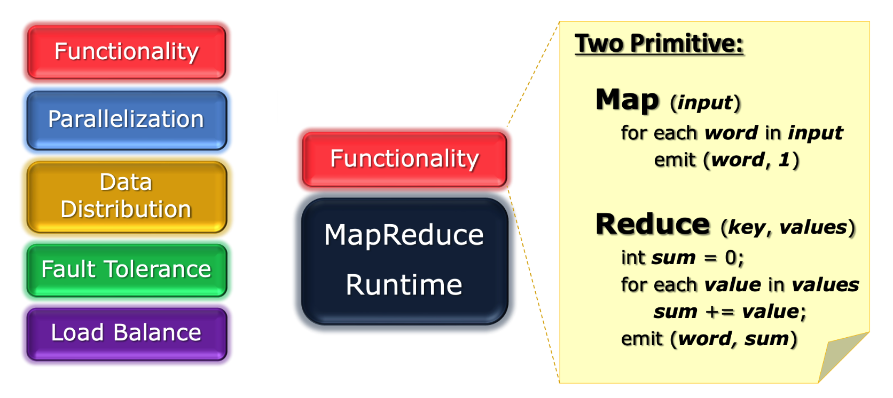
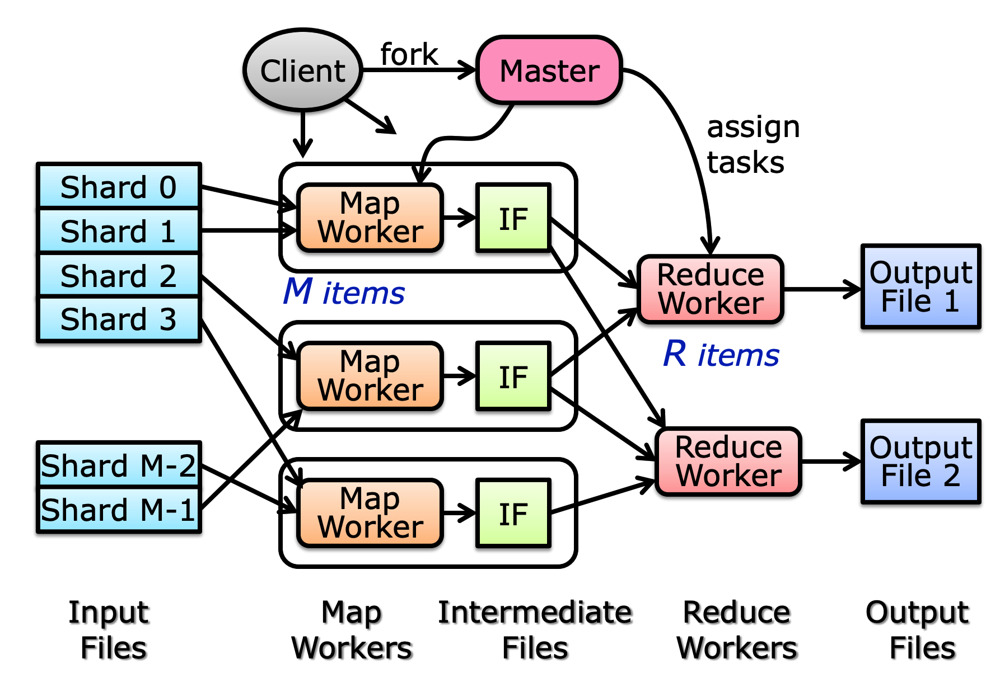

# 框架

MapReduce 提供的是一套 DP 框架，这套框架的目的是为了屏蔽在并行过程中的许多细节，而指向程序员暴露两个接口 `map(input)` 和 `reduce(key, values)` 。

从此之后，程序员只需要思考两件事情：

- 如何在 `map` 函数中，构造出多个 `<key, value>` 。
- 如何在 `reduce` 函数中，对于相同的 `key` 的 `<key, value>` 对进行操作即可。

# 封装

据说 MapReduce 借鉴了函数式编程思想，这点我没有异议。

不过让我比较困惑的是，在词频这个例子里，我不理解为什么要构造出形如 `<word, 1>` 这样的 KV Pair，而不是 `<word, partial_sum>` 这种 KV Pair。也就是当某个 Node 拿到了一个数据块的时候，它反正也要遍历所有的单词，为什么它不顺手把他这个数据块的词频就统计了，这样 reduce 的时候的工作量也会少一些。

如果真的按照我这样去构造 `<word, partial_sum>` 是不会成功的。这是因为在 `map` 的时候，我并不知道我拿到了哪个具体的数据块（shard），自然也就没有办法计算 `partial_sum` 了。那我为什么不知道 shard 呢？这就是因为 MapReduce 作为框架，封装了具体的分块细节。

# 实现

MapReduce 的底层实现如下图所示：

流程如下：

- 首先将输入分成多个部分（shard）。
- 将这些 shard 分发给 Map Worker，Map Worker 根据用户定义的 `map` ，来对数据进行操作，生成的 KV Pair 会存在 IF（Intermediate File）中，IF 是在磁盘中的。
- 每个 Reduce Worker 会读取 IF 中某些 Key 对应的所有 KV Pair，并根据 `reduce` 来进行归并，最终输出结果。

