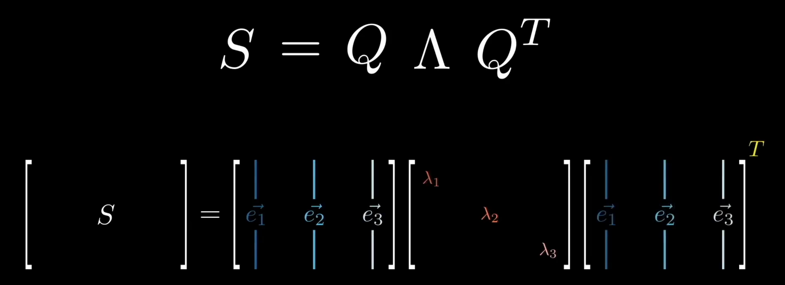

# 分块乘法

对于一个矩阵乘法：

``` math
C_{M, K} = A_{M, N} \times B_{N, K}
```

我们可以对其进行分块计算：

``` math
c_{m, k} = a_{m, n} \times b_{n, k}
```

这个等式看着很显然，但是实际上有如下推论：

- 分块矩阵乘法的最小单元是被分割后的矩阵，而不再是标量了。
- 分块矩阵乘法依然遵循：$A$ 中的行与 $B$ 中的列对应元素相乘，然后再叠加。
- 分块只有一条限制，对于 $A$ 的列分割方案要和对于 $B$ 的行分割方案保持一致。
- 从 $A$ 的列分割方案和 $B$ 的行分割方案可以看出来最终一个分块矩阵结果的形状。

# 基向量变换

我们都知道一个 $A_{M, N}$ 的矩阵可以看作是从 $\mathbb{R}^{N}$ 到 $\mathbb{R}^{M}$ 的线性映射。但是这个映射有没有一种直观的解释呢？是有的。

我们可以给 $A$ 右乘一个单位矩阵 $I$ ，有：

$$
A_{M, N} = A_{M, N} \times I_{N, N}
$$

其中 $I$ 可以被视为一组列基向量，比如说我们看

$$
A_{1} = A_{M, N} \times \begin{bmatrix} 1 \\ 0 \\ \cdots \\ 0 \end{bmatrix}
$$

也就是在 $\mathbb{R}^{N}$ 空间中的第一个基向量，会变成 $A$ 中的第一个列向量，以此类推。

因此我们可以将 $A$ 视为 N 个新的基向量。

# 对角矩阵

对角矩阵（diagonal）本质是一种“拉伸矩阵”，比如下面这个矩阵，本质就是在 x 维度上拉伸 2 倍，在 y 维度上拉伸 5 倍，在 z 维度上拉伸 8 倍：

$$
\begin{bmatrix}
   2 & 0 & 0 \\
   0 & 5 & 0 \\
   0 & 0 & 8
\end{bmatrix}
$$

而且对角矩阵的计算也非常简单，对于 $DA$ 的形式，本质是将 $A$ 中的第 $i$ 个行向量扩大 $D_{ii}$ 倍。而对于 $AD$ 的形式，则是将 $A$ 中的第 $i$ 个列向量扩大 $D_{ii}$ 倍。

# 正交矩阵

正交矩阵是一种方阵，每个列向量都与其他列向量正交，而且其本身的模为 1 。

上面这种说法有些过于啰唆，写成数学表达就是 $AA^{T} = I$ 。我们注意到这里出现了出现的转置，这是为了让列向量彼此相乘而出现的策略。

从上面也可以看出一个新的性质，那就是 $A^{T} = A^{-1 }$ 。

正交矩阵的特点是，它可以视为一种“旋转映射”。

# 对称矩阵

对称矩阵（Symmetric）指的是 $A = A^{T}$ 的矩阵。

它有一个重要的性质，就是不同特征值所对应的特征向量是正交的，因此可以构成一个正交基。它的所有的特征值也是正的。因此我们可以对对称矩阵 $S$ 进行谱分解（Spectral）：



这种特性非常强，它将一个复杂的矩阵变换，拆解成了“旋转-缩放-逆旋转” 3 个简单清晰的步骤。

但是对称矩阵真的很多见吗？如果我们遇到一个不是对称的矩阵，甚至都不是方阵的情况，我们该怎么办呢？想办法构造出一个对称矩阵。这正是 [[SVD]] 的思路。

# 正定矩阵

一个对称矩阵 $A$ 是正定（Positive Definite）的，如果对于任何非零向量 $x$，都满足 $x^T A x > 0$ 。

正定矩阵的所有特征值都是正的，但是反过来，所有特征值都是正的矩阵不一定是正定矩阵。
