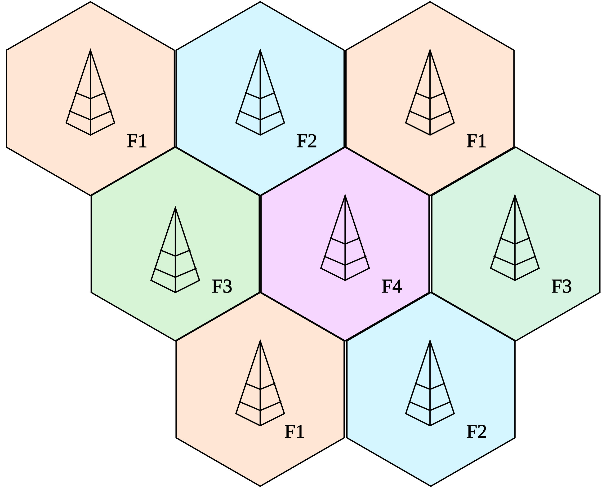

移动网络（Mobile Network）就是“广域蜂窝网络（Cellular network）”，这是一种无线通信网络，通常用于移动电话和数据传输。它是一种广域网，而不是 [[Wi-Fi]] 这种局域网。它的特点是：

- 覆盖范围广
- 用户在不同地理位置移动时，保持网络连接

网络覆盖区域被划分为多个小区域，称为“蜂窝”。每个蜂窝由一个基站提供服务，这样可以有效地管理资源和频谱。通过在不同的蜂窝中重复使用相同的频率，提高了频谱利用率。用户可以在不同的蜂窝之间无缝切换，保持连接不中断（也就是一种非常适应 **“移动性”** 的设计）。

从早期的 1G、2G（如 GSM、[[CDMA]]）到 3G（如 UMTS、CDMA2000），再到 4G（如 [[LTE]]）和 5G，提供了越来越高的数据速度和更丰富的服务。
