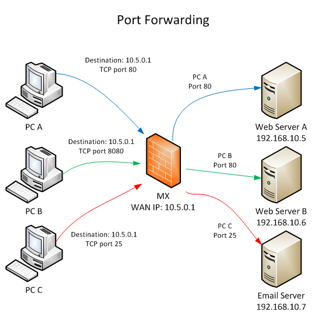

NAT（Network Address Translation）可以允许多个设备通过一个公共 IP 地址访问外部网络。NAT 通常在路由器上实现。

路由器为每个内部设备分配一个内部 IP 地址，所有来自这些内部设备的请求都会被替换为路由器的公共 IP 地址。当响应返回时，路由器根据端口号将数据包转发回适当的内部设备（也就是端口转发 Port Forwarding）。

NAT 技术的优势有：

1.  用于允许多个设备共享单一的公共 IP 地址，避免 IPv4 耗尽。
2.  有助于提高网络安全性，因为内部网络的 IP 地址通常不直接暴露在公共互联网中。
