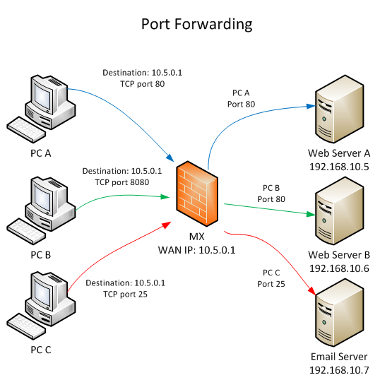

# 网关

NAT（Network Address Translation）可以允许多个设备通过一个公共 IP 地址访问外部网络。NAT 通常在路由器（或者说网关）上实现。

路由器为每个内部设备分配一个内部 IP 地址，所有来自这些内部设备的请求都会被替换为路由器的公共 IP 地址。当响应返回时，路由器根据端口号将数据包转发回适当的内部设备（也就是端口转发 Port Forwarding）。

NAT 技术的优势有：

1.  用于允许多个设备共享单一的公共 IP 地址，避免 IPv4 耗尽。
2.  有助于提高网络安全性，因为内部网络的 IP 地址通常不直接暴露在公共互联网中。

# 打洞

像 Tailscale 这样的工具，常常会有“打洞”的功能，也就是说，明明两个机子在不同局域网下持有两个内网 IP 可以直连，而不需要再走一个中继服务器（Relay）。

那这是怎么做到的呢？按理说内网 IP 是无法跨内网寻址的，这是利用了 NAT 机制的一个“漏洞”。Tailscale 会让双方知道彼此的这个“公网映射地址”，然后双方同时向对方发包。NAT 看到“这是我内网机器主动发起过的连接”，就可能允许对方回包进来。这样“打洞”就算成功了，可以维持一段时间，当然也有可能打洞失败，也就是 NAT 不支持。