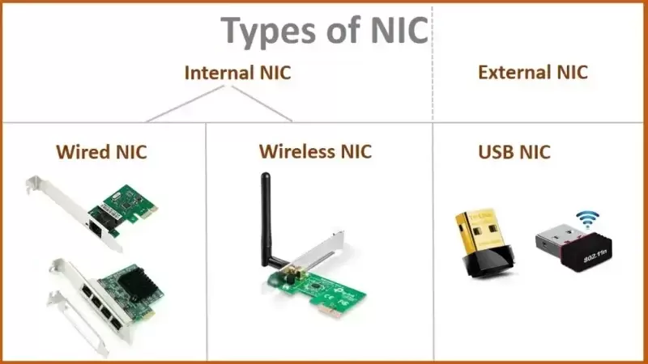
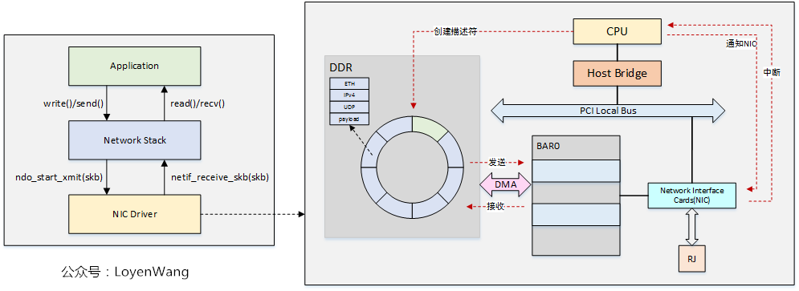

NIC（Network Interface Controller）网络接口卡，在 OSI 模型的物理层（PHY）和数据链路层（MAC）上工作，并且可以集成到计算机的主板中或作为扩展卡添加。 NIC 对于实现网络连接至关重要，无论是有线（以太网）还是无线（Wi-Fi）。

它长成这个样子：

NIC 和软件的协作大概是这样的，用户态软件会用 [[Socket]] 接口和内核通信，内核会利用网络协议栈进行网络包的封装，然后将封装好的网络包交给内核中的 NIC 驱动，NIC 驱动的内存中中有一个 TX Ring 和 RX Ring ，NIC 驱动会将网络包放到对应的 Ring 中，并通过 MMIO 的方式修改 NIC 的寄存器（这个寄存器就是 Ring 的 Head 或者 Tail）来提醒 NIC 工作。NIC 会用 DMA 的方式读取 Ring 并修改 Ring ，然后用中断的方式提醒通知 NIC 驱动任务完成。整体流程如下：

