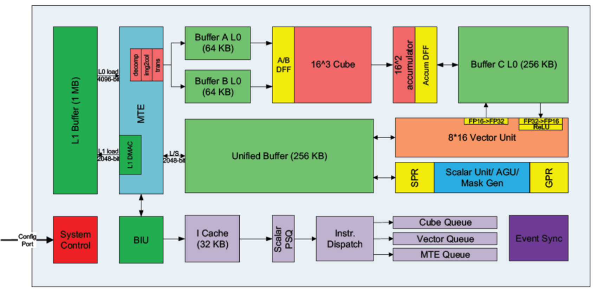

当我们谈到 NPU 的时候，一般指的是 [[HUAWEI]] 开发的 Ascend NPU 。因使用场景的不同（服务器，端侧），NPU 也有不同的形态，比如说在嵌入式开发中就不会使用 [[HBM]] 。

里面有 1D, 2D (Systolic Array), 3D ([[Systolic Array vs Tensor Core]]) 的计算单元，但是规模并没有 TPU 那种 256 x 256 的规模，而是像 GPU 一样是 8x 或者 16x 的规模。以 Ascend910 为例：

所以昇腾的编译器开发非常困难，因为他们面临着一种异构的加速器。所以可能需要使用更多的 pipeline 和 superscala 技术 ，这可能也是 NPU 上 buffer 很多的原因。
