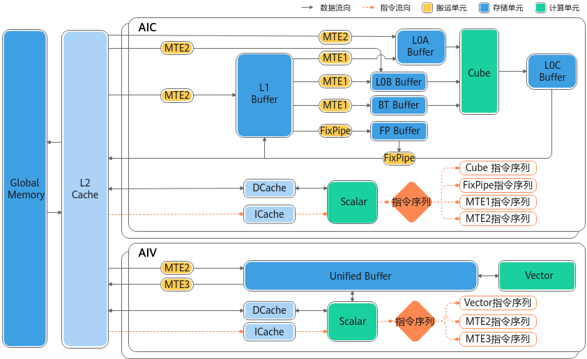
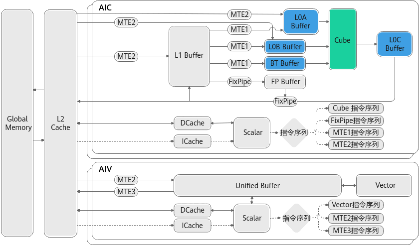
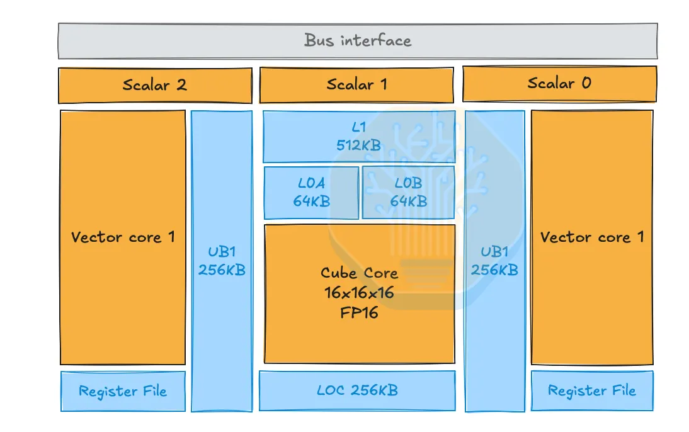

当我们谈到 NPU 的时候，一般指的是 [[HUAWEI]] 开发的 Ascend NPU 。因使用场景的不同（服务器，端侧），NPU 也有不同的形态，比如说在嵌入式开发中就不会使用 [[HBM]] 。

目前 NPU 可以与 GPU 的架构有一个对应关系，如下表所示：

| GPU                      | NPU                        | 解释     |
| ------------------------ | -------------------------- | ------ |
| SM                       | AI Core                    | 处理器    |
| CUDA Core                | AIV                        | 向量处理单元 |
| Tensor Core              | AIC                        | 矩阵处理单元 |
| TMA                      | MTE                        | 数据搬运单元 |
| HBM                      | GM                         | 设备内存   |
| L1 Cache / Shared Memory | L1 Buffer / Unified Buffer | L1 缓存  |
| Register                 | L0 Buffer / Unified Buffer | 寄存器    |

那么既然 NPU 和 GPU 这么像，它们的区别是什么。我觉得是 NPU 的 AIV 和 AIC 是独立的，是享有独立的 L1 Cache 和 MTE 单元的。换句话说，AIV 和 AIC 如果想要配合（比如说 FA 所引入的 qkv 矩阵运算和 softmax 的 fusion），就会走一个“AIV -> L1 Cache -> L2 Cache -> L1 Cache -> AIC”的长通路，而 GPU 需要走“CUDA Core -> L1 Cache -> Tensor Core”的短通路，甚至可以直接走寄存器。

NPU 架构如图所示：

来个动态图，展示不同的计算形式对应的不同单元，可以看到基本上是解耦的：

一个 AI Core 的样子：

图中画的是一个 AIC 搭配两个 AIV ，实际上两者的比例是可以调整的。

此外 NPU 还有一个独特的东西，那就是 AI CPU ，它是一个 NPU 侧的 ARM64 执行单元，可以直接访问设备内存。它作为 AI Core 的补充，用于处理那些不适合 SIMD/SIMT 内核执行的任务。

NPU 的常见型号：

- 310：低功耗推理
- 910：训练 + 高端推理
- 950PR：新的 Prefill
- 950DT：新的 Decode + Training

950 系列的分类很有趣，它并没有按照计算强度 workload 分成“Prefill + Training”与“Decode”。那么现有的分类是怎么来的呢？我觉得它其实是按照 HBM Capacity 来划分的。decode 和 training 对与 HBM 的需求更大，所以被划到了一类，950DT 的 HBM 的容量就是比 950PR 的要大。