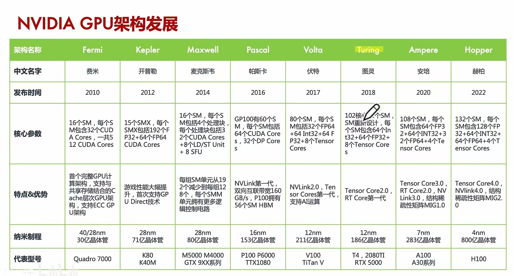
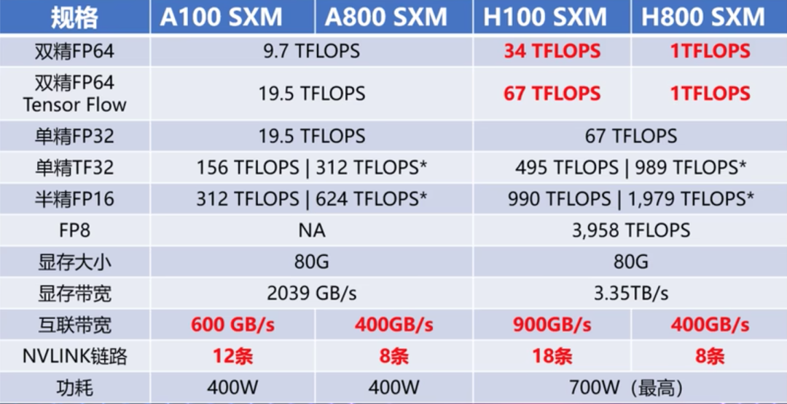
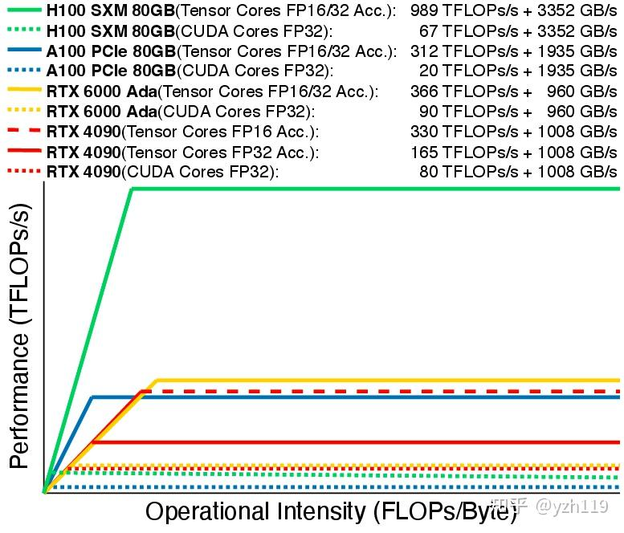

# 架构发展

NVIDIA 家的 GPGPU 架构如下所示：

需要注意这些是 GPGPU ，而对于普通 GPU ，则有：

| 型号   | 架构         | 发行时间 |
|--------|--------------|----------|
| RTX 30 | Ampere       | 2020     |
| RTX 40 | Ada Lovelace | 2022     |
| RTX 50 | Blackwell    | 2024     |

顺便说一下，Ada 是第一个女程序员，Blackwell 是一个黑人数学家。此外更加详细的数据可以在 [官网](https://www.nvidia.cn/geforce/graphics-cards/compare/?section=compare-specs) 上看到。

此外，除了以科学家的身份命名外，GPU 架构还有数字命名，比如说：

- Kepler (sm30, sm35, sm37)
- Maxwell (sm50, sm52, sm53)
- Pascal (sm60, sm61)
- Volta (sm70)
- Turing (sm75)
- Ampere (sm80)
- Ada (sm89)
- Hopper (sm90a)

# 阉割版

A800/H800 是针对中国特供版（低配版），相对于 A100/H100，主要区别：

上图的 Tensor Flow 应该指的是 Tensor Core 而不是 Cuda Core 的算力。

# Roofline

看到一个很不错的 [[Roofline]] 的图：

从图上可以看出，随着架构的发展，HBM 的带宽在增加，Tensor Core 的数目在增加，但是 CUDA Core 的数目在减少。