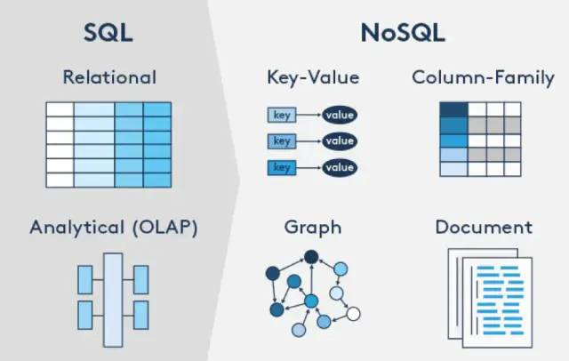

自从上世纪 80 年代以降，关系型数据库，能够满足很多需求。但是，随着数据量的激增、对查询响应要求提升、越来越多非结构化数据泛滥等原因，关系型数据库的领域面临挑战，因此催生了 NoSQL（非关系型、not only SQL）运动 —— 这个词在世纪之交才出现，但是 NoSQL 思想和数据库出现得要早得多。

各式各样的 NoSQL 数据库在分布式、实时性、可扩展性、Schema-less 等方向都取得了突破。下图示出了关系型数据库和 NoSQL 的区别，以及 4 种 NoSQL 存储模式：键值、列族、图和文档。



传统数据库基于 ACID 理论，但是在分布式系统上实现 ACID 太难了，所以 BASE 理论成了 NoSQL 运动的理论基础，它是三个词组的首字母缩写，即：

- 基本可用（basically available）
- 软状态（soft state）
- 最终一致性（eventually consistent）

文字游戏很有意思，acid（“酸”）与 base（“碱”）正好是对立的，当然这不代表 RDBMS 和 NoSQL 是水火不容的哈。

BASE 是对 CAP 一致性和可用性权衡的结果，来源于对大规模互联网分布式实践的总结，是基于 CAP 理论演化来的。

NoSQL 运动有一个很有趣的口号：

``` sql
select fun, profit from real_world where relational=false;
```

目前 SQL 和 NoSQL 的占比：


