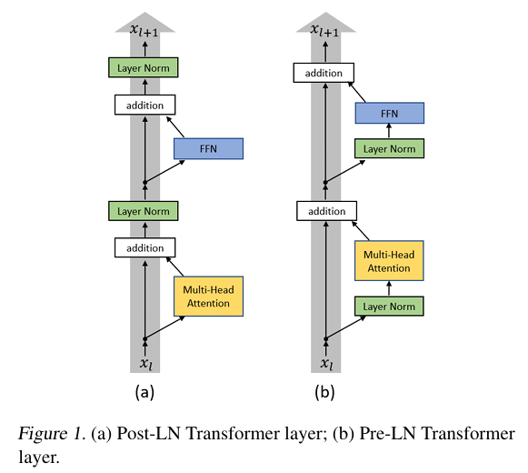

# BatchNorm & LayerNorm & RMSNorm

为了更好的说明问题，我们将要表示的要正则处理的张量形状表示为 `[reqs, dim]` 。

在传统 CV 场景下，我们进行 BatchNorm，也就是选择 `[:, dim_i]` 进行正则处理，相当于是对同一个 batch 内同一个 dim 的所有 request 进行正则。

但是这种方式不适合 LLM，这是因为 LLM 的 batch size 很小，这样正则的意义不是很大，而且 LLM 的 request 之间的差异性也非常显著，就更不适合这种 batch 内的正则了。

因为 LLM 使用 LayerNorm，也就是选择 `[req_i, :]` 进行正则处理，相当于是对同一个 request 里的所有 dim 进行正则。其算法如下：

$$
LayerNorm(X) = \frac{X - \mu}{\sigma} \gamma + \beta
$$

其中 $\mu$ 表示 $X$ 的均值，而 $\sigma$ 是方差：

$$
\sigma = \sqrt{\frac{1}{|X|} \sum (X - \mu)^2}
$$

而 $\gamma$ 和 $\beta$ 用于调整正则化后的数据的缩放比例和中心，是可以学习的参数。

后来人们为了提高层归一化的训练速度，去掉了 LayerNorm 的“平移部分”，只保留了“缩放部分”，这就是 RMSNorm，其算法如下：

$$
RMSNorm(X) = \frac{X}{RMS(X)} \gamma
$$

其中 RMS 是 Root Mean Square 的意思，算法如下：

$$
RMS(X) = \sqrt{\frac{1}{|X|} }
$$
# Pre-Norm vs Post-Norm

在 Transformer 中，有 Post-Norm 和 Pre-Norm 两种架构：

残差连接有两条数据通路，主通路和残差通路。这两条通路必须同时发挥作用，才能让训练效果最好：

- 主通路如果变强，输入信号比较稳定，那么有利于训练的稳定性，我们就可以训练更加深的网络。反之，正因为更稳定，所以更难学到东西，进而导致表示坍塌（Representation Collapse）
- 残差通路如果变强，那么就更容易改变原本的输入，那么训练的准确性就会更好。反之，因为削弱了主通路的影响，导致梯度消失（Gradient Vanishing）所以稳定性会下降。

Post-Norm 相比于 Pre-Norm，训练的准确度会更高，但是训练的稳定性会更差。使用 Post-Norm 的模型深度不能很高，不然就容易训练失败。据说是因为 Pre-Norm 的残差通路上没有 LayerNorm ，使得梯度可以更好地向后传播。

在早期的 LLM 中，常使用 Post-Norm，而现在会使用 Pre-Norm 。