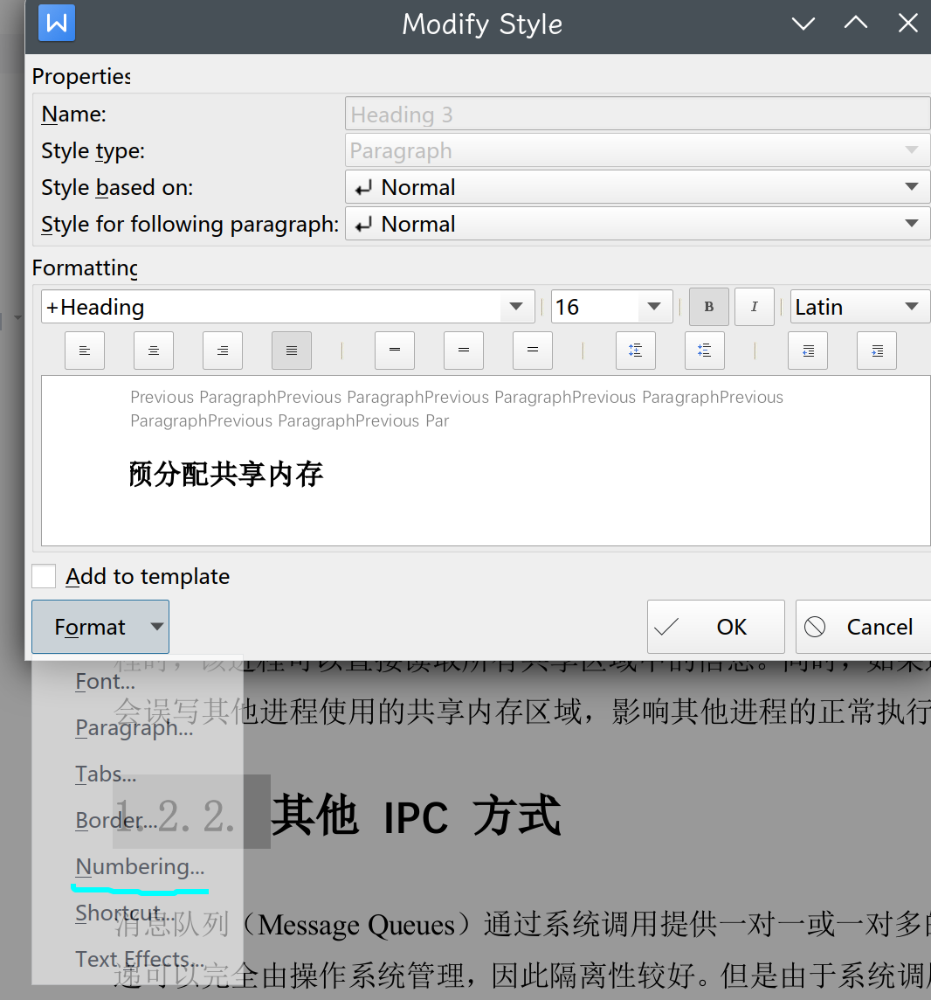
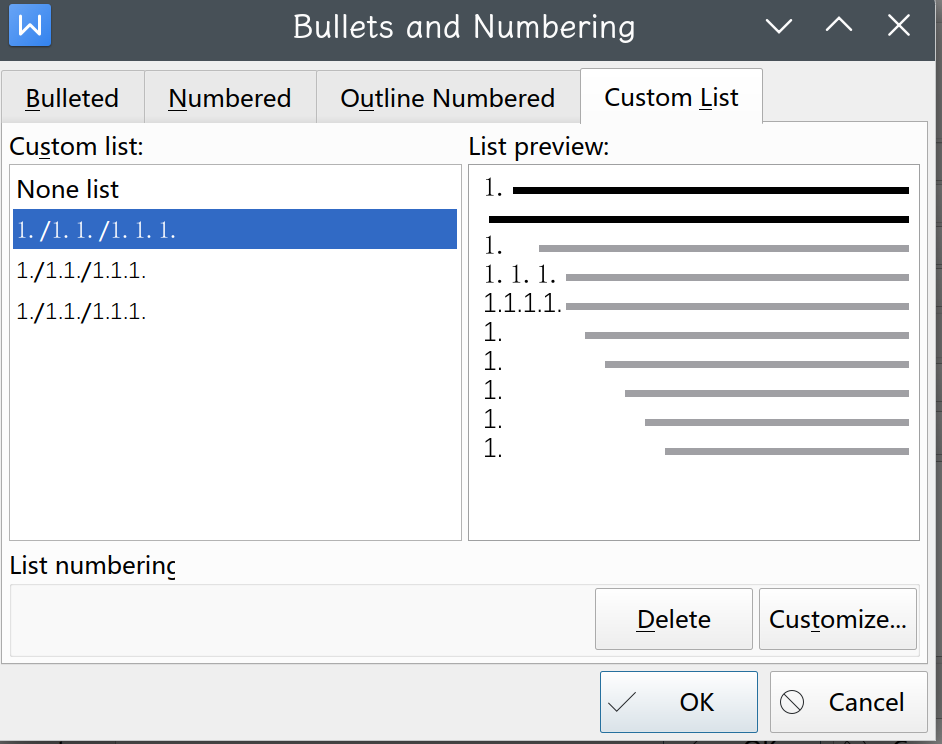
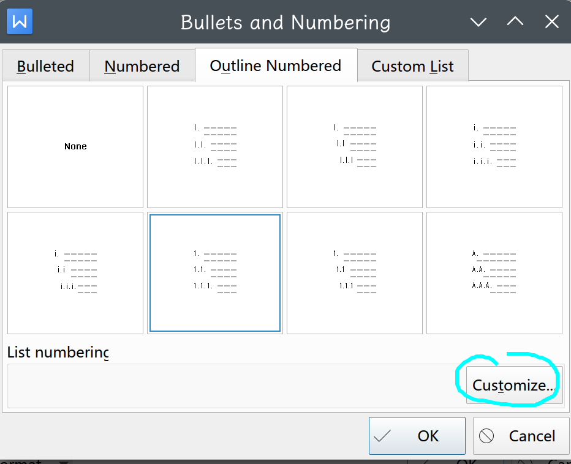
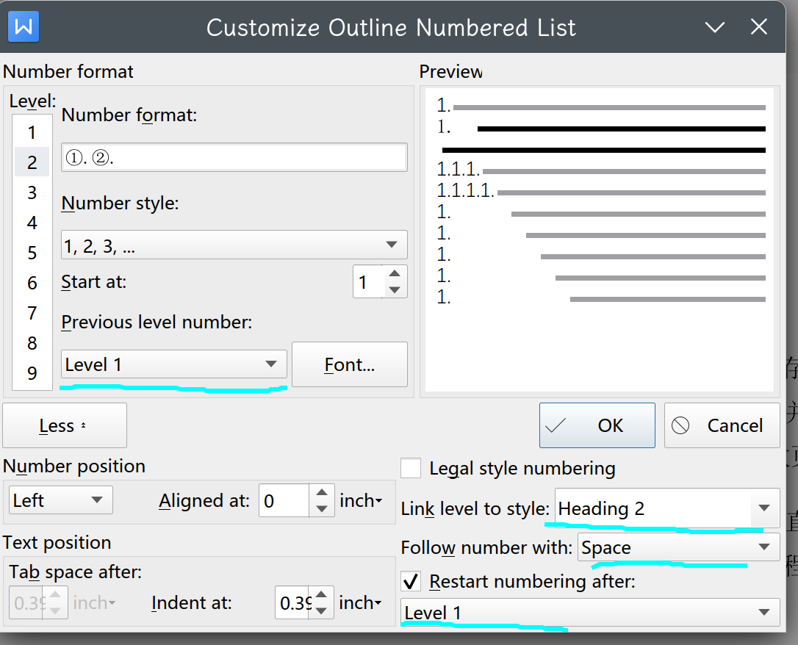
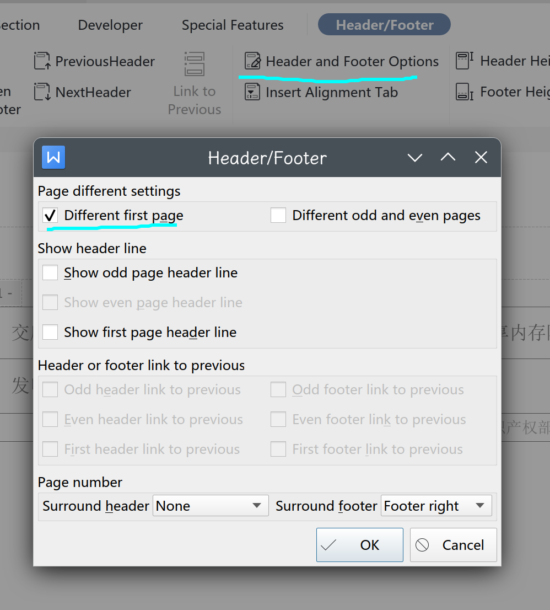

# 标题序号

非常抽象，因为我无法到底是所有标题样式（Heading）共享一套标号系统（Numbering），还是每个标题都有自己的标号系统（目前来看应该是第一种）。

此外，似乎 Linux 版本的 WPS 有 bug ，导致总是无法设置 Heading2 的标题。

总的来说，在我们样式设置栏，将每个 heading 的 Numbering 的 Custom List 都清空

这里都 delete 掉，注意是所有 heading 都需要干净：

然后只在 Heading1 的时候选择 custom Outline Number ：

这几个位置都需要设置，才能保证序号都正确编码：

**最重要的一点是** ，需要在 Heading1 的地方设置所有 Heading 的样式，也就是说，需要点击上图左侧不同的 Level 进行设置，而不是只设置 Heading1 的样式。

# 首页页眉页脚

可以用这种方法特殊设置首页的页眉页脚不显示：

