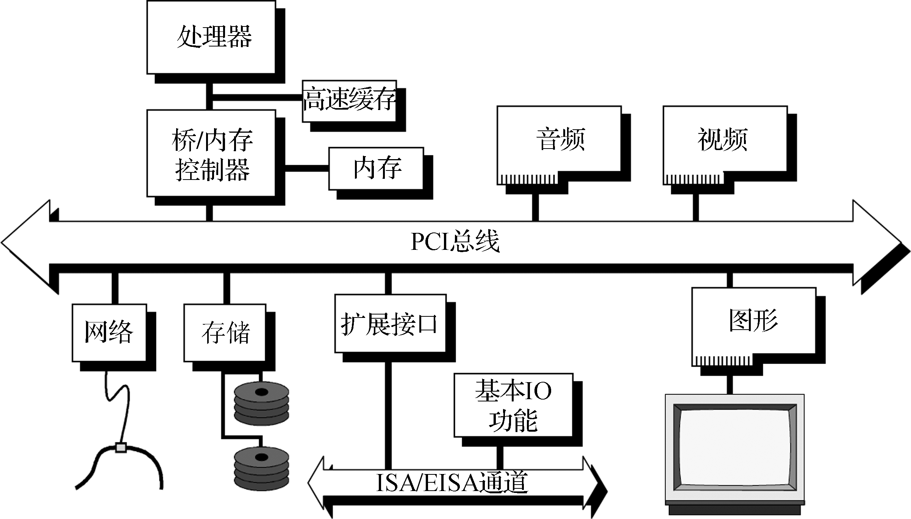
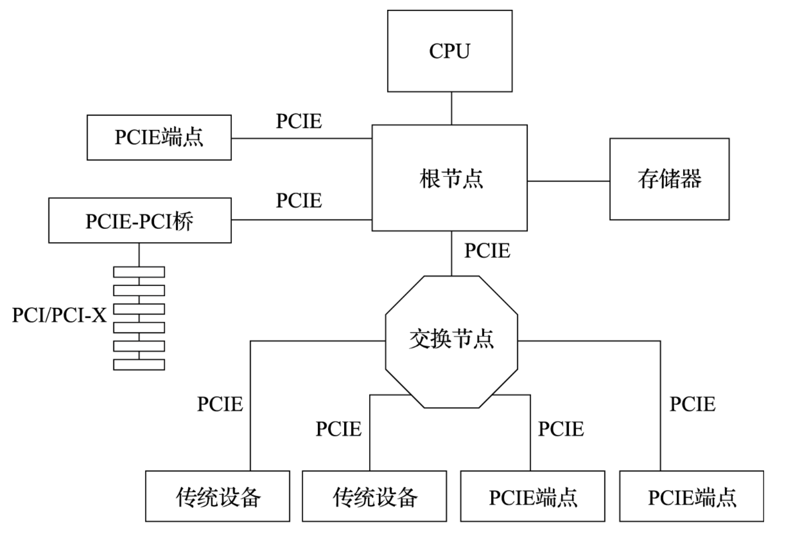

PCIe 即 Peripheral Component Interconnect Express 。

PCIe 采用点到点拓扑，不同于 PCI 的共享总线拓扑，所以效率更好。同时 PCIe 作为多路串行总线结构，也比原本的 PCI 的并行总线结构带宽更高。

PCIe 上，root 侧（也叫做 Host）有不同厂家的 cpu，device 侧有不同加速器或者其他设备，而且 PCIe 提出的时候就没有加速器一致性访存的约束。

也是近几年 AI 爆热吵起来的，只有 GPU 加速器这种强大的设备才需要拥有这么强大的总线（严格意义上不能叫“总线”了，因为点对点拓扑，每个 PCIe 线路都是“专用”的）。

PCI 设备有 BAR 空间。BAR（Base Address Register）空间指的是 PCI（Peripheral Component Interconnect）设备用于映射其内存或 I/O 空间的寄存器。我觉得就理解成 PCI 设备自己的寄存器和内存即可，并且这些寄存器和内存都可以被 CPU “看到”，属于是 public 的寄存器和内存。
