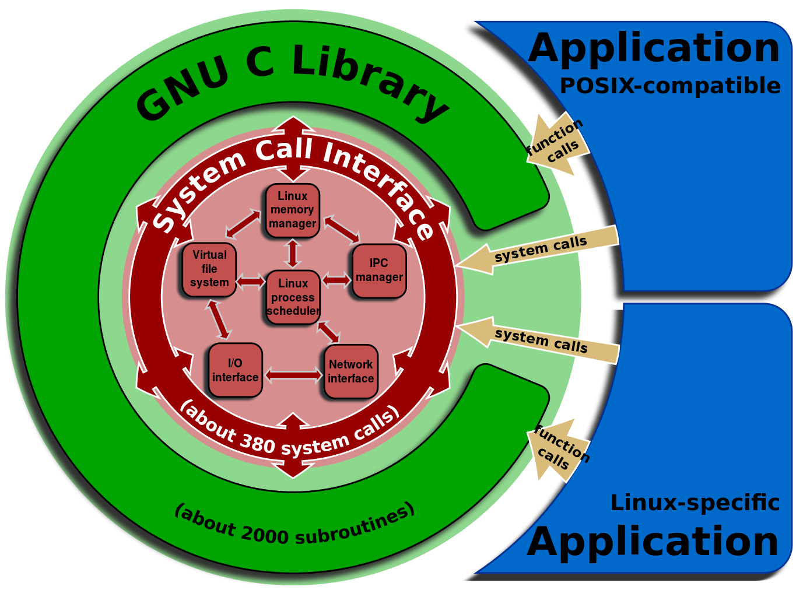

# ABI or API

POSIX 是（Portable Operating System Interface）可移植操作系统接口。它本身是为了解决 [[Unix]] 的多个版本导致的移植困难问题，POSIX 为类 Unix 操作系统提供了一套“设计需求”。

如果按照上面的理解，很容易把 POSIX 认为成是一套 OS 系统调用（System Call, ABI）集合，不过实际上它是一组 API ，同时约束 OS 和应用程序。

一般情况下，应用程序通过应用编程接口（API）而不是直接通过系统调用来编程。这点很重要，因为应用程序使用的这种编程接口实际上并不需要和内核提供的系统调用一一对应。

一个 API 定义了一组应用程序使用的编程接口。它们可以实现成一个系统调用，也可以通过调用多个系统调用来实现，而完全不使用任何系统调用也不存在问题。实际上，API 可以在各种不同的操作系统上实现，给应用程序提供完全相同的接口，而它们本身在这些系统上的实现却可能迥异。

这组 API 的具体实现，往往是一个 C 库，我们并不直接使用系统调用，因为它的本质是 ABI 而非高级语言，不利于移植。所有的 C 程序都可以使用 C 库，而由于 C 语言本身的特点，其他语言也可以很方便地把它们封装起来使用。在 Linux 上这个 C 库即 Glibc ，它是系统调用的封装器（虽然图上有直接使用系统调用的例子）：

# Just or More

实际上 POSIX 也并不只是程序的 API ，它由 4 个部分组成：

1.  Base Definitions（基础定义）：该部分定义了 POSIX 标准涉及的基本数据类型、常量以及错误码。这些定义确保了不同操作系统之间的可移植性。
2.  System Interfaces（系统接口）：该部分定义了 POSIX 标准下的系统调用和库函数。这些接口包括文件、进程控制、输入输出等常见的操作系统功能。
3.  Shell and Utilities（ [[Shell]] 和实用工具）：该部分定义了 POSIX 兼容的 Shell 语言和一系列工具的行为。这些工具包括文本处理工具（如 `grep, sed` ）、文件管理工具（如 `ls, cp` ）等。
4.  Rationale（原理）：该部分提供了 POSIX 标准的解释和背后的原理。它描述了标准制定的动机、设计决策以及与其他标准和规范的关联。

所以 POSIX 的范围很大，它甚至会去规定每个 OS 上都要有 `vi` 和 `ls` 。所以 POSIX 强调的可移植性，我个人觉得不只是应用程序更好移植了，用户使用上也更加习惯了，用户也更好“移植”了。具体对应命令行工具的规范，可以在 [这里](https://linux.cn/article-11222-1.html) 有一个更加详细的了解。

当然上面的说法过于理想化了，更大的可能是，为了保证 Shell 脚本的可移植性，其中使用的命令的行为最好也要保证一致。

# Equal or Not

所以除了 Unix 以外，还有操作系统遵循 POSIX 吗？其实是有的，[[Linux]] 同样遵循 POSIX ，事实上，正是因为 Linux 遵循了 POSIX ，才在早期就吸引了很多原本在 Unix 的用户（Unix 因为打官司不太平）。

不过 Linux 并不是完全遵循 POSIX ，这需要从两方面论证：

- Linux 并不能满足所有 POSIX 的规定，因为有些规定确实有些愚蠢或者历史遗留问题
- Linux 不止满足了 POSIX 的规定，它还具有其他功能

POSIX 的命名者 [[RMS]] 对 POSIX 和 GNU 的关系做了一定阐释：

> - GNU’s Not Unix 而 POSIX 却是类比 Unix 加的 IX 后缀
> - GNU 将 POSIX 视为指南而非权威，遵循(following)而不是遵守(complying) POSIX 标准：一部分 GNU 应用程序符合 POSIX 标准，另一部分 GNU 应用程序的特定功能，要么不符合 POSIX 规范，要么缺少对规范的实现。
> - GNU 优先考虑自由(freedom)，然后是用户便利(convenience)，符合标准优先级更低
